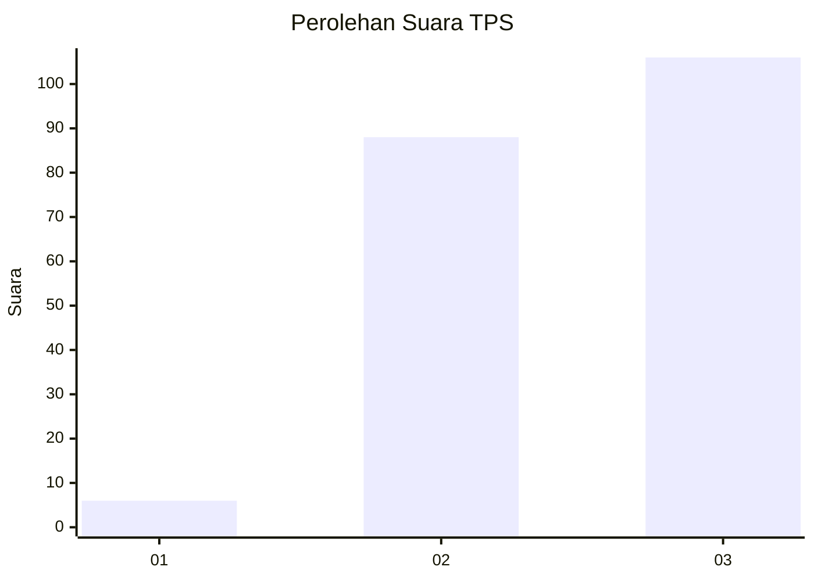
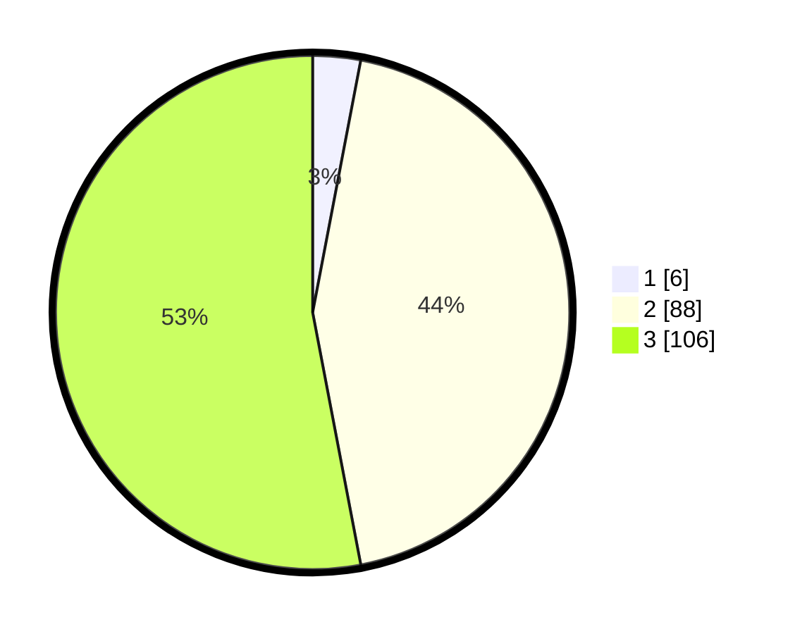

# Hasil

## Grafik

## Tabel

| No. | Nama Paslon    | Suara | Suara (raw) | Persentase |
|:--- |:-------------- | -----:| -----------:| ----------:|
| 1   | ANIES MUHAIMIN | 6     | [6][p-1]    | 3,00       |
| 2   | PRABOWO GIBRAN | 88    | [88][p-2]   | 44,00      |
| 3   | GANJAR MAHFUD  | 106   | [106][p-3]  | 53,00      |

[p-1]: https://github.com/gigit-pemilu/pemilu-2024-33-jawa-tengah/blob/main/pilpres/hitung-suara/sub/33-jawa-tengah/sub/07-wonosobo/sub/04-kaliwiro/sub/2020-kemiriombo/sub/001-tps/sub/paslon-1.txt
[p-2]: https://github.com/gigit-pemilu/pemilu-2024-33-jawa-tengah/blob/main/pilpres/hitung-suara/sub/33-jawa-tengah/sub/07-wonosobo/sub/04-kaliwiro/sub/2020-kemiriombo/sub/001-tps/sub/paslon-2.txt
[p-3]: https://github.com/gigit-pemilu/pemilu-2024-33-jawa-tengah/blob/main/pilpres/hitung-suara/sub/33-jawa-tengah/sub/07-wonosobo/sub/04-kaliwiro/sub/2020-kemiriombo/sub/001-tps/sub/paslon-3.txt

## Foto C Plano

https://sirekap-obj-formc.kpu.go.id/47cb/pemilu/ppwp/33/07/04/20/20/3307042020001-20240214-223603--ac15615f-7895-464c-8b79-fc0f4354b5c7.jpg

https://sirekap-obj-formc.kpu.go.id/47cb/pemilu/ppwp/33/07/04/20/20/3307042020001-20240215-000035--21eaf46c-8057-46a0-87e6-c8f1da73e7eb.jpg

https://sirekap-obj-formc.kpu.go.id/47cb/pemilu/ppwp/33/07/04/20/20/3307042020001-20240215-000354--e0f8a2bf-943c-45cc-a7a1-60a0fa6fcab0.jpg

## Metadata

| Key        | Value               |
| ---------- | ------------------- |
| Time Stamp | 2024-02-15 12:00:28 |

