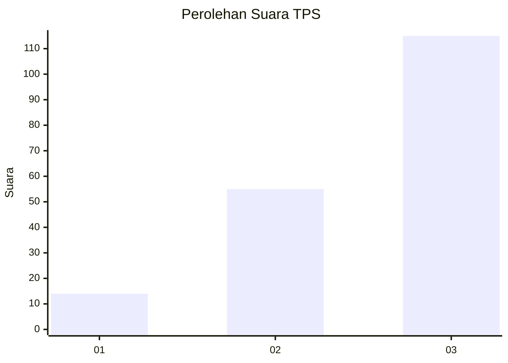
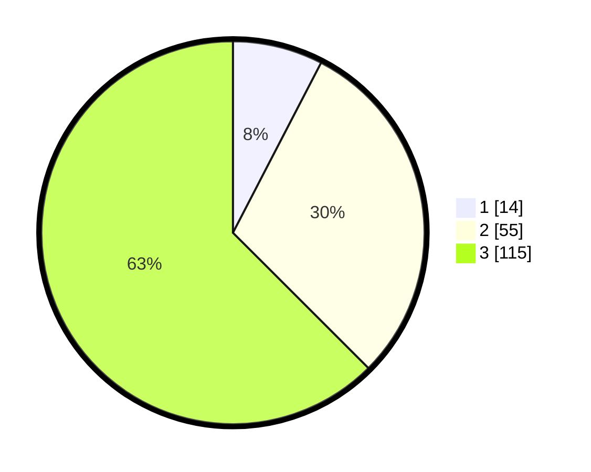

# Hasil

## Grafik

## Tabel

| No. | Nama Paslon    | Suara | Suara (raw) | Persentase |
|:--- |:-------------- | -----:| -----------:| ----------:|
| 1   | ANIES MUHAIMIN | 14    | [14][p-1]   | 7,61       |
| 2   | PRABOWO GIBRAN | 55    | [55][p-2]   | 29,89      |
| 3   | GANJAR MAHFUD  | 115   | [115][p-3]  | 62,50      |

[p-1]: https://github.com/gigit-pemilu/pemilu-2024/blob/main/pilpres/hitung-suara/sub/33-jawa-tengah/sub/07-wonosobo/sub/05-leksono/sub/1006-leksono/sub/014-tps/sub/paslon-1.txt
[p-2]: https://github.com/gigit-pemilu/pemilu-2024/blob/main/pilpres/hitung-suara/sub/33-jawa-tengah/sub/07-wonosobo/sub/05-leksono/sub/1006-leksono/sub/014-tps/sub/paslon-2.txt
[p-3]: https://github.com/gigit-pemilu/pemilu-2024/blob/main/pilpres/hitung-suara/sub/33-jawa-tengah/sub/07-wonosobo/sub/05-leksono/sub/1006-leksono/sub/014-tps/sub/paslon-3.txt

## Foto C Plano

https://sirekap-obj-formc.kpu.go.id/1fc3/pemilu/ppwp/33/07/05/10/06/3307051006014-20240214-193432--9cc845e5-252c-41f1-9942-bc75adf02dbe.jpg

https://sirekap-obj-formc.kpu.go.id/1fc3/pemilu/ppwp/33/07/05/10/06/3307051006014-20240214-193536--75472a8d-f1b4-478b-89c8-ce34030f5d6b.jpg

https://sirekap-obj-formc.kpu.go.id/1fc3/pemilu/ppwp/33/07/05/10/06/3307051006014-20240215-012608--fbc04e8f-7a33-407d-bdb3-f2505887bd6b.jpg

## Metadata

| Key        | Value               |
| ---------- | ------------------- |
| Time Stamp | 2024-02-15 15:00:29 |

