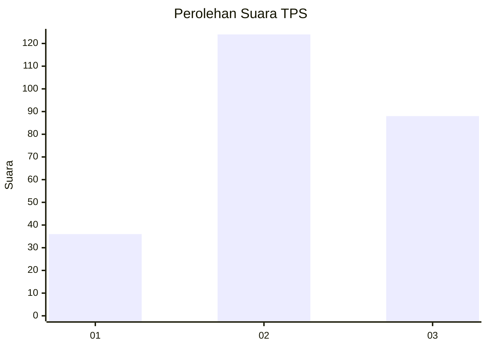
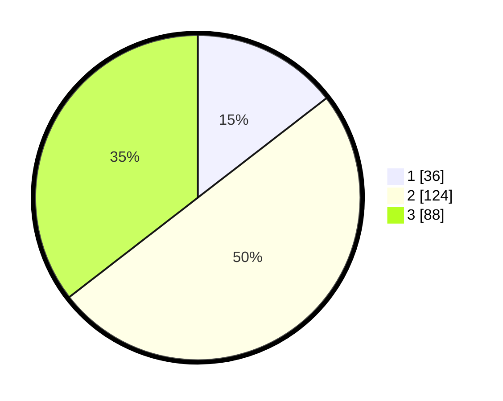

# Hasil

## Grafik

## Tabel

| No. | Nama Paslon    | Suara | Suara (raw) | Persentase |
|:--- |:-------------- | -----:| -----------:| ----------:|
| 1   | ANIES MUHAIMIN | 36    | [36][p-1]   | 14,52      |
| 2   | PRABOWO GIBRAN | 124   | [124][p-2]  | 50,00      |
| 3   | GANJAR MAHFUD  | 88    | [88][p-3]   | 35,48      |

[p-1]: https://github.com/gigit-pemilu/pemilu-2024/blob/main/pilpres/hitung-suara/sub/33-jawa-tengah/sub/07-wonosobo/sub/06-selomerto/sub/2010-kalierang/sub/003-tps/sub/paslon-1.txt
[p-2]: https://github.com/gigit-pemilu/pemilu-2024/blob/main/pilpres/hitung-suara/sub/33-jawa-tengah/sub/07-wonosobo/sub/06-selomerto/sub/2010-kalierang/sub/003-tps/sub/paslon-2.txt
[p-3]: https://github.com/gigit-pemilu/pemilu-2024/blob/main/pilpres/hitung-suara/sub/33-jawa-tengah/sub/07-wonosobo/sub/06-selomerto/sub/2010-kalierang/sub/003-tps/sub/paslon-3.txt

## Foto C Plano

https://sirekap-obj-formc.kpu.go.id/d0d0/pemilu/ppwp/33/07/06/20/10/3307062010003-20240214-203153--d76b9f25-0ccf-453b-9ebd-dbfabd95641e.jpg

https://sirekap-obj-formc.kpu.go.id/d0d0/pemilu/ppwp/33/07/06/20/10/3307062010003-20240214-203230--e78e9083-2c9a-47e5-b93c-36166b857840.jpg

https://sirekap-obj-formc.kpu.go.id/d0d0/pemilu/ppwp/33/07/06/20/10/3307062010003-20240214-203414--c14151ee-e685-46fd-9e7e-fd13fd4ddfbf.jpg

## Metadata

| Key        | Value               |
| ---------- | ------------------- |
| Time Stamp | 2024-02-19 06:16:00 |

