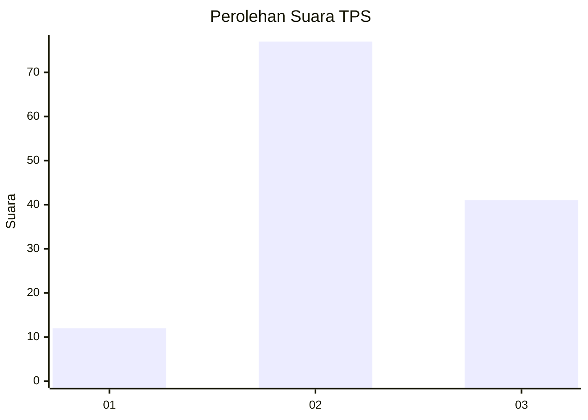
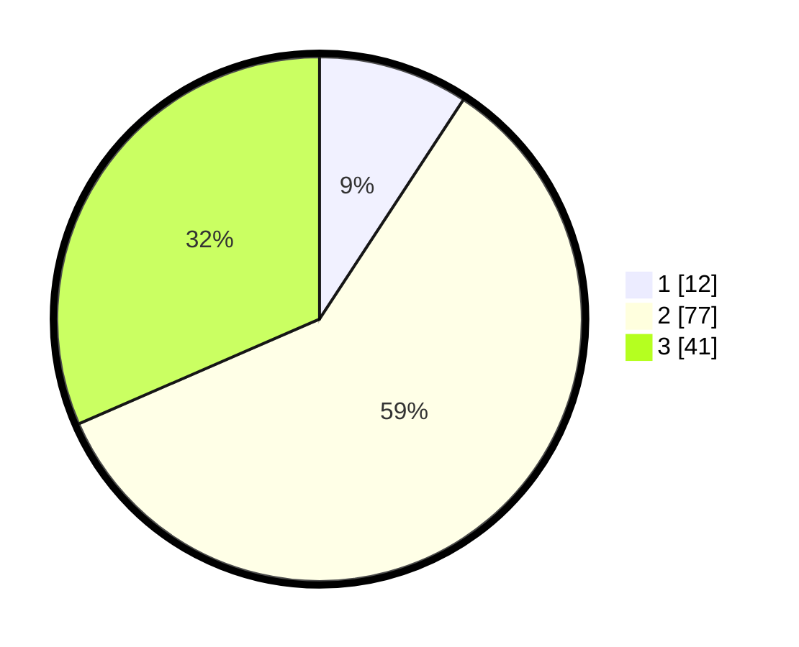

# Hasil

## Grafik

## Tabel

| No. | Nama Paslon    | Suara | Suara (raw) | Persentase |
|:--- |:-------------- | -----:| -----------:| ----------:|
| 1   | ANIES MUHAIMIN | 12    | [12][p-1]   | 9,23       |
| 2   | PRABOWO GIBRAN | 77    | [77][p-2]   | 59,23      |
| 3   | GANJAR MAHFUD  | 41    | [41][p-3]   | 31,54      |

[p-1]: https://github.com/gigit-pemilu/pemilu-2024/blob/main/pilpres/hitung-suara/sub/33-jawa-tengah/sub/07-wonosobo/sub/06-selomerto/sub/2012-wilayu/sub/003-tps/sub/paslon-1.txt
[p-2]: https://github.com/gigit-pemilu/pemilu-2024/blob/main/pilpres/hitung-suara/sub/33-jawa-tengah/sub/07-wonosobo/sub/06-selomerto/sub/2012-wilayu/sub/003-tps/sub/paslon-2.txt
[p-3]: https://github.com/gigit-pemilu/pemilu-2024/blob/main/pilpres/hitung-suara/sub/33-jawa-tengah/sub/07-wonosobo/sub/06-selomerto/sub/2012-wilayu/sub/003-tps/sub/paslon-3.txt

## Foto C Plano

https://sirekap-obj-formc.kpu.go.id/6f25/pemilu/ppwp/33/07/06/20/12/3307062012003-20240214-231034--8a7d1dd6-6948-4cd1-b53d-777b7d2f92f7.jpg

https://sirekap-obj-formc.kpu.go.id/6f25/pemilu/ppwp/33/07/06/20/12/3307062012003-20240214-231241--5920ada4-3ca7-4bcd-9c0b-8f616409f6e9.jpg

https://sirekap-obj-formc.kpu.go.id/6f25/pemilu/ppwp/33/07/06/20/12/3307062012003-20240214-231411--0dc9b279-230d-4038-a74b-a87303c18a24.jpg

## Metadata

| Key        | Value               |
| ---------- | ------------------- |
| Time Stamp | 2024-02-15 15:00:29 |

