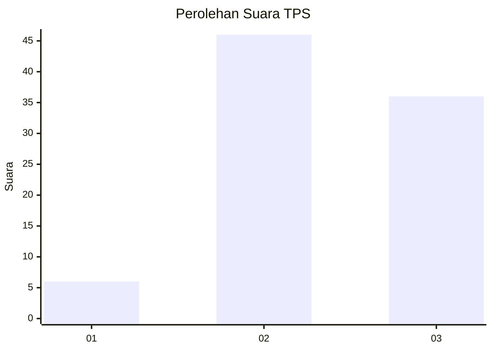
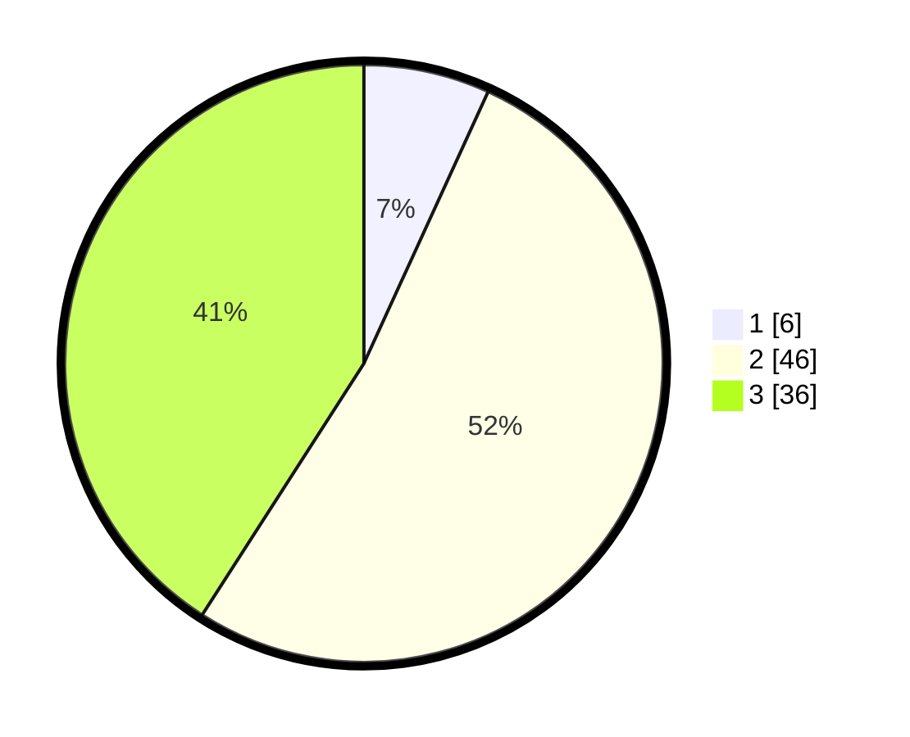

# Hasil

## Grafik

## Tabel

| No. | Nama Paslon    | Suara | Suara (raw) | Persentase |
|:--- |:-------------- | -----:| -----------:| ----------:|
| 1   | ANIES MUHAIMIN | 6     | [6][p-1]    | 6,82       |
| 2   | PRABOWO GIBRAN | 46    | [46][p-2]   | 52,27      |
| 3   | GANJAR MAHFUD  | 36    | [36][p-3]   | 40,91      |

[p-1]: https://github.com/gigit-pemilu/pemilu-2024/blob/main/pilpres/hitung-suara/sub/33-jawa-tengah/sub/07-wonosobo/sub/06-selomerto/sub/2016-simbarejo/sub/005-tps/sub/paslon-1.txt
[p-2]: https://github.com/gigit-pemilu/pemilu-2024/blob/main/pilpres/hitung-suara/sub/33-jawa-tengah/sub/07-wonosobo/sub/06-selomerto/sub/2016-simbarejo/sub/005-tps/sub/paslon-2.txt
[p-3]: https://github.com/gigit-pemilu/pemilu-2024/blob/main/pilpres/hitung-suara/sub/33-jawa-tengah/sub/07-wonosobo/sub/06-selomerto/sub/2016-simbarejo/sub/005-tps/sub/paslon-3.txt

## Foto C Plano

https://sirekap-obj-formc.kpu.go.id/ac43/pemilu/ppwp/33/07/06/20/16/3307062016005-20240214-231740--cbdda0c8-d3fc-41fb-a9e0-e76127f182fe.jpg

https://sirekap-obj-formc.kpu.go.id/ac43/pemilu/ppwp/33/07/06/20/16/3307062016005-20240214-232649--a2fd6852-37ab-4996-a9ee-4b8b740b1a56.jpg

https://sirekap-obj-formc.kpu.go.id/ac43/pemilu/ppwp/33/07/06/20/16/3307062016005-20240214-232529--76645737-d989-4ed8-a128-99330962078a.jpg

## Metadata

| Key        | Value               |
| ---------- | ------------------- |
| Time Stamp | 2024-02-19 06:16:00 |

