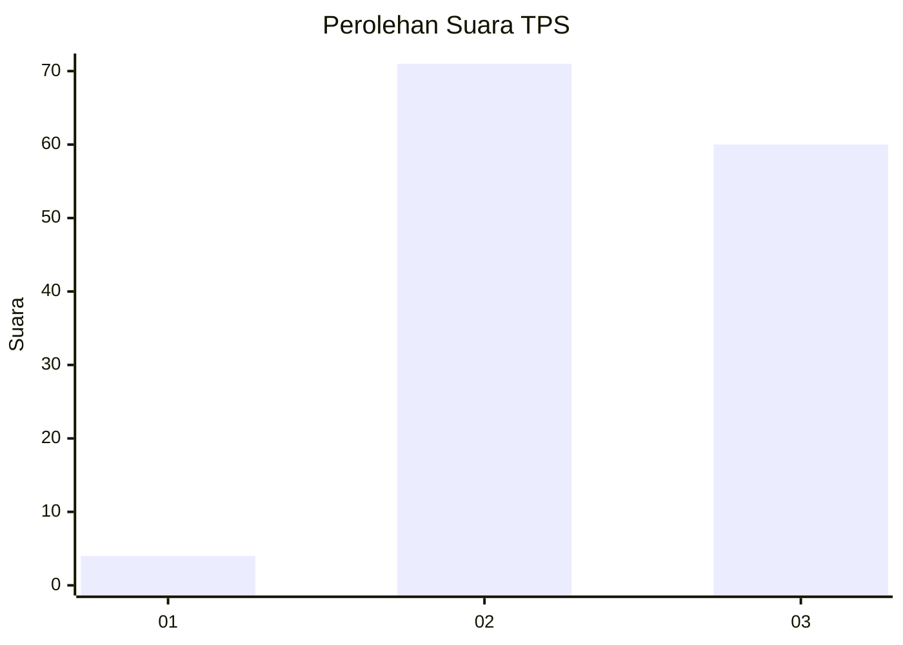
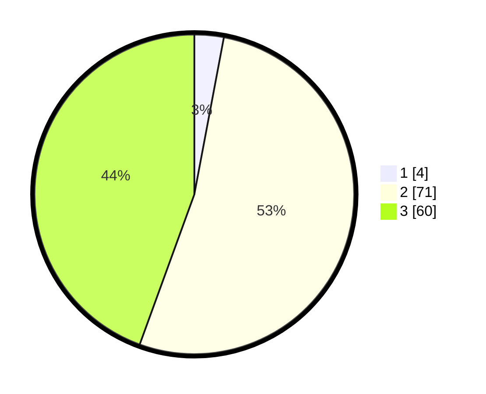

# Hasil

## Grafik

## Tabel

| No. | Nama Paslon    | Suara | Suara (raw) | Persentase |
|:--- |:-------------- | -----:| -----------:| ----------:|
| 1   | ANIES MUHAIMIN | 4     | [4][p-1]    | 2,96       |
| 2   | PRABOWO GIBRAN | 71    | [71][p-2]   | 52,59      |
| 3   | GANJAR MAHFUD  | 60    | [60][p-3]   | 44,44      |

[p-1]: https://github.com/gigit-pemilu/pemilu-2024-33-jawa-tengah/blob/main/pilpres/hitung-suara/sub/33-jawa-tengah/sub/07-wonosobo/sub/06-selomerto/sub/2017-wulungsari/sub/005-tps/sub/paslon-1.txt
[p-2]: https://github.com/gigit-pemilu/pemilu-2024-33-jawa-tengah/blob/main/pilpres/hitung-suara/sub/33-jawa-tengah/sub/07-wonosobo/sub/06-selomerto/sub/2017-wulungsari/sub/005-tps/sub/paslon-2.txt
[p-3]: https://github.com/gigit-pemilu/pemilu-2024-33-jawa-tengah/blob/main/pilpres/hitung-suara/sub/33-jawa-tengah/sub/07-wonosobo/sub/06-selomerto/sub/2017-wulungsari/sub/005-tps/sub/paslon-3.txt

## Foto C Plano

https://sirekap-obj-formc.kpu.go.id/a62a/pemilu/ppwp/33/07/06/20/17/3307062017005-20240215-004258--7af72b91-1b3d-46e2-9218-68b3f20c9217.jpg

https://sirekap-obj-formc.kpu.go.id/a62a/pemilu/ppwp/33/07/06/20/17/3307062017005-20240215-004437--e08961ae-2ffa-4d91-8823-82ea380817c0.jpg

https://sirekap-obj-formc.kpu.go.id/a62a/pemilu/ppwp/33/07/06/20/17/3307062017005-20240215-004606--cfa9d2ad-accc-43d9-b26c-e10318d69afb.jpg

## Metadata

| Key        | Value               |
| ---------- | ------------------- |
| Time Stamp | 2024-02-19 06:16:00 |

