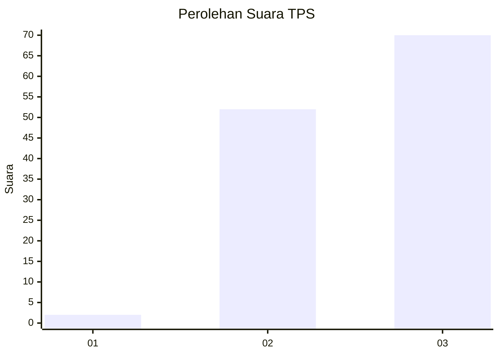
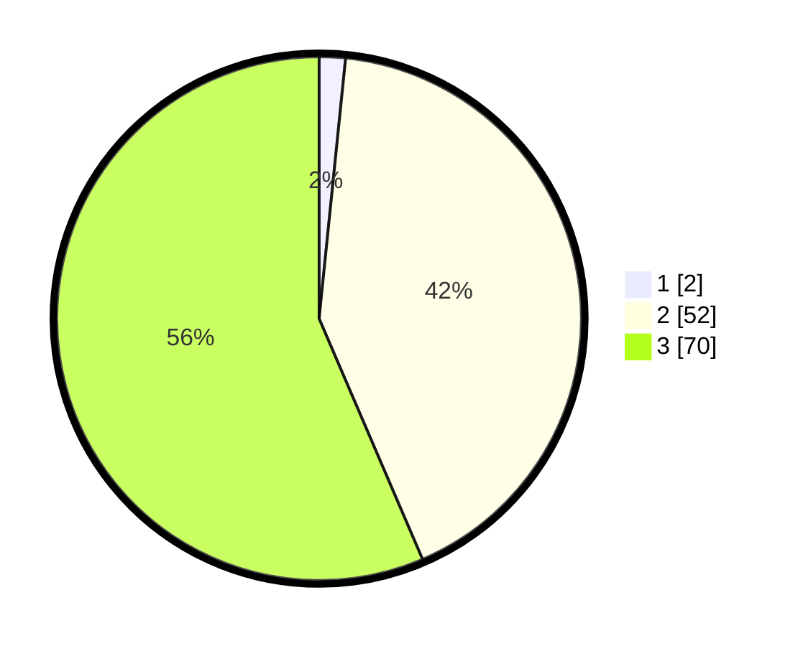

# Hasil

## Grafik

## Tabel

| No. | Nama Paslon    | Suara | Suara (raw) | Persentase |
|:--- |:-------------- | -----:| -----------:| ----------:|
| 1   | ANIES MUHAIMIN | 2     | [2][p-1]    | 1,61       |
| 2   | PRABOWO GIBRAN | 52    | [52][p-2]   | 41,94      |
| 3   | GANJAR MAHFUD  | 70    | [70][p-3]   | 56,45      |

[p-1]: https://github.com/gigit-pemilu/pemilu-2024/blob/main/pilpres/hitung-suara/sub/33-jawa-tengah/sub/07-wonosobo/sub/06-selomerto/sub/2018-bumitirto/sub/003-tps/sub/paslon-1.txt
[p-2]: https://github.com/gigit-pemilu/pemilu-2024/blob/main/pilpres/hitung-suara/sub/33-jawa-tengah/sub/07-wonosobo/sub/06-selomerto/sub/2018-bumitirto/sub/003-tps/sub/paslon-2.txt
[p-3]: https://github.com/gigit-pemilu/pemilu-2024/blob/main/pilpres/hitung-suara/sub/33-jawa-tengah/sub/07-wonosobo/sub/06-selomerto/sub/2018-bumitirto/sub/003-tps/sub/paslon-3.txt

## Foto C Plano

https://sirekap-obj-formc.kpu.go.id/663b/pemilu/ppwp/33/07/06/20/18/3307062018003-20240215-001452--10bdc3c2-a654-43d8-864e-4d46529a5880.jpg

https://sirekap-obj-formc.kpu.go.id/663b/pemilu/ppwp/33/07/06/20/18/3307062018003-20240215-001631--07b1c2bd-db77-4f49-b27a-9707512be05e.jpg

https://sirekap-obj-formc.kpu.go.id/663b/pemilu/ppwp/33/07/06/20/18/3307062018003-20240215-001743--82f84c7b-b3db-482f-8894-47bffa0ba3d8.jpg

## Metadata

| Key        | Value               |
| ---------- | ------------------- |
| Time Stamp | 2024-02-15 12:00:28 |

