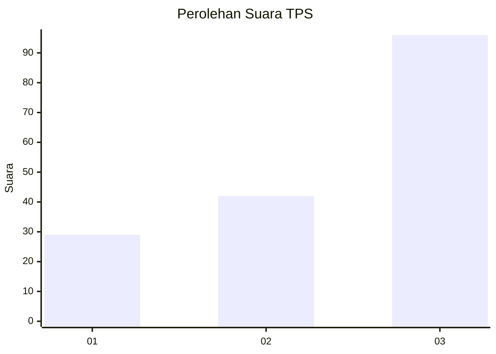
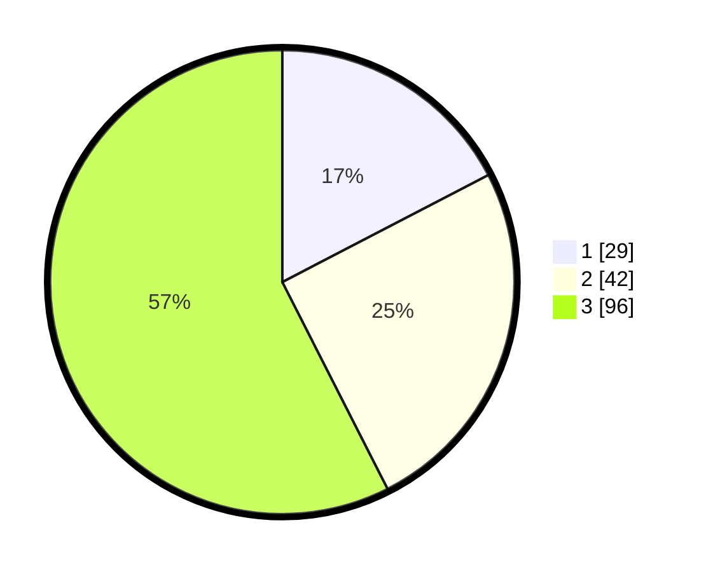

# Hasil

## Grafik

## Tabel

| No. | Nama Paslon    | Suara | Suara (raw) | Persentase |
|:--- |:-------------- | -----:| -----------:| ----------:|
| 1   | ANIES MUHAIMIN | 29    | [29][p-1]   | 17,37      |
| 2   | PRABOWO GIBRAN | 42    | [42][p-2]   | 25,15      |
| 3   | GANJAR MAHFUD  | 96    | [96][p-3]   | 57,49      |

[p-1]: https://github.com/gigit-pemilu/pemilu-2024-33-jawa-tengah/blob/main/pilpres/hitung-suara/sub/33-jawa-tengah/sub/07-wonosobo/sub/06-selomerto/sub/2020-adiwarno/sub/008-tps/sub/paslon-1.txt
[p-2]: https://github.com/gigit-pemilu/pemilu-2024-33-jawa-tengah/blob/main/pilpres/hitung-suara/sub/33-jawa-tengah/sub/07-wonosobo/sub/06-selomerto/sub/2020-adiwarno/sub/008-tps/sub/paslon-2.txt
[p-3]: https://github.com/gigit-pemilu/pemilu-2024-33-jawa-tengah/blob/main/pilpres/hitung-suara/sub/33-jawa-tengah/sub/07-wonosobo/sub/06-selomerto/sub/2020-adiwarno/sub/008-tps/sub/paslon-3.txt

## Foto C Plano

https://sirekap-obj-formc.kpu.go.id/58e8/pemilu/ppwp/33/07/06/20/20/3307062020008-20240215-011631--4afc7b03-7c05-4f03-b477-be05d6d8140c.jpg

https://sirekap-obj-formc.kpu.go.id/58e8/pemilu/ppwp/33/07/06/20/20/3307062020008-20240215-011733--b487f6d6-6c3e-46bb-ba4b-f4b93f5d02ff.jpg

https://sirekap-obj-formc.kpu.go.id/58e8/pemilu/ppwp/33/07/06/20/20/3307062020008-20240215-011845--15367aaa-4793-45b6-96ea-da0ffa5ff369.jpg

## Metadata

| Key        | Value               |
| ---------- | ------------------- |
| Time Stamp | 2024-02-19 06:16:00 |

