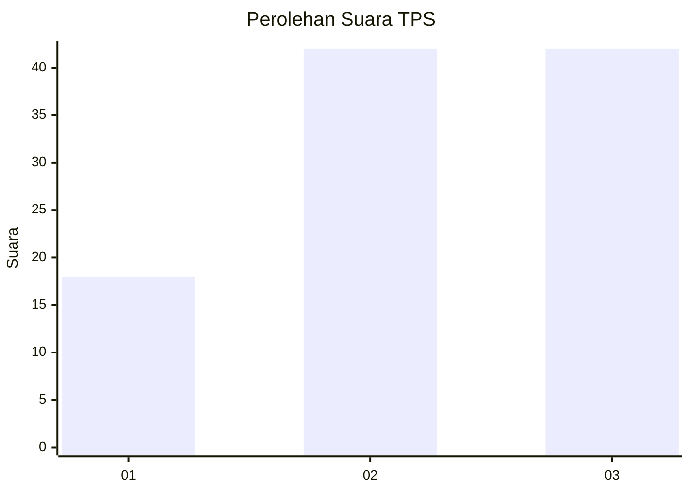
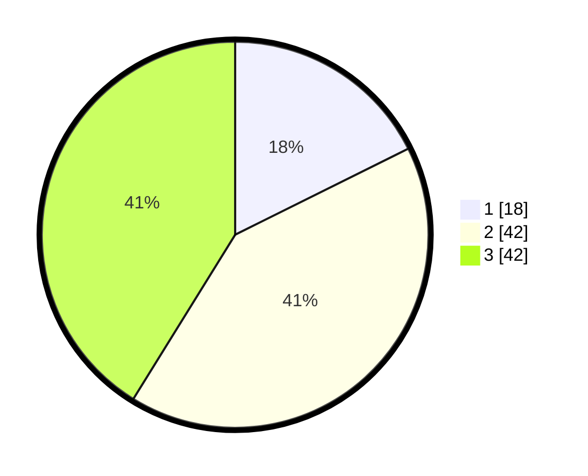

# Hasil

## Grafik

## Tabel

| No. | Nama Paslon    | Suara | Suara (raw) | Persentase |
|:--- |:-------------- | -----:| -----------:| ----------:|
| 1   | ANIES MUHAIMIN | 18    | [18][p-1]   | 17,65      |
| 2   | PRABOWO GIBRAN | 42    | [42][p-2]   | 41,18      |
| 3   | GANJAR MAHFUD  | 42    | [42][p-3]   | 41,18      |

[p-1]: https://github.com/gigit-pemilu/pemilu-2024/blob/main/pilpres/hitung-suara/sub/33-jawa-tengah/sub/07-wonosobo/sub/06-selomerto/sub/2021-kadipaten/sub/011-tps/sub/paslon-1.txt
[p-2]: https://github.com/gigit-pemilu/pemilu-2024/blob/main/pilpres/hitung-suara/sub/33-jawa-tengah/sub/07-wonosobo/sub/06-selomerto/sub/2021-kadipaten/sub/011-tps/sub/paslon-2.txt
[p-3]: https://github.com/gigit-pemilu/pemilu-2024/blob/main/pilpres/hitung-suara/sub/33-jawa-tengah/sub/07-wonosobo/sub/06-selomerto/sub/2021-kadipaten/sub/011-tps/sub/paslon-3.txt

## Foto C Plano

https://sirekap-obj-formc.kpu.go.id/b4dc/pemilu/ppwp/33/07/06/20/21/3307062021011-20240214-194132--95a5b48d-4ded-4efe-a55f-f6740896c47a.jpg

https://sirekap-obj-formc.kpu.go.id/b4dc/pemilu/ppwp/33/07/06/20/21/3307062021011-20240214-201557--e7795972-c7d1-4e98-9ed7-f776dafc2df1.jpg

https://sirekap-obj-formc.kpu.go.id/b4dc/pemilu/ppwp/33/07/06/20/21/3307062021011-20240214-201727--f5b9c022-6974-4b68-891d-a538987456fd.jpg

## Metadata

| Key        | Value               |
| ---------- | ------------------- |
| Time Stamp | 2024-02-19 06:16:00 |

