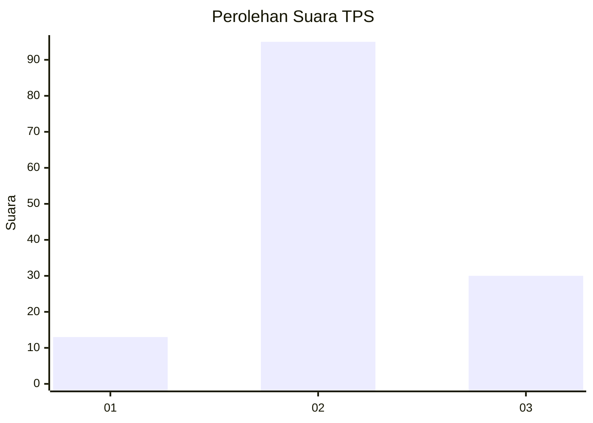
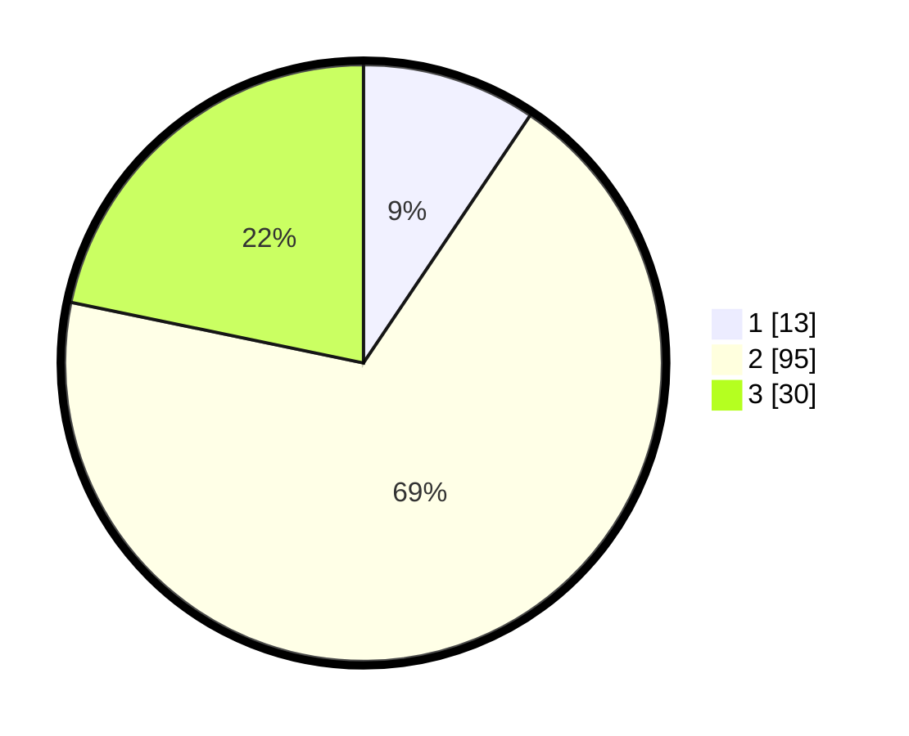

# Hasil

## Grafik

## Tabel

| No. | Nama Paslon    | Suara | Suara (raw) | Persentase |
|:--- |:-------------- | -----:| -----------:| ----------:|
| 1   | ANIES MUHAIMIN | 13    | [13][p-1]   | 9,42       |
| 2   | PRABOWO GIBRAN | 95    | [95][p-2]   | 68,84      |
| 3   | GANJAR MAHFUD  | 30    | [30][p-3]   | 21,74      |

[p-1]: https://github.com/gigit-pemilu/pemilu-2024-33-jawa-tengah/blob/main/pilpres/hitung-suara/sub/33-jawa-tengah/sub/07-wonosobo/sub/06-selomerto/sub/2023-tumenggungan/sub/005-tps/sub/paslon-1.txt
[p-2]: https://github.com/gigit-pemilu/pemilu-2024-33-jawa-tengah/blob/main/pilpres/hitung-suara/sub/33-jawa-tengah/sub/07-wonosobo/sub/06-selomerto/sub/2023-tumenggungan/sub/005-tps/sub/paslon-2.txt
[p-3]: https://github.com/gigit-pemilu/pemilu-2024-33-jawa-tengah/blob/main/pilpres/hitung-suara/sub/33-jawa-tengah/sub/07-wonosobo/sub/06-selomerto/sub/2023-tumenggungan/sub/005-tps/sub/paslon-3.txt

## Foto C Plano

https://sirekap-obj-formc.kpu.go.id/5971/pemilu/ppwp/33/07/06/20/23/3307062023005-20240215-022402--fd1e53a9-14ae-46d2-9721-2648d5d2e8b3.jpg

https://sirekap-obj-formc.kpu.go.id/5971/pemilu/ppwp/33/07/06/20/23/3307062023005-20240215-030454--13a1fd6e-5fce-439f-a6e2-50a0021703d5.jpg

https://sirekap-obj-formc.kpu.go.id/5971/pemilu/ppwp/33/07/06/20/23/3307062023005-20240215-030550--5357d1ab-1b2b-4900-926e-1195a152301c.jpg

## Metadata

| Key        | Value               |
| ---------- | ------------------- |
| Time Stamp | 2024-02-19 06:16:00 |

