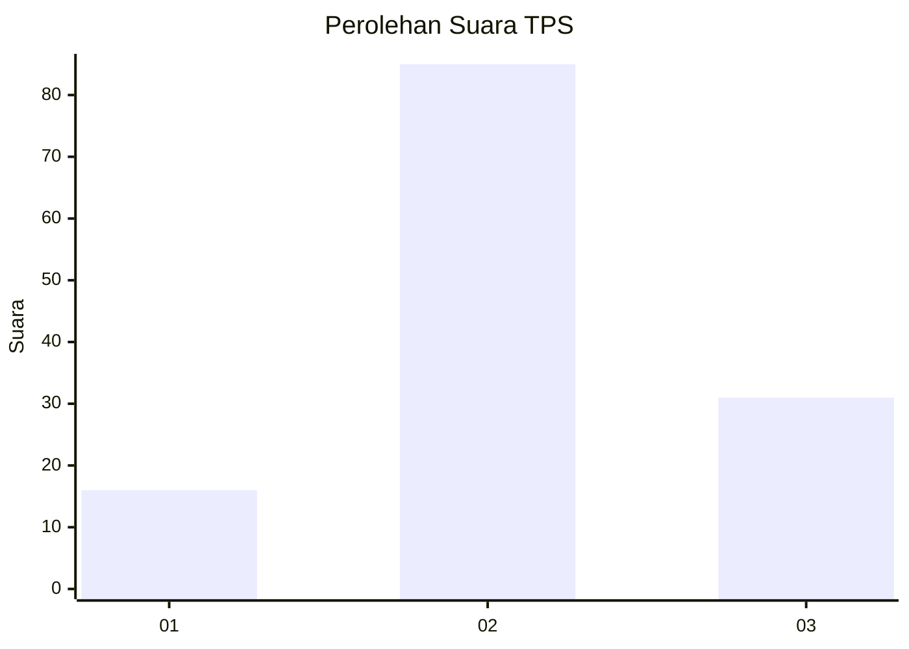
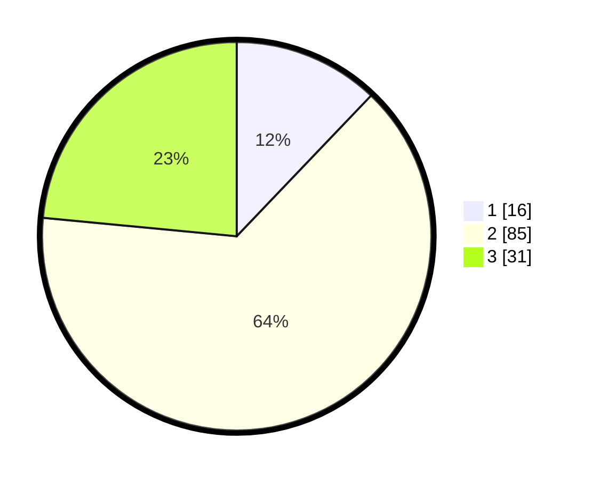

# Hasil

## Grafik

## Tabel

| No. | Nama Paslon    | Suara | Suara (raw) | Persentase |
|:--- |:-------------- | -----:| -----------:| ----------:|
| 1   | ANIES MUHAIMIN | 16    | [16][p-1]   | 12,12      |
| 2   | PRABOWO GIBRAN | 85    | [85][p-2]   | 64,39      |
| 3   | GANJAR MAHFUD  | 31    | [31][p-3]   | 23,48      |

[p-1]: https://github.com/gigit-pemilu/pemilu-2024-33-jawa-tengah/blob/main/pilpres/hitung-suara/sub/33-jawa-tengah/sub/07-wonosobo/sub/06-selomerto/sub/2023-tumenggungan/sub/012-tps/sub/paslon-1.txt
[p-2]: https://github.com/gigit-pemilu/pemilu-2024-33-jawa-tengah/blob/main/pilpres/hitung-suara/sub/33-jawa-tengah/sub/07-wonosobo/sub/06-selomerto/sub/2023-tumenggungan/sub/012-tps/sub/paslon-2.txt
[p-3]: https://github.com/gigit-pemilu/pemilu-2024-33-jawa-tengah/blob/main/pilpres/hitung-suara/sub/33-jawa-tengah/sub/07-wonosobo/sub/06-selomerto/sub/2023-tumenggungan/sub/012-tps/sub/paslon-3.txt

## Foto C Plano

https://sirekap-obj-formc.kpu.go.id/59d2/pemilu/ppwp/33/07/06/20/23/3307062023012-20240214-223509--b5e4d0aa-c000-4dd0-88c3-2b6d0b8adafc.jpg

https://sirekap-obj-formc.kpu.go.id/59d2/pemilu/ppwp/33/07/06/20/23/3307062023012-20240214-223631--3b7f8d4a-d88d-4fa7-8125-36b2fdcf720c.jpg

https://sirekap-obj-formc.kpu.go.id/59d2/pemilu/ppwp/33/07/06/20/23/3307062023012-20240214-223724--f11bb863-1962-4a74-97e4-3855060f7bec.jpg

## Metadata

| Key        | Value               |
| ---------- | ------------------- |
| Time Stamp | 2024-02-15 12:00:28 |

