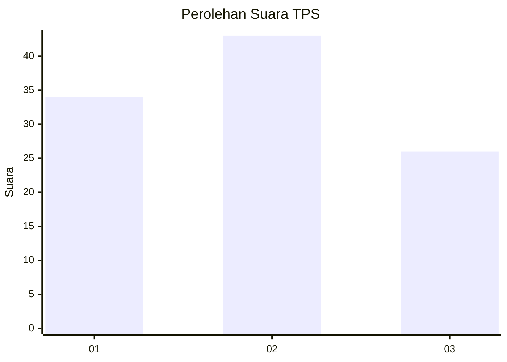
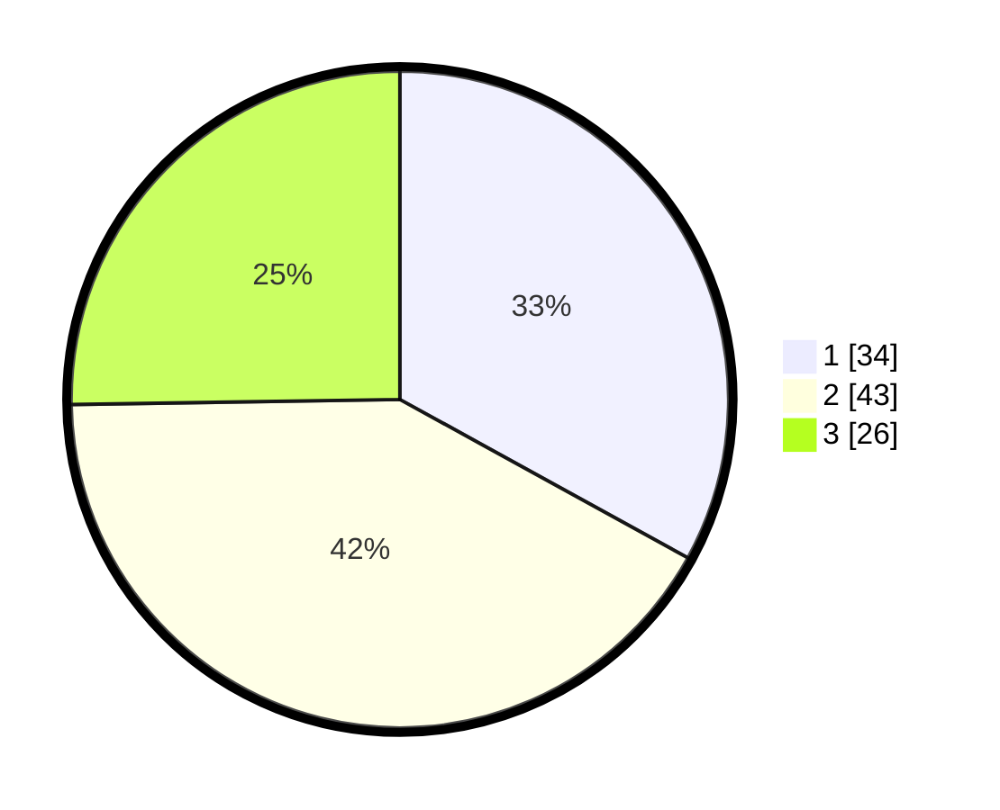

# Hasil

## Grafik

## Tabel

| No. | Nama Paslon    | Suara | Suara (raw) | Persentase |
|:--- |:-------------- | -----:| -----------:| ----------:|
| 1   | ANIES MUHAIMIN | 34    | [34][p-1]   | 33,01      |
| 2   | PRABOWO GIBRAN | 43    | [43][p-2]   | 41,75      |
| 3   | GANJAR MAHFUD  | 26    | [26][p-3]   | 25,24      |

[p-1]: https://github.com/gigit-pemilu/pemilu-2024/blob/main/pilpres/hitung-suara/sub/33-jawa-tengah/sub/07-wonosobo/sub/07-kalikajar/sub/1006-kalikajar/sub/002-tps/sub/paslon-1.txt
[p-2]: https://github.com/gigit-pemilu/pemilu-2024/blob/main/pilpres/hitung-suara/sub/33-jawa-tengah/sub/07-wonosobo/sub/07-kalikajar/sub/1006-kalikajar/sub/002-tps/sub/paslon-2.txt
[p-3]: https://github.com/gigit-pemilu/pemilu-2024/blob/main/pilpres/hitung-suara/sub/33-jawa-tengah/sub/07-wonosobo/sub/07-kalikajar/sub/1006-kalikajar/sub/002-tps/sub/paslon-3.txt

## Foto C Plano

https://sirekap-obj-formc.kpu.go.id/1433/pemilu/ppwp/33/07/07/10/06/3307071006002-20240216-003202--1aec33ad-ee2b-434b-a38b-6681f1aec38b.jpg

https://sirekap-obj-formc.kpu.go.id/1433/pemilu/ppwp/33/07/07/10/06/3307071006002-20240216-003203--7c934715-ed1c-421d-859f-23c3385184bc.jpg

https://sirekap-obj-formc.kpu.go.id/1433/pemilu/ppwp/33/07/07/10/06/3307071006002-20240216-002608--aebb85f8-badc-4ea2-b86b-6df59a90ecb5.jpg

## Metadata

| Key        | Value               |
| ---------- | ------------------- |
| Time Stamp | 2024-02-16 08:30:27 |

## DATA PEMILIH TETAP

Jumlah pemilih dalam DPT: **129**.
 * L: **60**.
 * P: **69**.

## DATA PENGGUNA HAK PILIH

Jumlah pengguna hak pilih dalam DPT: **109**.
 * L: **49**.
 * P: **60**.

Jumlah pengguna hak pilih dalam DPTb: **0**.
 * L: **0**.
 * P: **0**.

Jumlah pengguna hak pilih dalam DPK: **2**.
 * L: **1**.
 * P: **1**.

Jumlah pengguna hak pilih: **111**.
 * L: **50**.
 * P: **61**.

## JUMLAH SUARA SAH DAN TIDAK SAH

JUMLAH SELURUH SUARA SAH: **103**.

JUMLAH SUARA TIDAK SAH: **8**.

JUMLAH SELURUH SUARA SAH DAN SUARA TIDAK SAH: **111**.

