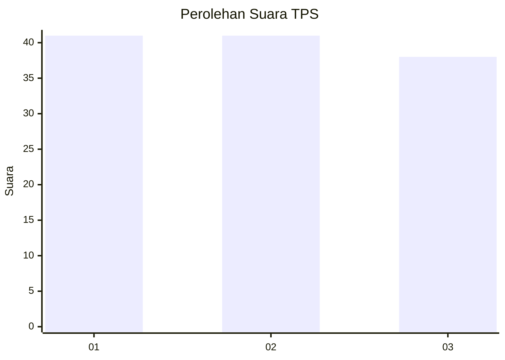
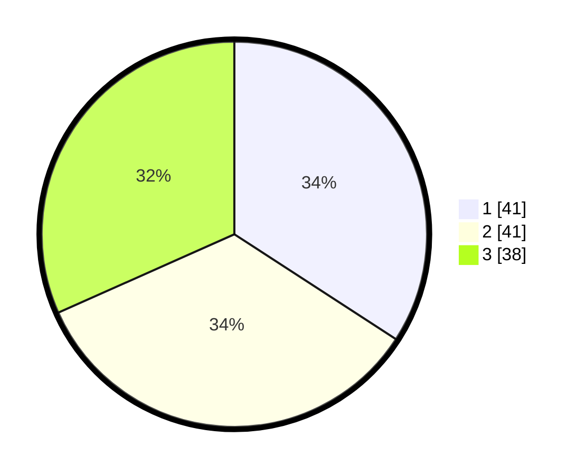

# Hasil

## Grafik

## Tabel

| No. | Nama Paslon    | Suara | Suara (raw) | Persentase |
|:--- |:-------------- | -----:| -----------:| ----------:|
| 1   | ANIES MUHAIMIN | 41    | [41][p-1]   | 34,17      |
| 2   | PRABOWO GIBRAN | 41    | [41][p-2]   | 34,17      |
| 3   | GANJAR MAHFUD  | 38    | [38][p-3]   | 31,67      |

[p-1]: https://github.com/gigit-pemilu/pemilu-2024-33-jawa-tengah/blob/main/pilpres/hitung-suara/sub/33-jawa-tengah/sub/07-wonosobo/sub/07-kalikajar/sub/1006-kalikajar/sub/022-tps/sub/paslon-1.txt
[p-2]: https://github.com/gigit-pemilu/pemilu-2024-33-jawa-tengah/blob/main/pilpres/hitung-suara/sub/33-jawa-tengah/sub/07-wonosobo/sub/07-kalikajar/sub/1006-kalikajar/sub/022-tps/sub/paslon-2.txt
[p-3]: https://github.com/gigit-pemilu/pemilu-2024-33-jawa-tengah/blob/main/pilpres/hitung-suara/sub/33-jawa-tengah/sub/07-wonosobo/sub/07-kalikajar/sub/1006-kalikajar/sub/022-tps/sub/paslon-3.txt

## Foto C Plano

https://sirekap-obj-formc.kpu.go.id/007f/pemilu/ppwp/33/07/07/10/06/3307071006022-20240215-044431--0f00aa98-6f75-4eda-b58e-9c4a269daa42.jpg

https://sirekap-obj-formc.kpu.go.id/007f/pemilu/ppwp/33/07/07/10/06/3307071006022-20240215-044404--1efe480d-dc46-4f4e-bd10-4f6dc8fee0d0.jpg

https://sirekap-obj-formc.kpu.go.id/007f/pemilu/ppwp/33/07/07/10/06/3307071006022-20240215-044457--d581ad9a-bbce-4c7e-93fe-a20de8336436.jpg

## Metadata

| Key        | Value               |
| ---------- | ------------------- |
| Time Stamp | 2024-02-16 10:00:28 |

