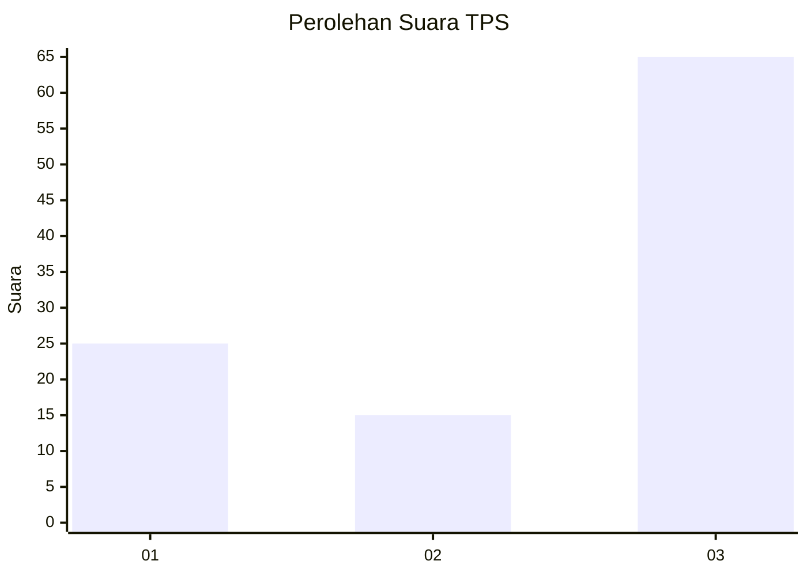
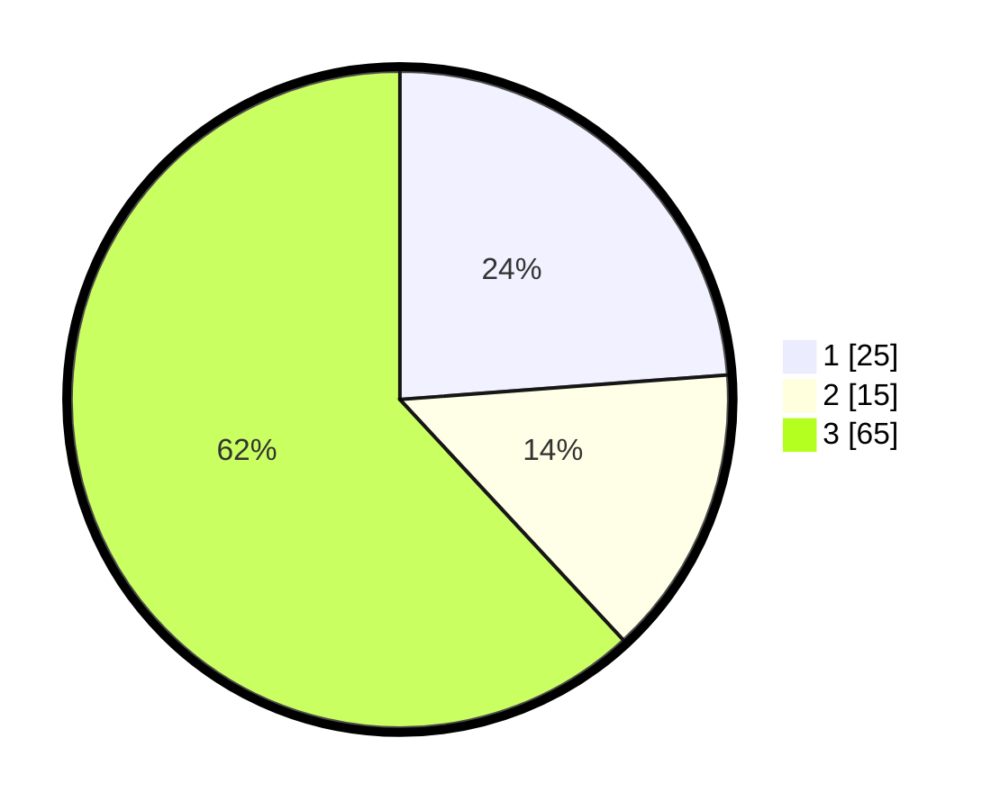

# Hasil

## Grafik

## Tabel

| No. | Nama Paslon    | Suara | Suara (raw) | Persentase |
|:--- |:-------------- | -----:| -----------:| ----------:|
| 1   | ANIES MUHAIMIN | 25    | [25][p-1]   | 23,81      |
| 2   | PRABOWO GIBRAN | 15    | [15][p-2]   | 14,29      |
| 3   | GANJAR MAHFUD  | 65    | [65][p-3]   | 61,90      |

[p-1]: https://github.com/gigit-pemilu/pemilu-2024/blob/main/pilpres/hitung-suara/sub/33-jawa-tengah/sub/07-wonosobo/sub/07-kalikajar/sub/2001-mangunrejo/sub/002-tps/sub/paslon-1.txt
[p-2]: https://github.com/gigit-pemilu/pemilu-2024/blob/main/pilpres/hitung-suara/sub/33-jawa-tengah/sub/07-wonosobo/sub/07-kalikajar/sub/2001-mangunrejo/sub/002-tps/sub/paslon-2.txt
[p-3]: https://github.com/gigit-pemilu/pemilu-2024/blob/main/pilpres/hitung-suara/sub/33-jawa-tengah/sub/07-wonosobo/sub/07-kalikajar/sub/2001-mangunrejo/sub/002-tps/sub/paslon-3.txt

## Foto C Plano

https://sirekap-obj-formc.kpu.go.id/901c/pemilu/ppwp/33/07/07/20/01/3307072001002-20240215-031440--ab2a82d0-22a6-45ab-bbe4-b007b8404fa9.jpg

https://sirekap-obj-formc.kpu.go.id/901c/pemilu/ppwp/33/07/07/20/01/3307072001002-20240215-031556--007d528f-b4b8-4974-aade-2c2bf0c3e834.jpg

https://sirekap-obj-formc.kpu.go.id/901c/pemilu/ppwp/33/07/07/20/01/3307072001002-20240215-011810--78fa8c49-adb5-4c96-8480-58dc7f4bbea0.jpg

## Metadata

| Key        | Value               |
| ---------- | ------------------- |
| Time Stamp | 2024-02-16 16:25:10 |

