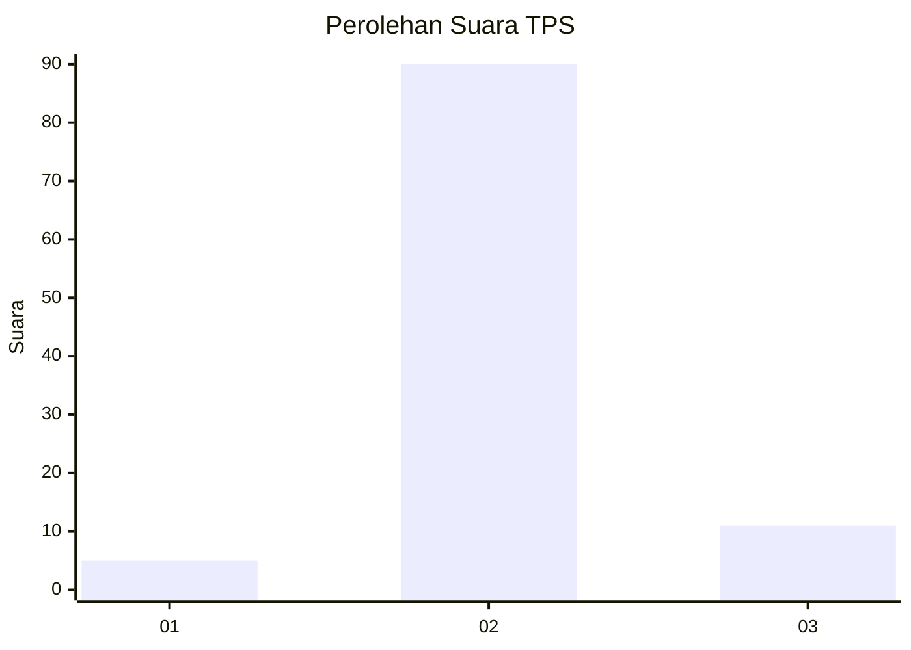
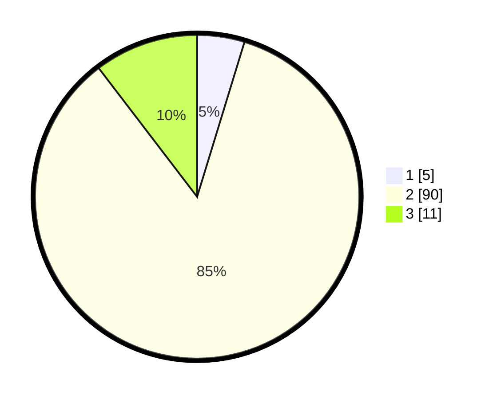

# Hasil

## Grafik

## Tabel

| No. | Nama Paslon    | Suara | Suara (raw) | Persentase |
|:--- |:-------------- | -----:| -----------:| ----------:|
| 1   | ANIES MUHAIMIN | 5     | [5][p-1]    | 4,72       |
| 2   | PRABOWO GIBRAN | 90    | [90][p-2]   | 84,91      |
| 3   | GANJAR MAHFUD  | 11    | [11][p-3]   | 10,38      |

[p-1]: https://github.com/gigit-pemilu/pemilu-2024-33-jawa-tengah/blob/main/pilpres/hitung-suara/sub/33-jawa-tengah/sub/07-wonosobo/sub/07-kalikajar/sub/2008-karangduwur/sub/003-tps/sub/paslon-1.txt
[p-2]: https://github.com/gigit-pemilu/pemilu-2024-33-jawa-tengah/blob/main/pilpres/hitung-suara/sub/33-jawa-tengah/sub/07-wonosobo/sub/07-kalikajar/sub/2008-karangduwur/sub/003-tps/sub/paslon-2.txt
[p-3]: https://github.com/gigit-pemilu/pemilu-2024-33-jawa-tengah/blob/main/pilpres/hitung-suara/sub/33-jawa-tengah/sub/07-wonosobo/sub/07-kalikajar/sub/2008-karangduwur/sub/003-tps/sub/paslon-3.txt

## Foto C Plano

https://sirekap-obj-formc.kpu.go.id/3a1e/pemilu/ppwp/33/07/07/20/08/3307072008003-20240214-213057--2f30ae26-ca6a-47f9-9a2e-0eba347d5ca1.jpg

https://sirekap-obj-formc.kpu.go.id/3a1e/pemilu/ppwp/33/07/07/20/08/3307072008003-20240214-213359--18f5ec99-4092-4959-929d-ccfd9b7642be.jpg

https://sirekap-obj-formc.kpu.go.id/3a1e/pemilu/ppwp/33/07/07/20/08/3307072008003-20240214-213614--c8e653a1-004f-4427-a3a6-ae81fac05e51.jpg

## Metadata

| Key        | Value               |
| ---------- | ------------------- |
| Time Stamp | 2024-02-16 16:25:10 |

