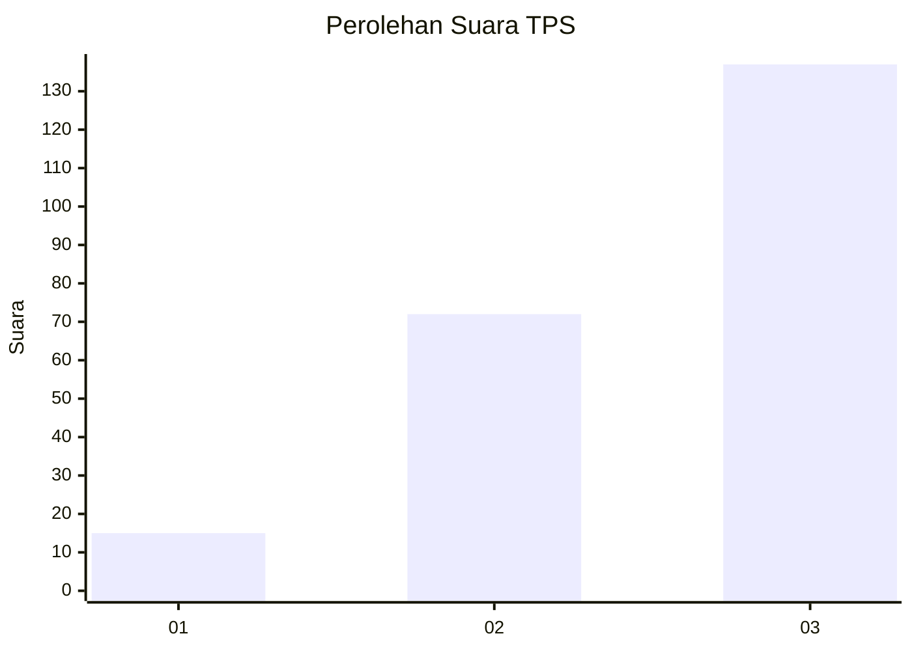
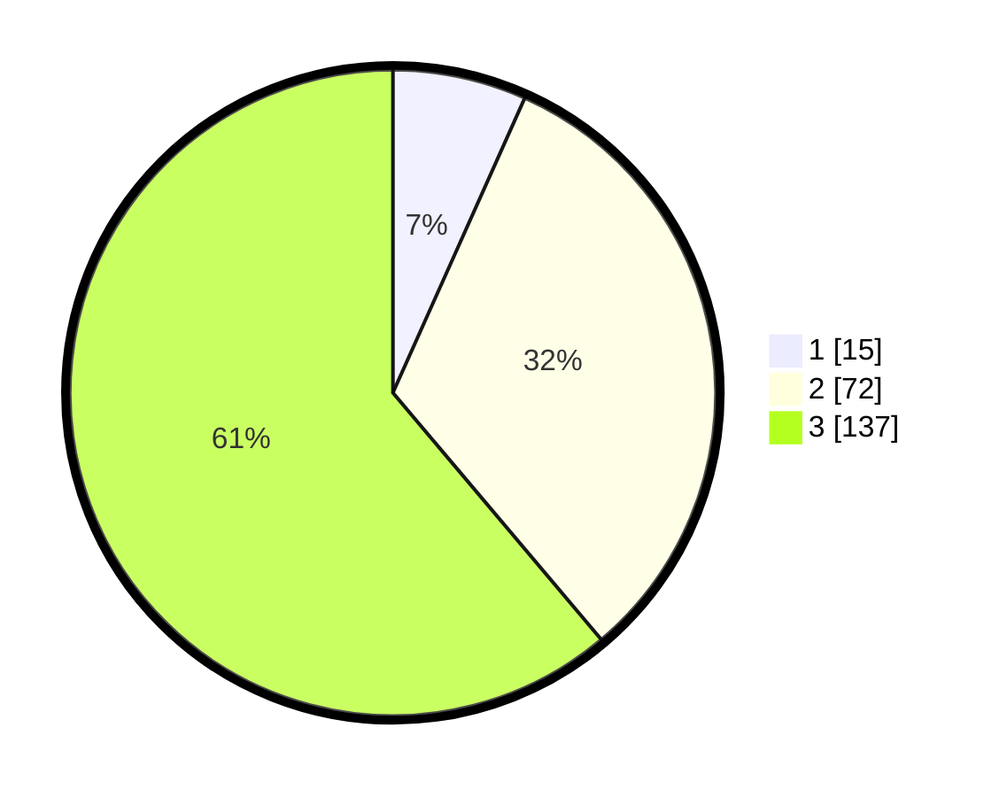

# Hasil

## Grafik

## Tabel

| No. | Nama Paslon    | Suara | Suara (raw) | Persentase |
|:--- |:-------------- | -----:| -----------:| ----------:|
| 1   | ANIES MUHAIMIN | 15    | [15][p-1]   | 6,70       |
| 2   | PRABOWO GIBRAN | 72    | [72][p-2]   | 32,14      |
| 3   | GANJAR MAHFUD  | 137   | [137][p-3]  | 61,16      |

[p-1]: https://github.com/gigit-pemilu/pemilu-2024-33-jawa-tengah/blob/main/pilpres/hitung-suara/sub/33-jawa-tengah/sub/07-wonosobo/sub/07-kalikajar/sub/2018-butuh/sub/020-tps/sub/paslon-1.txt
[p-2]: https://github.com/gigit-pemilu/pemilu-2024-33-jawa-tengah/blob/main/pilpres/hitung-suara/sub/33-jawa-tengah/sub/07-wonosobo/sub/07-kalikajar/sub/2018-butuh/sub/020-tps/sub/paslon-2.txt
[p-3]: https://github.com/gigit-pemilu/pemilu-2024-33-jawa-tengah/blob/main/pilpres/hitung-suara/sub/33-jawa-tengah/sub/07-wonosobo/sub/07-kalikajar/sub/2018-butuh/sub/020-tps/sub/paslon-3.txt

## Foto C Plano

https://sirekap-obj-formc.kpu.go.id/5f19/pemilu/ppwp/33/07/07/20/18/3307072018020-20240215-005219--a41805b2-0f8d-4000-ad46-2a36b424ce10.jpg

https://sirekap-obj-formc.kpu.go.id/5f19/pemilu/ppwp/33/07/07/20/18/3307072018020-20240216-124335--39ac00d3-84f5-41cc-8ae5-1294423e8581.jpg

https://sirekap-obj-formc.kpu.go.id/5f19/pemilu/ppwp/33/07/07/20/18/3307072018020-20240215-005851--1c9c03c0-588a-43c7-8a62-df066b51f676.jpg

## Metadata

| Key        | Value               |
| ---------- | ------------------- |
| Time Stamp | 2024-02-16 16:25:10 |

