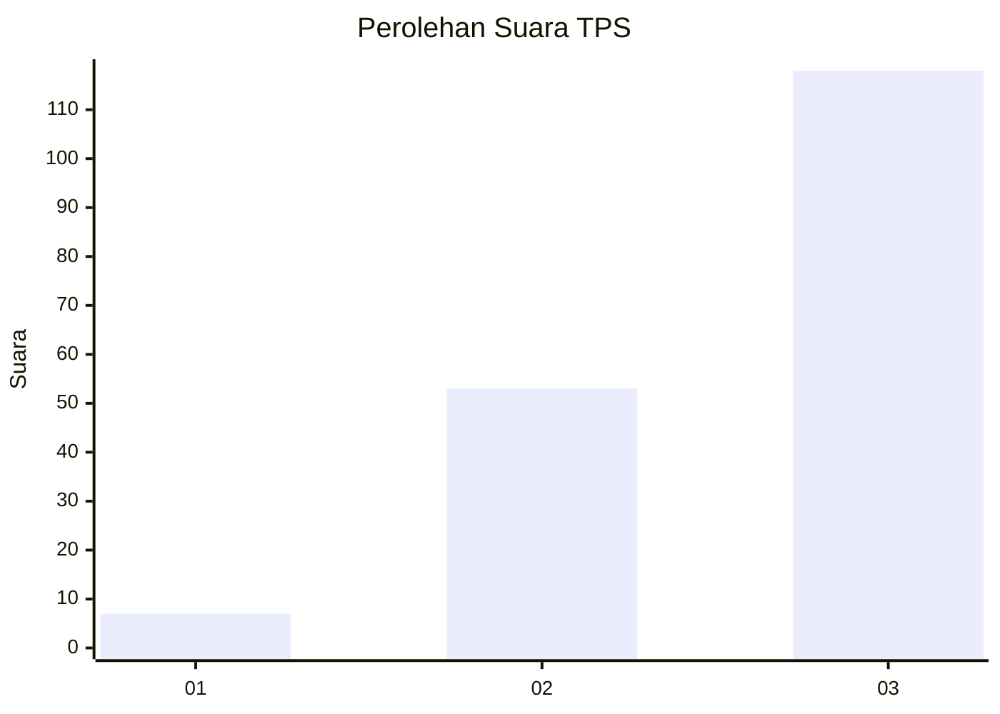
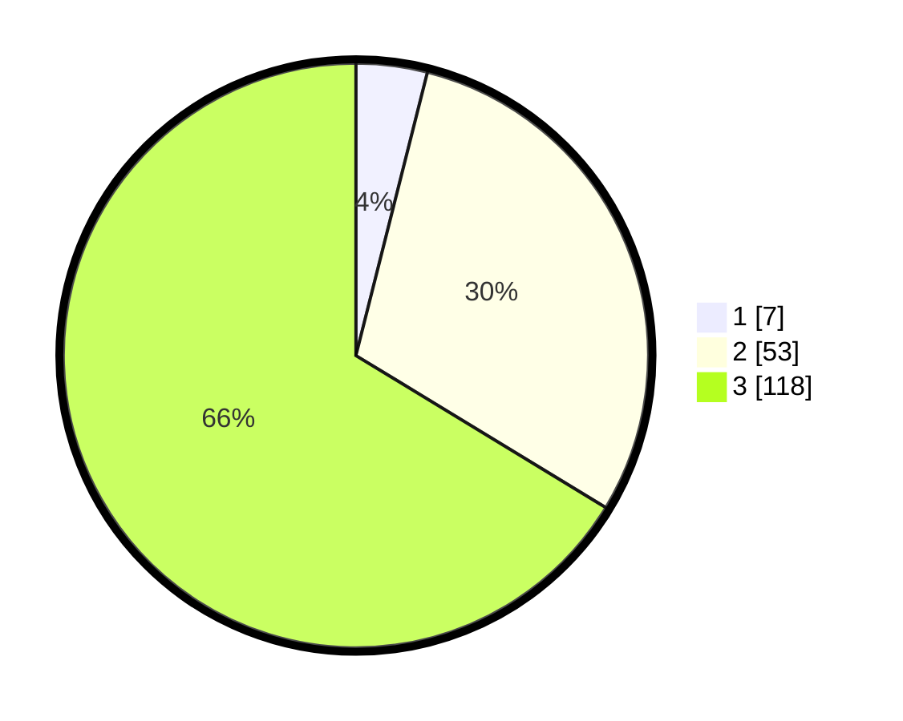

# Hasil

## Grafik

## Tabel

| No. | Nama Paslon    | Suara | Suara (raw) | Persentase |
|:--- |:-------------- | -----:| -----------:| ----------:|
| 1   | ANIES MUHAIMIN | 7     | [7][p-1]    | 3,93       |
| 2   | PRABOWO GIBRAN | 53    | [53][p-2]   | 29,78      |
| 3   | GANJAR MAHFUD  | 118   | [118][p-3]  | 66,29      |

[p-1]: https://github.com/gigit-pemilu/pemilu-2024-33-jawa-tengah/blob/main/pilpres/hitung-suara/sub/33-jawa-tengah/sub/07-wonosobo/sub/07-kalikajar/sub/2019-butuh-kidul/sub/005-tps/sub/paslon-1.txt
[p-2]: https://github.com/gigit-pemilu/pemilu-2024-33-jawa-tengah/blob/main/pilpres/hitung-suara/sub/33-jawa-tengah/sub/07-wonosobo/sub/07-kalikajar/sub/2019-butuh-kidul/sub/005-tps/sub/paslon-2.txt
[p-3]: https://github.com/gigit-pemilu/pemilu-2024-33-jawa-tengah/blob/main/pilpres/hitung-suara/sub/33-jawa-tengah/sub/07-wonosobo/sub/07-kalikajar/sub/2019-butuh-kidul/sub/005-tps/sub/paslon-3.txt

## Foto C Plano

https://sirekap-obj-formc.kpu.go.id/fd2f/pemilu/ppwp/33/07/07/20/19/3307072019005-20240215-000947--ef648f8d-8121-4305-8b21-00199d2cc097.jpg

https://sirekap-obj-formc.kpu.go.id/fd2f/pemilu/ppwp/33/07/07/20/19/3307072019005-20240215-001037--b6fd6a95-2483-4109-a8bd-68207af6bad3.jpg

https://sirekap-obj-formc.kpu.go.id/fd2f/pemilu/ppwp/33/07/07/20/19/3307072019005-20240215-001119--1f3fa929-0499-4237-82ed-9934da44fdc3.jpg

## Metadata

| Key        | Value               |
| ---------- | ------------------- |
| Time Stamp | 2024-02-17 11:30:03 |

