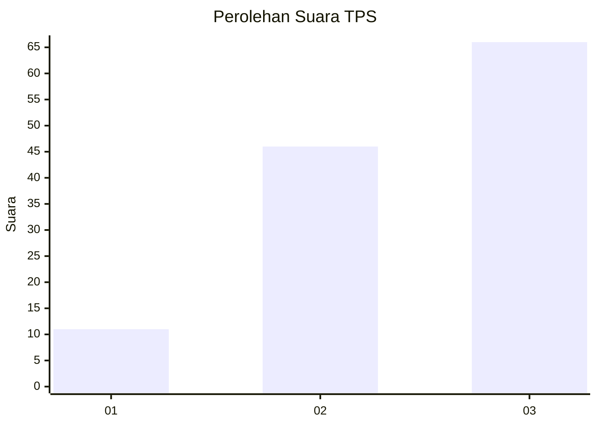
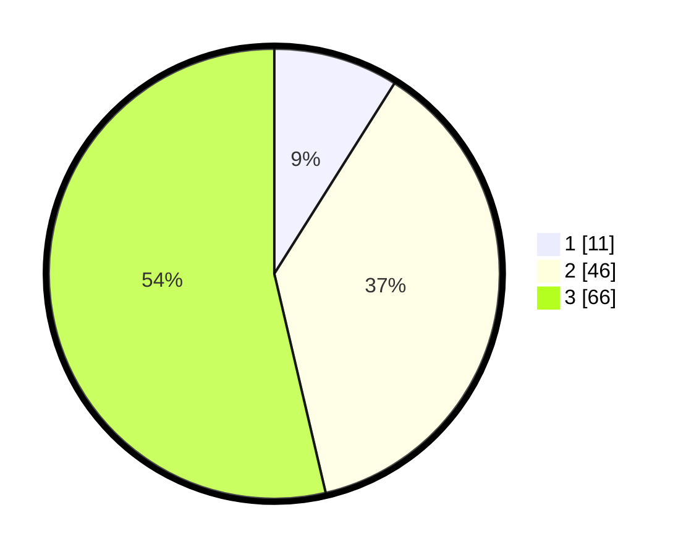

# Hasil

## Grafik

## Tabel

| No. | Nama Paslon    | Suara | Suara (raw) | Persentase |
|:--- |:-------------- | -----:| -----------:| ----------:|
| 1   | ANIES MUHAIMIN | 11    | [11][p-1]   | 8,94       |
| 2   | PRABOWO GIBRAN | 46    | [46][p-2]   | 37,40      |
| 3   | GANJAR MAHFUD  | 66    | [66][p-3]   | 53,66      |

[p-1]: https://github.com/gigit-pemilu/pemilu-2024/blob/main/pilpres/hitung-suara/sub/33-jawa-tengah/sub/07-wonosobo/sub/08-kertek/sub/1001-wringinanom/sub/003-tps/sub/paslon-1.txt
[p-2]: https://github.com/gigit-pemilu/pemilu-2024/blob/main/pilpres/hitung-suara/sub/33-jawa-tengah/sub/07-wonosobo/sub/08-kertek/sub/1001-wringinanom/sub/003-tps/sub/paslon-2.txt
[p-3]: https://github.com/gigit-pemilu/pemilu-2024/blob/main/pilpres/hitung-suara/sub/33-jawa-tengah/sub/07-wonosobo/sub/08-kertek/sub/1001-wringinanom/sub/003-tps/sub/paslon-3.txt

## Foto C Plano

https://sirekap-obj-formc.kpu.go.id/cb47/pemilu/ppwp/33/07/08/10/01/3307081001003-20240214-221508--66614a79-5842-4edb-890e-758f59660f7d.jpg

https://sirekap-obj-formc.kpu.go.id/cb47/pemilu/ppwp/33/07/08/10/01/3307081001003-20240215-182401--02f34748-1481-4dc3-9902-cd5c71b3c021.jpg

https://sirekap-obj-formc.kpu.go.id/cb47/pemilu/ppwp/33/07/08/10/01/3307081001003-20240215-182512--5da659a0-4f28-498f-9d69-3addfecc5250.jpg

## Metadata

| Key        | Value               |
| ---------- | ------------------- |
| Time Stamp | 2024-02-19 11:00:00 |

