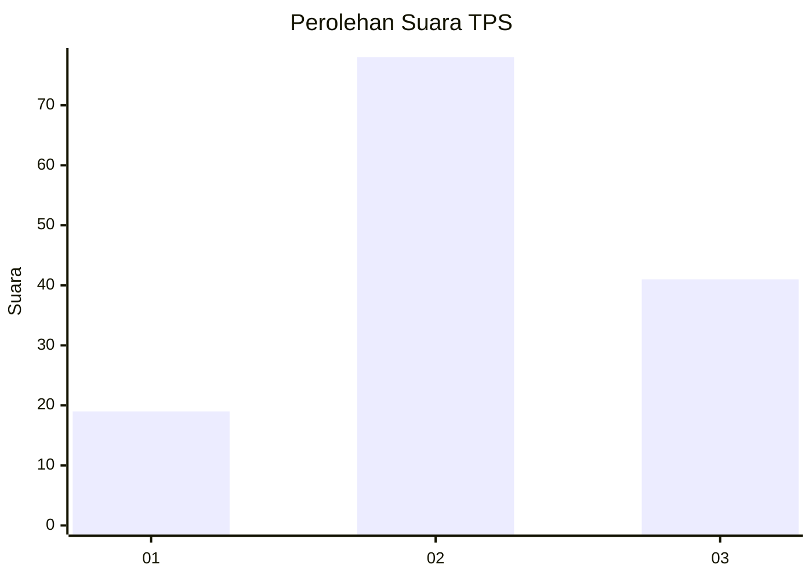
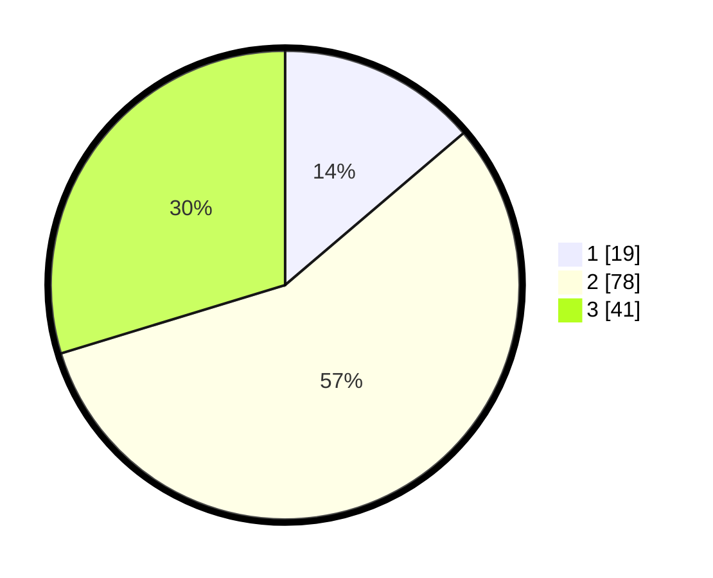

# Hasil

## Grafik

## Tabel

| No. | Nama Paslon    | Suara | Suara (raw) | Persentase |
|:--- |:-------------- | -----:| -----------:| ----------:|
| 1   | ANIES MUHAIMIN | 19    | [19][p-1]   | 13,77      |
| 2   | PRABOWO GIBRAN | 78    | [78][p-2]   | 56,52      |
| 3   | GANJAR MAHFUD  | 41    | [41][p-3]   | 29,71      |

[p-1]: https://github.com/gigit-pemilu/pemilu-2024/blob/main/pilpres/hitung-suara/sub/33-jawa-tengah/sub/07-wonosobo/sub/08-kertek/sub/1001-wringinanom/sub/004-tps/sub/paslon-1.txt
[p-2]: https://github.com/gigit-pemilu/pemilu-2024/blob/main/pilpres/hitung-suara/sub/33-jawa-tengah/sub/07-wonosobo/sub/08-kertek/sub/1001-wringinanom/sub/004-tps/sub/paslon-2.txt
[p-3]: https://github.com/gigit-pemilu/pemilu-2024/blob/main/pilpres/hitung-suara/sub/33-jawa-tengah/sub/07-wonosobo/sub/08-kertek/sub/1001-wringinanom/sub/004-tps/sub/paslon-3.txt

## Foto C Plano

https://sirekap-obj-formc.kpu.go.id/7649/pemilu/ppwp/33/07/08/10/01/3307081001004-20240214-204108--46182dfe-3ccd-49e2-a0da-7510d35ed345.jpg

https://sirekap-obj-formc.kpu.go.id/7649/pemilu/ppwp/33/07/08/10/01/3307081001004-20240214-204512--b4cb5070-1d5b-438f-903c-f064b3db00b3.jpg

https://sirekap-obj-formc.kpu.go.id/7649/pemilu/ppwp/33/07/08/10/01/3307081001004-20240214-204819--e499e564-e243-401a-aa14-05cf0e17c402.jpg

## Metadata

| Key        | Value               |
| ---------- | ------------------- |
| Time Stamp | 2024-02-15 00:41:44 |

