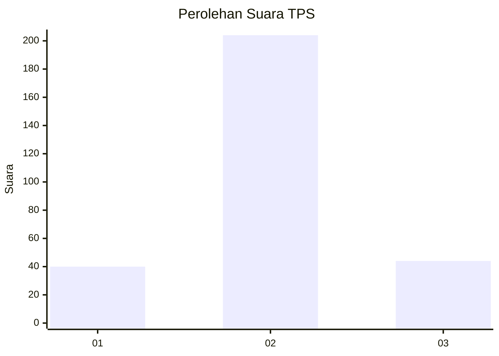

# Hasil

## Grafik

## Tabel

| No. | Nama Paslon    | Suara | Suara (raw) | Persentase |
|:--- |:-------------- | -----:| -----------:| ----------:|
| 1   | ANIES MUHAIMIN | 40    | [40][p-1]   | 13,89      |
| 2   | PRABOWO GIBRAN | 204   | [204][p-2]  | 70,83      |
| 3   | GANJAR MAHFUD  | 44    | [44][p-3]   | 15,28      |

[p-1]: https://github.com/gigit-pemilu/pemilu-2024-33-jawa-tengah/blob/main/pilpres/hitung-suara/sub/33-jawa-tengah/sub/07-wonosobo/sub/08-kertek/sub/2002-sudungdewo/sub/012-tps/sub/paslon-1.txt
[p-2]: https://github.com/gigit-pemilu/pemilu-2024-33-jawa-tengah/blob/main/pilpres/hitung-suara/sub/33-jawa-tengah/sub/07-wonosobo/sub/08-kertek/sub/2002-sudungdewo/sub/012-tps/sub/paslon-2.txt
[p-3]: https://github.com/gigit-pemilu/pemilu-2024-33-jawa-tengah/blob/main/pilpres/hitung-suara/sub/33-jawa-tengah/sub/07-wonosobo/sub/08-kertek/sub/2002-sudungdewo/sub/012-tps/sub/paslon-3.txt

## Foto C Plano

https://sirekap-obj-formc.kpu.go.id/839b/pemilu/ppwp/33/07/08/20/02/3307082002012-20240215-013649--ed60e2a2-d7ff-4c8c-b0e0-e68eab03185d.jpg

https://sirekap-obj-formc.kpu.go.id/839b/pemilu/ppwp/33/07/08/20/02/3307082002012-20240215-013746--a157f423-5ffb-4765-b255-0a418b38ccbb.jpg

https://sirekap-obj-formc.kpu.go.id/839b/pemilu/ppwp/33/07/08/20/02/3307082002012-20240215-013809--084f1acc-96ba-4215-bc5b-83401c122614.jpg

## Metadata

| Key        | Value               |
| ---------- | ------------------- |
| Time Stamp | 2024-02-15 15:00:29 |

