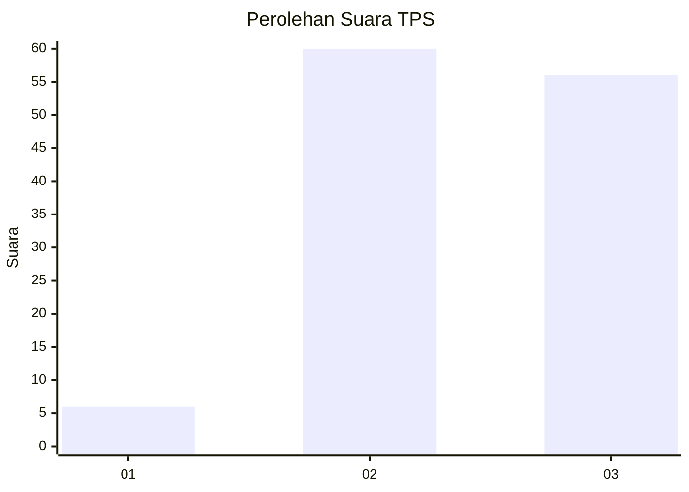
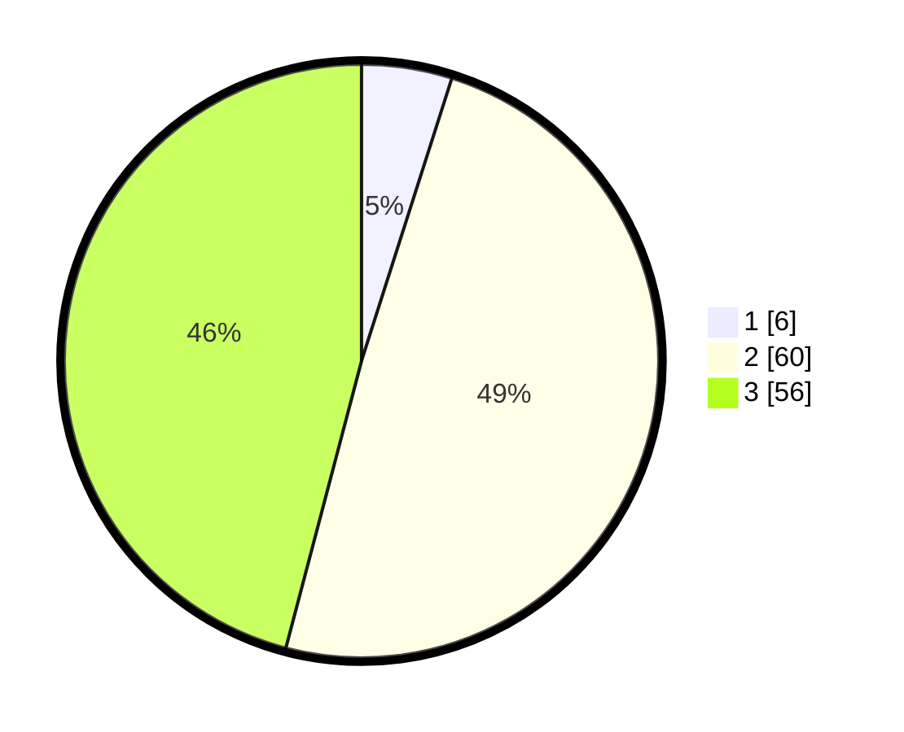

# Hasil

## Grafik

## Tabel

| No. | Nama Paslon    | Suara | Suara (raw) | Persentase |
|:--- |:-------------- | -----:| -----------:| ----------:|
| 1   | ANIES MUHAIMIN | 6     | [6][p-1]    | 4,92       |
| 2   | PRABOWO GIBRAN | 60    | [60][p-2]   | 49,18      |
| 3   | GANJAR MAHFUD  | 56    | [56][p-3]   | 45,90      |

[p-1]: https://github.com/gigit-pemilu/pemilu-2024-33-jawa-tengah/blob/main/pilpres/hitung-suara/sub/33-jawa-tengah/sub/07-wonosobo/sub/08-kertek/sub/2004-ngadikusuman/sub/012-tps/sub/paslon-1.txt
[p-2]: https://github.com/gigit-pemilu/pemilu-2024-33-jawa-tengah/blob/main/pilpres/hitung-suara/sub/33-jawa-tengah/sub/07-wonosobo/sub/08-kertek/sub/2004-ngadikusuman/sub/012-tps/sub/paslon-2.txt
[p-3]: https://github.com/gigit-pemilu/pemilu-2024-33-jawa-tengah/blob/main/pilpres/hitung-suara/sub/33-jawa-tengah/sub/07-wonosobo/sub/08-kertek/sub/2004-ngadikusuman/sub/012-tps/sub/paslon-3.txt

## Foto C Plano

https://sirekap-obj-formc.kpu.go.id/dc64/pemilu/ppwp/33/07/08/20/04/3307082004012-20240215-005542--78663d62-2be6-49a7-a74d-770e4db90ead.jpg

https://sirekap-obj-formc.kpu.go.id/dc64/pemilu/ppwp/33/07/08/20/04/3307082004012-20240215-005605--032801c4-0e16-4634-a321-74287beb2c32.jpg

https://sirekap-obj-formc.kpu.go.id/dc64/pemilu/ppwp/33/07/08/20/04/3307082004012-20240215-005633--e87d36ac-dc8d-4db0-95bd-6134864e003a.jpg

## Metadata

| Key        | Value               |
| ---------- | ------------------- |
| Time Stamp | 2024-02-15 15:00:29 |

