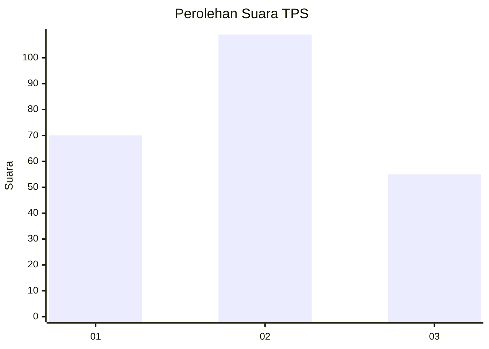
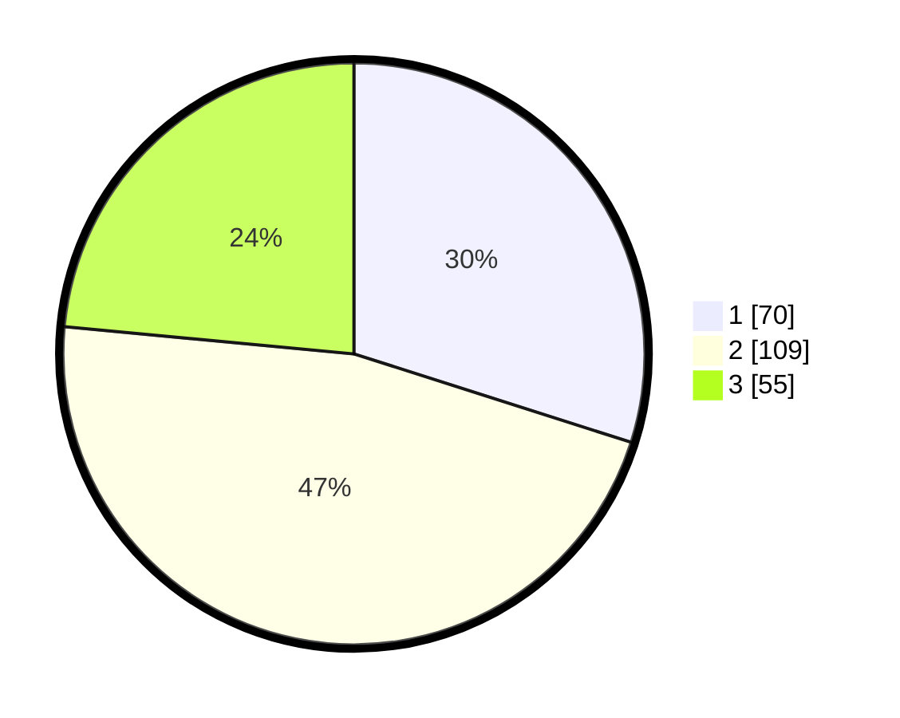

# Hasil

## Grafik

## Tabel

| No. | Nama Paslon    | Suara | Suara (raw) | Persentase |
|:--- |:-------------- | -----:| -----------:| ----------:|
| 1   | ANIES MUHAIMIN | 70    | [70][p-1]   | 29,91      |
| 2   | PRABOWO GIBRAN | 109   | [109][p-2]  | 46,58      |
| 3   | GANJAR MAHFUD  | 55    | [55][p-3]   | 23,50      |

[p-1]: https://github.com/gigit-pemilu/pemilu-2024/blob/main/pilpres/hitung-suara/sub/33-jawa-tengah/sub/07-wonosobo/sub/08-kertek/sub/2009-sumberdalem/sub/007-tps/sub/paslon-1.txt
[p-2]: https://github.com/gigit-pemilu/pemilu-2024/blob/main/pilpres/hitung-suara/sub/33-jawa-tengah/sub/07-wonosobo/sub/08-kertek/sub/2009-sumberdalem/sub/007-tps/sub/paslon-2.txt
[p-3]: https://github.com/gigit-pemilu/pemilu-2024/blob/main/pilpres/hitung-suara/sub/33-jawa-tengah/sub/07-wonosobo/sub/08-kertek/sub/2009-sumberdalem/sub/007-tps/sub/paslon-3.txt

## Foto C Plano

https://sirekap-obj-formc.kpu.go.id/f6f6/pemilu/ppwp/33/07/08/20/09/3307082009007-20240215-011112--0fb2bca7-e0c3-4a03-9b0e-963eabff2fa1.jpg

https://sirekap-obj-formc.kpu.go.id/f6f6/pemilu/ppwp/33/07/08/20/09/3307082009007-20240215-011230--4bb82066-a7e9-4031-9a53-c9e42bc2ecbc.jpg

https://sirekap-obj-formc.kpu.go.id/f6f6/pemilu/ppwp/33/07/08/20/09/3307082009007-20240215-011345--235f73a8-d52d-4cea-a632-f7203ee863e4.jpg

## Metadata

| Key        | Value               |
| ---------- | ------------------- |
| Time Stamp | 2024-02-16 17:30:00 |

