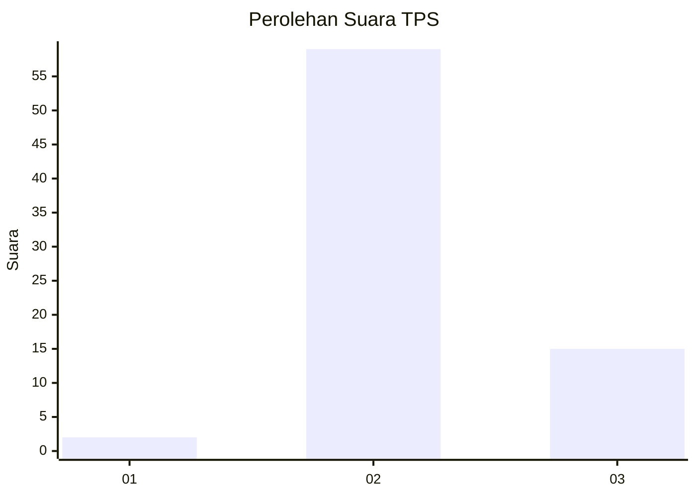

# Hasil

## Grafik

## Tabel

| No. | Nama Paslon    | Suara | Suara (raw) | Persentase |
|:--- |:-------------- | -----:| -----------:| ----------:|
| 1   | ANIES MUHAIMIN | 2     | [2][p-1]    | 2,63       |
| 2   | PRABOWO GIBRAN | 59    | [59][p-2]   | 77,63      |
| 3   | GANJAR MAHFUD  | 15    | [15][p-3]   | 19,74      |

[p-1]: https://github.com/gigit-pemilu/pemilu-2024/blob/main/pilpres/hitung-suara/sub/33-jawa-tengah/sub/07-wonosobo/sub/08-kertek/sub/2011-karangluhur/sub/022-tps/sub/paslon-1.txt
[p-2]: https://github.com/gigit-pemilu/pemilu-2024/blob/main/pilpres/hitung-suara/sub/33-jawa-tengah/sub/07-wonosobo/sub/08-kertek/sub/2011-karangluhur/sub/022-tps/sub/paslon-2.txt
[p-3]: https://github.com/gigit-pemilu/pemilu-2024/blob/main/pilpres/hitung-suara/sub/33-jawa-tengah/sub/07-wonosobo/sub/08-kertek/sub/2011-karangluhur/sub/022-tps/sub/paslon-3.txt

## Foto C Plano

https://sirekap-obj-formc.kpu.go.id/4b26/pemilu/ppwp/33/07/08/20/11/3307082011022-20240214-141657--19b69341-8169-4cb6-b68a-a95fad80be07.jpg

https://sirekap-obj-formc.kpu.go.id/4b26/pemilu/ppwp/33/07/08/20/11/3307082011022-20240214-195734--dd864619-577e-4891-a7c4-c123c1eb76ca.jpg

https://sirekap-obj-formc.kpu.go.id/4b26/pemilu/ppwp/33/07/08/20/11/3307082011022-20240214-225053--577b25b0-0ba5-47d3-89fa-b4191104d381.jpg

## Metadata

| Key        | Value               |
| ---------- | ------------------- |
| Time Stamp | 2024-02-15 04:00:24 |

