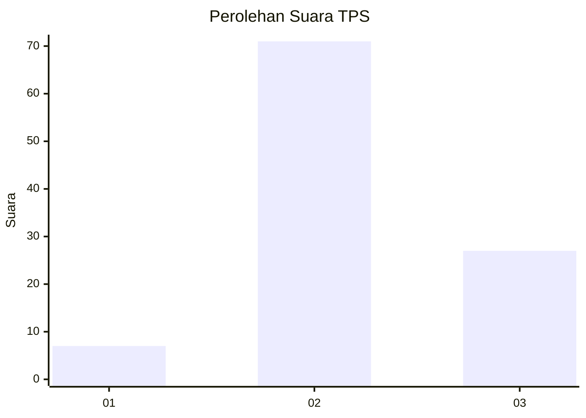
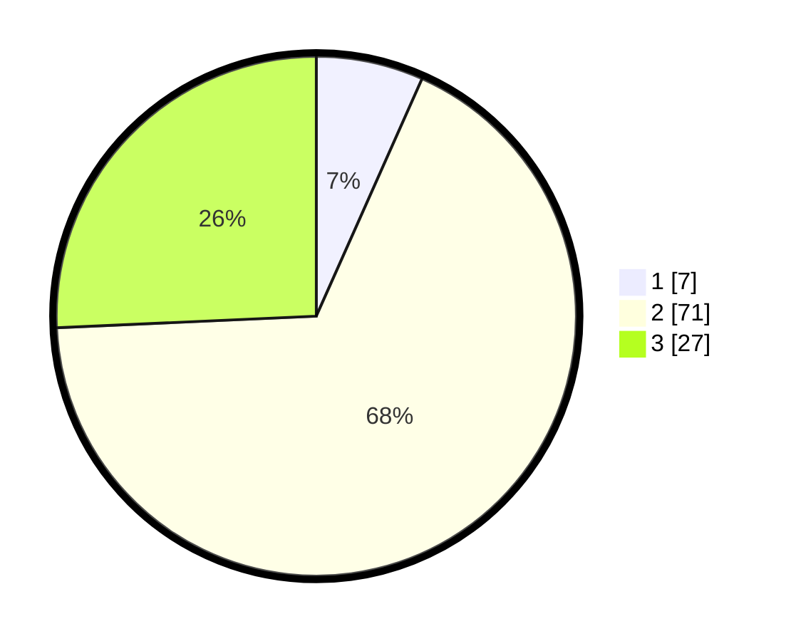

# Hasil

## Grafik

## Tabel

| No. | Nama Paslon    | Suara | Suara (raw) | Persentase |
|:--- |:-------------- | -----:| -----------:| ----------:|
| 1   | ANIES MUHAIMIN | 7     | [7][p-1]    | 6,67       |
| 2   | PRABOWO GIBRAN | 71    | [71][p-2]   | 67,62      |
| 3   | GANJAR MAHFUD  | 27    | [27][p-3]   | 25,71      |

[p-1]: https://github.com/gigit-pemilu/pemilu-2024/blob/main/pilpres/hitung-suara/sub/33-jawa-tengah/sub/07-wonosobo/sub/08-kertek/sub/2014-damarkasiyan/sub/004-tps/sub/paslon-1.txt
[p-2]: https://github.com/gigit-pemilu/pemilu-2024/blob/main/pilpres/hitung-suara/sub/33-jawa-tengah/sub/07-wonosobo/sub/08-kertek/sub/2014-damarkasiyan/sub/004-tps/sub/paslon-2.txt
[p-3]: https://github.com/gigit-pemilu/pemilu-2024/blob/main/pilpres/hitung-suara/sub/33-jawa-tengah/sub/07-wonosobo/sub/08-kertek/sub/2014-damarkasiyan/sub/004-tps/sub/paslon-3.txt

## Foto C Plano

https://sirekap-obj-formc.kpu.go.id/7f68/pemilu/ppwp/33/07/08/20/14/3307082014004-20240214-231030--8405fba5-0e39-4c45-9c7e-786d16d14b1a.jpg

https://sirekap-obj-formc.kpu.go.id/7f68/pemilu/ppwp/33/07/08/20/14/3307082014004-20240214-231105--07e79ce1-71c7-46d0-a3aa-60c9cc091450.jpg

https://sirekap-obj-formc.kpu.go.id/7f68/pemilu/ppwp/33/07/08/20/14/3307082014004-20240214-231122--0c78aa80-644c-4d35-9bba-f6689f5e4b1a.jpg

## Metadata

| Key        | Value               |
| ---------- | ------------------- |
| Time Stamp | 2024-02-15 15:30:25 |

