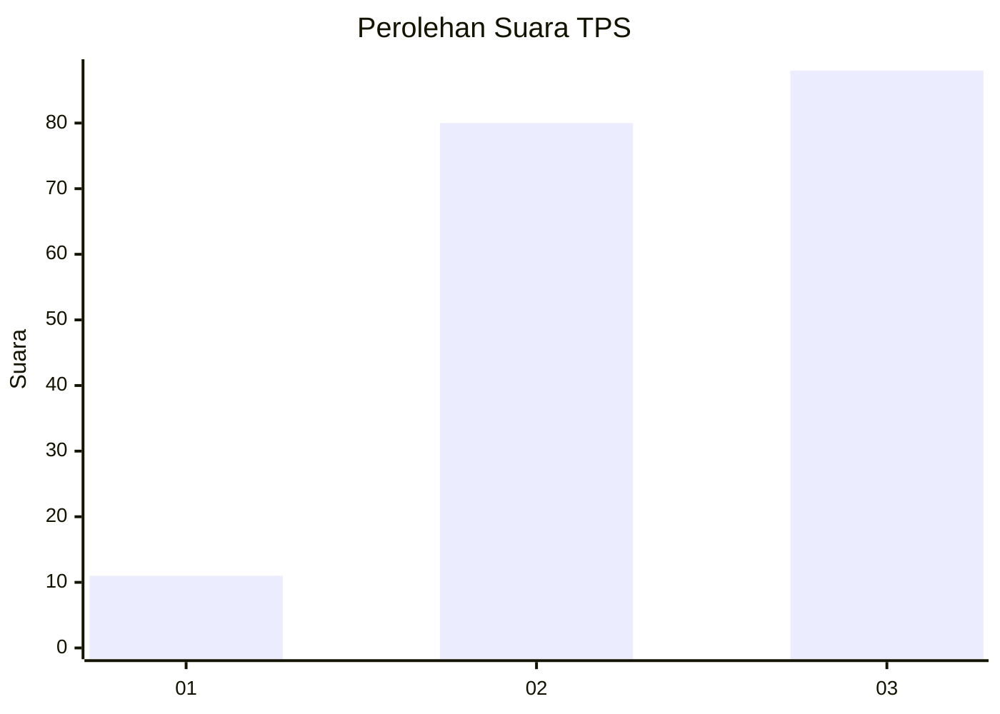
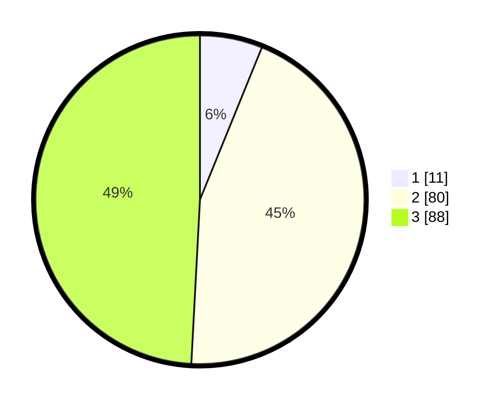

# Hasil

## Grafik

## Tabel

| No. | Nama Paslon    | Suara | Suara (raw) | Persentase |
|:--- |:-------------- | -----:| -----------:| ----------:|
| 1   | ANIES MUHAIMIN | 11    | [11][p-1]   | 6,15       |
| 2   | PRABOWO GIBRAN | 80    | [80][p-2]   | 44,69      |
| 3   | GANJAR MAHFUD  | 88    | [88][p-3]   | 49,16      |

[p-1]: https://github.com/gigit-pemilu/pemilu-2024/blob/main/pilpres/hitung-suara/sub/33-jawa-tengah/sub/07-wonosobo/sub/08-kertek/sub/2017-candimulyo/sub/004-tps/sub/paslon-1.txt
[p-2]: https://github.com/gigit-pemilu/pemilu-2024/blob/main/pilpres/hitung-suara/sub/33-jawa-tengah/sub/07-wonosobo/sub/08-kertek/sub/2017-candimulyo/sub/004-tps/sub/paslon-2.txt
[p-3]: https://github.com/gigit-pemilu/pemilu-2024/blob/main/pilpres/hitung-suara/sub/33-jawa-tengah/sub/07-wonosobo/sub/08-kertek/sub/2017-candimulyo/sub/004-tps/sub/paslon-3.txt

## Foto C Plano

https://sirekap-obj-formc.kpu.go.id/e50b/pemilu/ppwp/33/07/08/20/17/3307082017004-20240215-101326--fbf4807a-6713-4867-992a-1f7ac0f6b7d3.jpg

https://sirekap-obj-formc.kpu.go.id/e50b/pemilu/ppwp/33/07/08/20/17/3307082017004-20240215-101445--71b018be-2ce6-497b-8a69-fcb9b0bf6ae2.jpg

https://sirekap-obj-formc.kpu.go.id/e50b/pemilu/ppwp/33/07/08/20/17/3307082017004-20240215-101601--d1e52791-c408-460f-9a93-33fcdc22b796.jpg

## Metadata

| Key        | Value               |
| ---------- | ------------------- |
| Time Stamp | 2024-02-24 22:31:28 |

