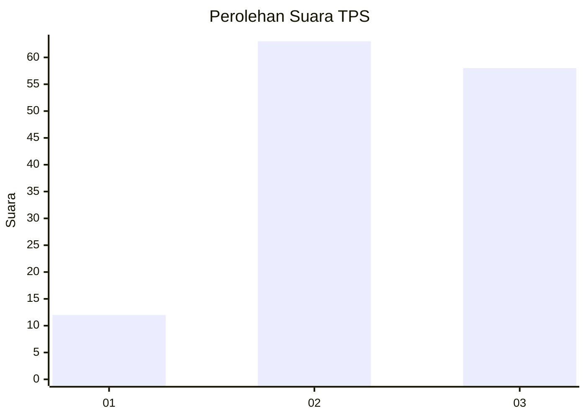
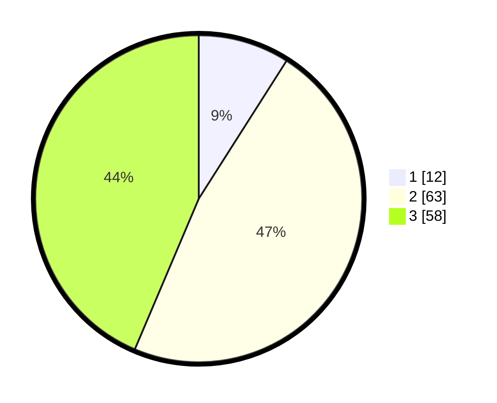

# Hasil

## Grafik

## Tabel

| No. | Nama Paslon    | Suara | Suara (raw) | Persentase |
|:--- |:-------------- | -----:| -----------:| ----------:|
| 1   | ANIES MUHAIMIN | 12    | [12][p-1]   | 9,02       |
| 2   | PRABOWO GIBRAN | 63    | [63][p-2]   | 47,37      |
| 3   | GANJAR MAHFUD  | 58    | [58][p-3]   | 43,61      |

[p-1]: https://github.com/gigit-pemilu/pemilu-2024/blob/main/pilpres/hitung-suara/sub/33-jawa-tengah/sub/07-wonosobo/sub/08-kertek/sub/2017-candimulyo/sub/008-tps/sub/paslon-1.txt
[p-2]: https://github.com/gigit-pemilu/pemilu-2024/blob/main/pilpres/hitung-suara/sub/33-jawa-tengah/sub/07-wonosobo/sub/08-kertek/sub/2017-candimulyo/sub/008-tps/sub/paslon-2.txt
[p-3]: https://github.com/gigit-pemilu/pemilu-2024/blob/main/pilpres/hitung-suara/sub/33-jawa-tengah/sub/07-wonosobo/sub/08-kertek/sub/2017-candimulyo/sub/008-tps/sub/paslon-3.txt

## Foto C Plano

https://sirekap-obj-formc.kpu.go.id/81ab/pemilu/ppwp/33/07/08/20/17/3307082017008-20240214-214026--109d3bef-8ed6-48ee-83b2-3bf8bf7090d5.jpg

https://sirekap-obj-formc.kpu.go.id/81ab/pemilu/ppwp/33/07/08/20/17/3307082017008-20240214-214258--beeda154-ef99-4162-a6a9-bec1e5072f59.jpg

https://sirekap-obj-formc.kpu.go.id/81ab/pemilu/ppwp/33/07/08/20/17/3307082017008-20240214-214416--15262724-fa3b-4310-89f4-752d2054f642.jpg

## Metadata

| Key        | Value               |
| ---------- | ------------------- |
| Time Stamp | 2024-02-25 15:00:00 |

