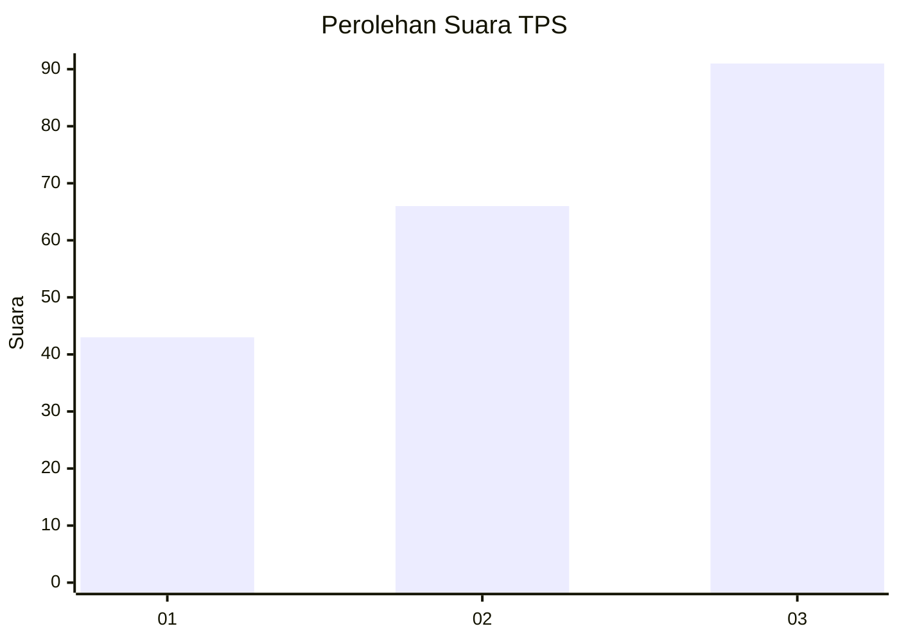
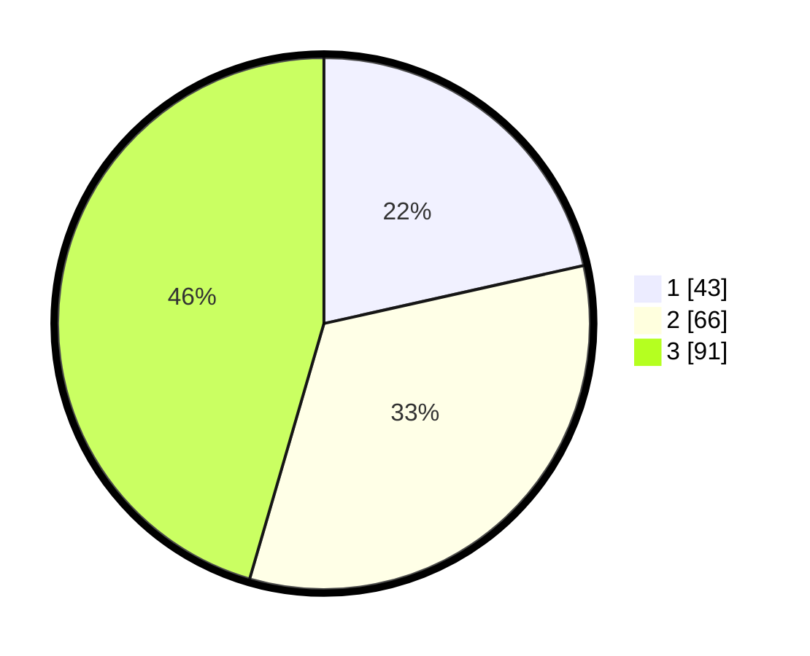

# Hasil

## Grafik

## Tabel

| No. | Nama Paslon    | Suara | Suara (raw) | Persentase |
|:--- |:-------------- | -----:| -----------:| ----------:|
| 1   | ANIES MUHAIMIN | 43    | [43][p-1]   | 21,50      |
| 2   | PRABOWO GIBRAN | 66    | [66][p-2]   | 33,00      |
| 3   | GANJAR MAHFUD  | 91    | [91][p-3]   | 45,50      |

[p-1]: https://github.com/gigit-pemilu/pemilu-2024/blob/main/pilpres/hitung-suara/sub/33-jawa-tengah/sub/07-wonosobo/sub/08-kertek/sub/2021-reco/sub/019-tps/sub/paslon-1.txt
[p-2]: https://github.com/gigit-pemilu/pemilu-2024/blob/main/pilpres/hitung-suara/sub/33-jawa-tengah/sub/07-wonosobo/sub/08-kertek/sub/2021-reco/sub/019-tps/sub/paslon-2.txt
[p-3]: https://github.com/gigit-pemilu/pemilu-2024/blob/main/pilpres/hitung-suara/sub/33-jawa-tengah/sub/07-wonosobo/sub/08-kertek/sub/2021-reco/sub/019-tps/sub/paslon-3.txt

## Foto C Plano

https://sirekap-obj-formc.kpu.go.id/6394/pemilu/ppwp/33/07/08/20/21/3307082021019-20240214-184541--27356083-f9bc-4a03-a7fc-2e6c8992efa8.jpg

https://sirekap-obj-formc.kpu.go.id/6394/pemilu/ppwp/33/07/08/20/21/3307082021019-20240214-184551--4740cc9e-75b9-4143-b59f-f27a6d98d9ad.jpg

https://sirekap-obj-formc.kpu.go.id/6394/pemilu/ppwp/33/07/08/20/21/3307082021019-20240214-184710--b80b5f5a-b773-4eab-be83-95b3793cf342.jpg

## Metadata

| Key        | Value               |
| ---------- | ------------------- |
| Time Stamp | 2024-02-15 00:41:44 |

