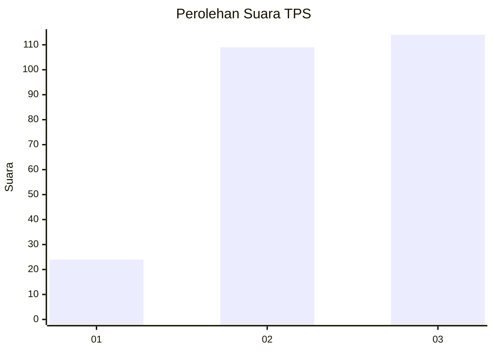
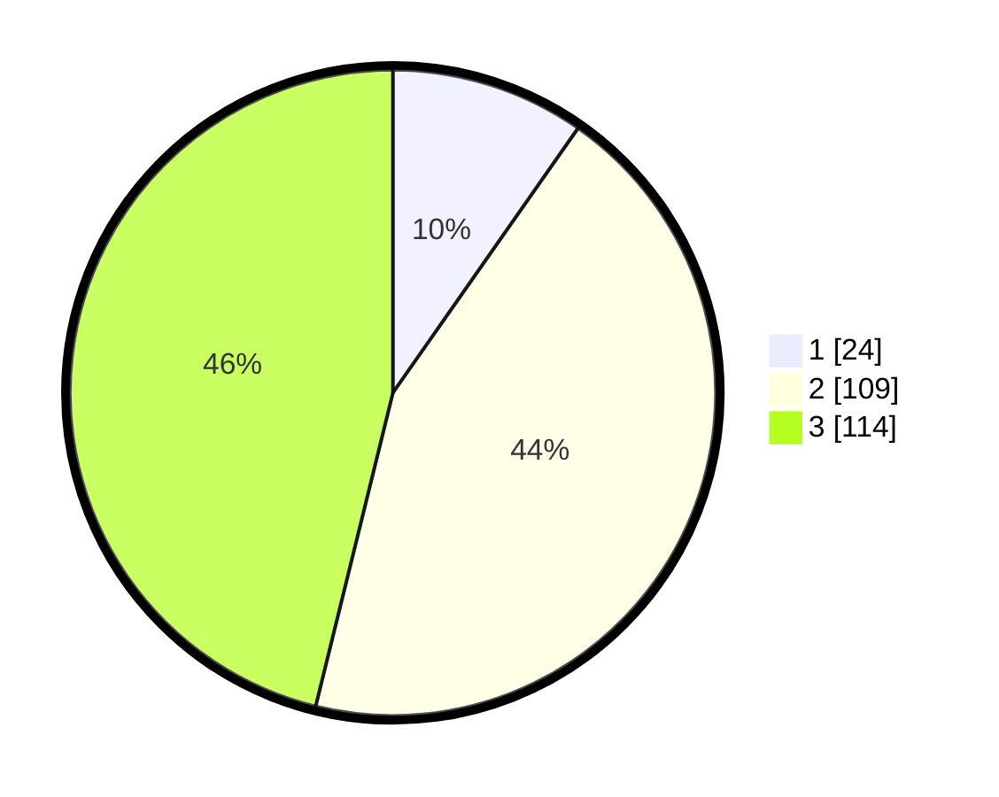

# Hasil

## Grafik

## Tabel

| No. | Nama Paslon    | Suara | Suara (raw) | Persentase |
|:--- |:-------------- | -----:| -----------:| ----------:|
| 1   | ANIES MUHAIMIN | 24    | [24][p-1]   | 9,72       |
| 2   | PRABOWO GIBRAN | 109   | [109][p-2]  | 44,13      |
| 3   | GANJAR MAHFUD  | 114   | [114][p-3]  | 46,15      |

[p-1]: https://github.com/gigit-pemilu/pemilu-2024/blob/main/pilpres/hitung-suara/sub/33-jawa-tengah/sub/07-wonosobo/sub/08-kertek/sub/2021-reco/sub/023-tps/sub/paslon-1.txt
[p-2]: https://github.com/gigit-pemilu/pemilu-2024/blob/main/pilpres/hitung-suara/sub/33-jawa-tengah/sub/07-wonosobo/sub/08-kertek/sub/2021-reco/sub/023-tps/sub/paslon-2.txt
[p-3]: https://github.com/gigit-pemilu/pemilu-2024/blob/main/pilpres/hitung-suara/sub/33-jawa-tengah/sub/07-wonosobo/sub/08-kertek/sub/2021-reco/sub/023-tps/sub/paslon-3.txt

## Foto C Plano

https://sirekap-obj-formc.kpu.go.id/fd1d/pemilu/ppwp/33/07/08/20/21/3307082021023-20240214-232732--6769de0a-d11a-4b3d-96e2-cf11aae930d9.jpg

https://sirekap-obj-formc.kpu.go.id/fd1d/pemilu/ppwp/33/07/08/20/21/3307082021023-20240214-232555--eaabfe86-9e68-405f-b1ce-464c12285d39.jpg

https://sirekap-obj-formc.kpu.go.id/fd1d/pemilu/ppwp/33/07/08/20/21/3307082021023-20240214-214931--0feda131-5972-4670-90db-179e25fa5ca0.jpg

## Metadata

| Key        | Value               |
| ---------- | ------------------- |
| Time Stamp | 2024-02-15 17:00:25 |

