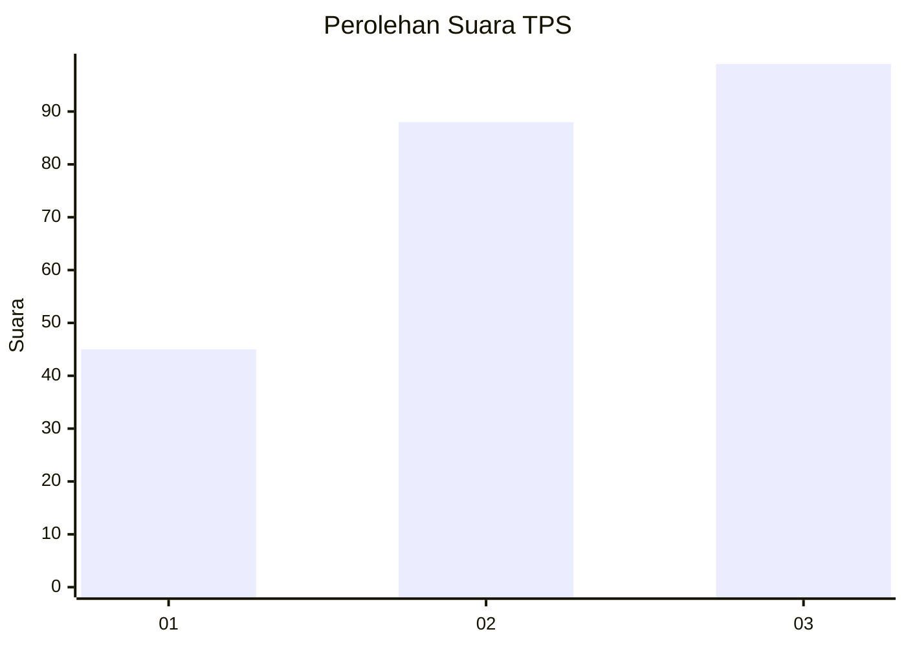
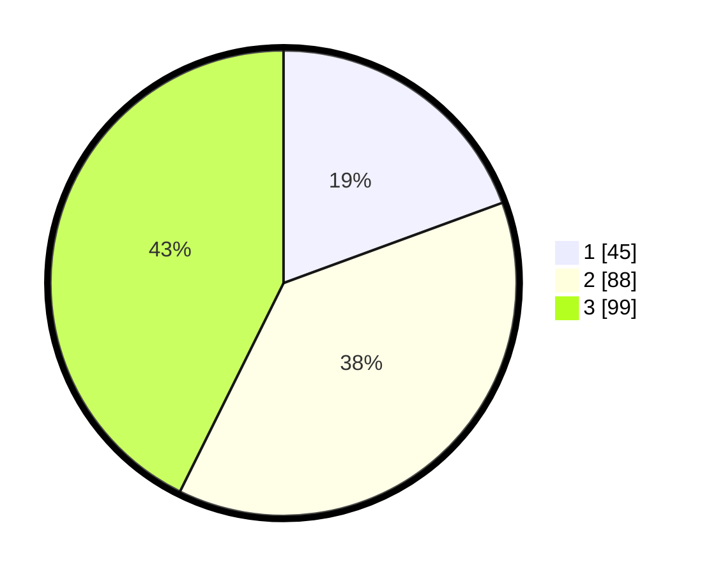

# Hasil

## Grafik

## Tabel

| No. | Nama Paslon    | Suara | Suara (raw) | Persentase |
|:--- |:-------------- | -----:| -----------:| ----------:|
| 1   | ANIES MUHAIMIN | 45    | [45][p-1]   | 19,40      |
| 2   | PRABOWO GIBRAN | 88    | [88][p-2]   | 37,93      |
| 3   | GANJAR MAHFUD  | 99    | [99][p-3]   | 42,67      |

[p-1]: https://github.com/gigit-pemilu/pemilu-2024-33-jawa-tengah/blob/main/pilpres/hitung-suara/sub/33-jawa-tengah/sub/07-wonosobo/sub/09-wonosobo/sub/1002-tawangsari/sub/001-tps/sub/paslon-1.txt
[p-2]: https://github.com/gigit-pemilu/pemilu-2024-33-jawa-tengah/blob/main/pilpres/hitung-suara/sub/33-jawa-tengah/sub/07-wonosobo/sub/09-wonosobo/sub/1002-tawangsari/sub/001-tps/sub/paslon-2.txt
[p-3]: https://github.com/gigit-pemilu/pemilu-2024-33-jawa-tengah/blob/main/pilpres/hitung-suara/sub/33-jawa-tengah/sub/07-wonosobo/sub/09-wonosobo/sub/1002-tawangsari/sub/001-tps/sub/paslon-3.txt

## Foto C Plano

https://sirekap-obj-formc.kpu.go.id/e3c8/pemilu/ppwp/33/07/09/10/02/3307091002001-20240217-103602--8ec24381-cebf-4691-b968-5a0eb4d3c157.jpg

https://sirekap-obj-formc.kpu.go.id/e3c8/pemilu/ppwp/33/07/09/10/02/3307091002001-20240217-103203--48e9c72b-574f-4b25-b369-82b2502503ab.jpg

https://sirekap-obj-formc.kpu.go.id/e3c8/pemilu/ppwp/33/07/09/10/02/3307091002001-20240217-104022--bd7f57a7-5aa0-4739-934b-e7ae49bf3666.jpg

## Metadata

| Key        | Value               |
| ---------- | ------------------- |
| Time Stamp | 2024-02-19 06:16:00 |

