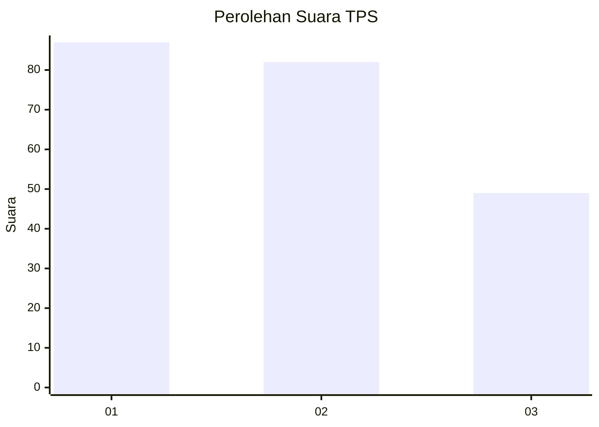
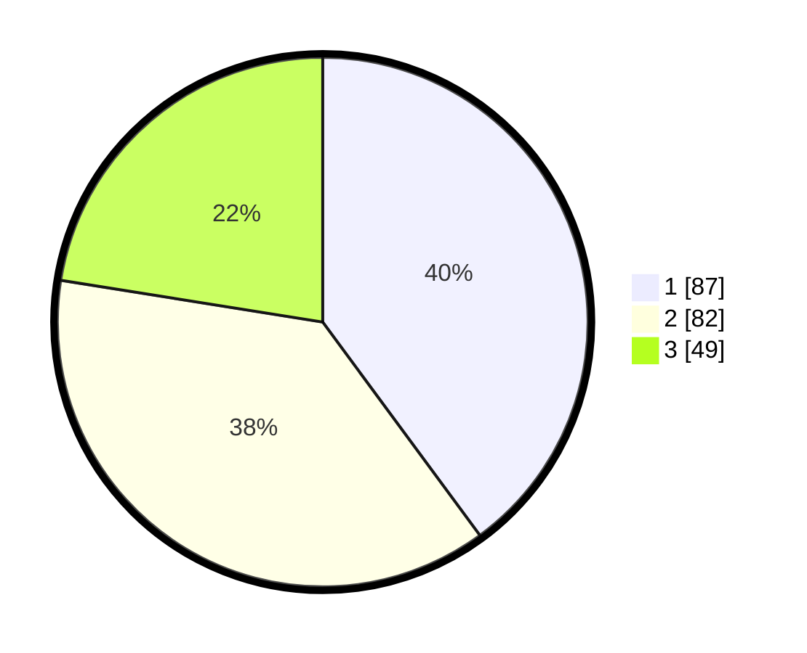

# Hasil

## Grafik

## Tabel

| No. | Nama Paslon    | Suara | Suara (raw) | Persentase |
|:--- |:-------------- | -----:| -----------:| ----------:|
| 1   | ANIES MUHAIMIN | 87    | [87][p-1]   | 39,91      |
| 2   | PRABOWO GIBRAN | 82    | [82][p-2]   | 37,61      |
| 3   | GANJAR MAHFUD  | 49    | [49][p-3]   | 22,48      |

[p-1]: https://github.com/gigit-pemilu/pemilu-2024-33-jawa-tengah/blob/main/pilpres/hitung-suara/sub/33-jawa-tengah/sub/07-wonosobo/sub/09-wonosobo/sub/1010-pagerkukuh/sub/009-tps/sub/paslon-1.txt
[p-2]: https://github.com/gigit-pemilu/pemilu-2024-33-jawa-tengah/blob/main/pilpres/hitung-suara/sub/33-jawa-tengah/sub/07-wonosobo/sub/09-wonosobo/sub/1010-pagerkukuh/sub/009-tps/sub/paslon-2.txt
[p-3]: https://github.com/gigit-pemilu/pemilu-2024-33-jawa-tengah/blob/main/pilpres/hitung-suara/sub/33-jawa-tengah/sub/07-wonosobo/sub/09-wonosobo/sub/1010-pagerkukuh/sub/009-tps/sub/paslon-3.txt

## Foto C Plano

https://sirekap-obj-formc.kpu.go.id/aabf/pemilu/ppwp/33/07/09/10/10/3307091010009-20240214-214155--dd2e668f-f00b-463c-9d65-87ebfb771bca.jpg

https://sirekap-obj-formc.kpu.go.id/aabf/pemilu/ppwp/33/07/09/10/10/3307091010009-20240215-010146--37d6c60f-7ed9-430c-9113-0f34727cc3c3.jpg

https://sirekap-obj-formc.kpu.go.id/aabf/pemilu/ppwp/33/07/09/10/10/3307091010009-20240215-010236--57f44122-9b5e-4270-8cb6-75350a6f01bd.jpg

## Metadata

| Key        | Value               |
| ---------- | ------------------- |
| Time Stamp | 2024-02-19 06:16:00 |

