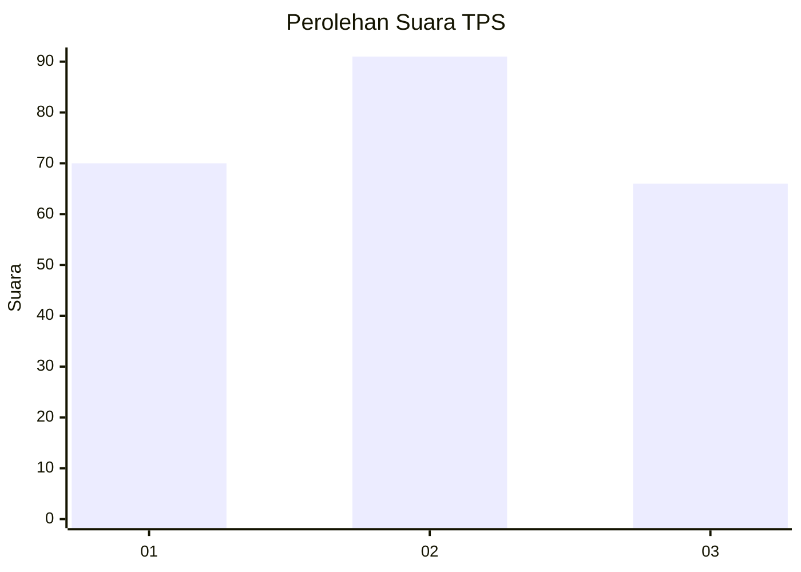
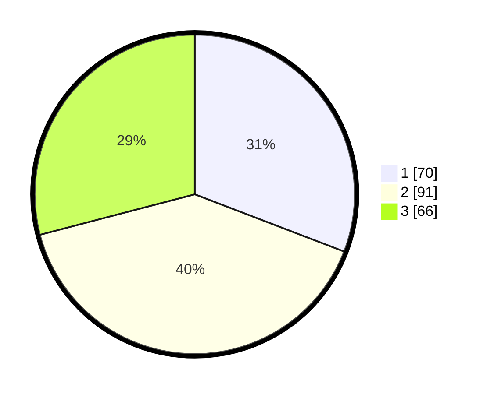

# Hasil

## Grafik

## Tabel

| No. | Nama Paslon    | Suara | Suara (raw) | Persentase |
|:--- |:-------------- | -----:| -----------:| ----------:|
| 1   | ANIES MUHAIMIN | 70    | [70][p-1]   | 30,84      |
| 2   | PRABOWO GIBRAN | 91    | [91][p-2]   | 40,09      |
| 3   | GANJAR MAHFUD  | 66    | [66][p-3]   | 29,07      |

[p-1]: https://github.com/gigit-pemilu/pemilu-2024/blob/main/pilpres/hitung-suara/sub/33-jawa-tengah/sub/07-wonosobo/sub/09-wonosobo/sub/1011-sambek/sub/002-tps/sub/paslon-1.txt
[p-2]: https://github.com/gigit-pemilu/pemilu-2024/blob/main/pilpres/hitung-suara/sub/33-jawa-tengah/sub/07-wonosobo/sub/09-wonosobo/sub/1011-sambek/sub/002-tps/sub/paslon-2.txt
[p-3]: https://github.com/gigit-pemilu/pemilu-2024/blob/main/pilpres/hitung-suara/sub/33-jawa-tengah/sub/07-wonosobo/sub/09-wonosobo/sub/1011-sambek/sub/002-tps/sub/paslon-3.txt

## Foto C Plano

https://sirekap-obj-formc.kpu.go.id/6895/pemilu/ppwp/33/07/09/10/11/3307091011002-20240214-211336--a6b3aa4d-e9f7-4dd9-aa05-38fb04c02754.jpg

https://sirekap-obj-formc.kpu.go.id/6895/pemilu/ppwp/33/07/09/10/11/3307091011002-20240215-013702--d92899d1-fc12-4e1f-838b-3f1e207407ce.jpg

https://sirekap-obj-formc.kpu.go.id/6895/pemilu/ppwp/33/07/09/10/11/3307091011002-20240214-211515--ebe8c98d-b9a2-4ef4-b4c4-2728d6502370.jpg

## Metadata

| Key        | Value               |
| ---------- | ------------------- |
| Time Stamp | 2024-02-15 22:30:27 |

