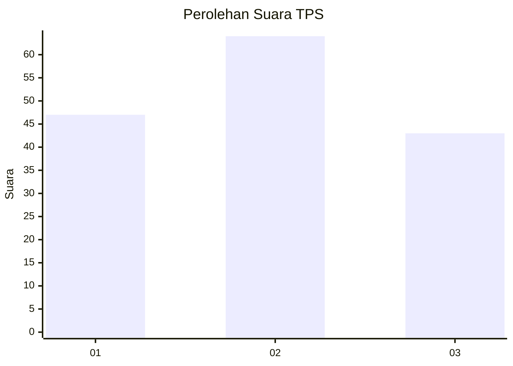
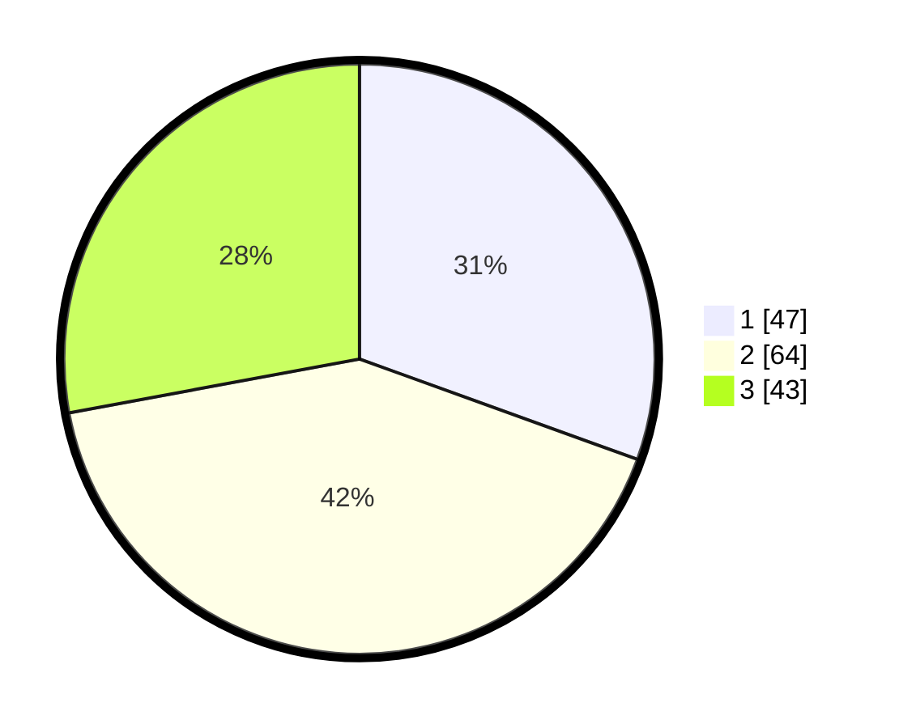

# Hasil

## Grafik

## Tabel

| No. | Nama Paslon    | Suara | Suara (raw) | Persentase |
|:--- |:-------------- | -----:| -----------:| ----------:|
| 1   | ANIES MUHAIMIN | 47    | [47][p-1]   | 30,52      |
| 2   | PRABOWO GIBRAN | 64    | [64][p-2]   | 41,56      |
| 3   | GANJAR MAHFUD  | 43    | [43][p-3]   | 27,92      |

[p-1]: https://github.com/gigit-pemilu/pemilu-2024-33-jawa-tengah/blob/main/pilpres/hitung-suara/sub/33-jawa-tengah/sub/07-wonosobo/sub/09-wonosobo/sub/1014-kalianget/sub/019-tps/sub/paslon-1.txt
[p-2]: https://github.com/gigit-pemilu/pemilu-2024-33-jawa-tengah/blob/main/pilpres/hitung-suara/sub/33-jawa-tengah/sub/07-wonosobo/sub/09-wonosobo/sub/1014-kalianget/sub/019-tps/sub/paslon-2.txt
[p-3]: https://github.com/gigit-pemilu/pemilu-2024-33-jawa-tengah/blob/main/pilpres/hitung-suara/sub/33-jawa-tengah/sub/07-wonosobo/sub/09-wonosobo/sub/1014-kalianget/sub/019-tps/sub/paslon-3.txt

## Foto C Plano

https://sirekap-obj-formc.kpu.go.id/347a/pemilu/ppwp/33/07/09/10/14/3307091014019-20240214-213857--73cc1658-7256-4eca-b43f-0b0a0fc2e4dd.jpg

https://sirekap-obj-formc.kpu.go.id/347a/pemilu/ppwp/33/07/09/10/14/3307091014019-20240214-213644--3bd85aba-78a2-4001-8148-63783ff42162.jpg

https://sirekap-obj-formc.kpu.go.id/347a/pemilu/ppwp/33/07/09/10/14/3307091014019-20240214-213810--893657b5-6325-47be-aa9e-a01275c087a1.jpg

## Metadata

| Key        | Value               |
| ---------- | ------------------- |
| Time Stamp | 2024-02-19 06:16:00 |

