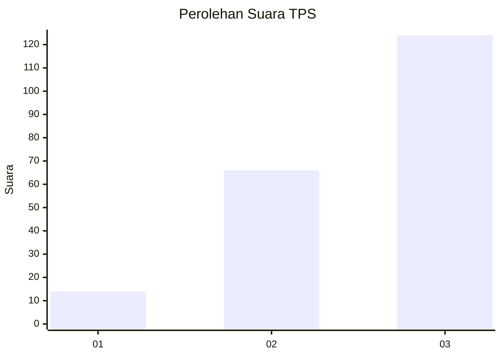
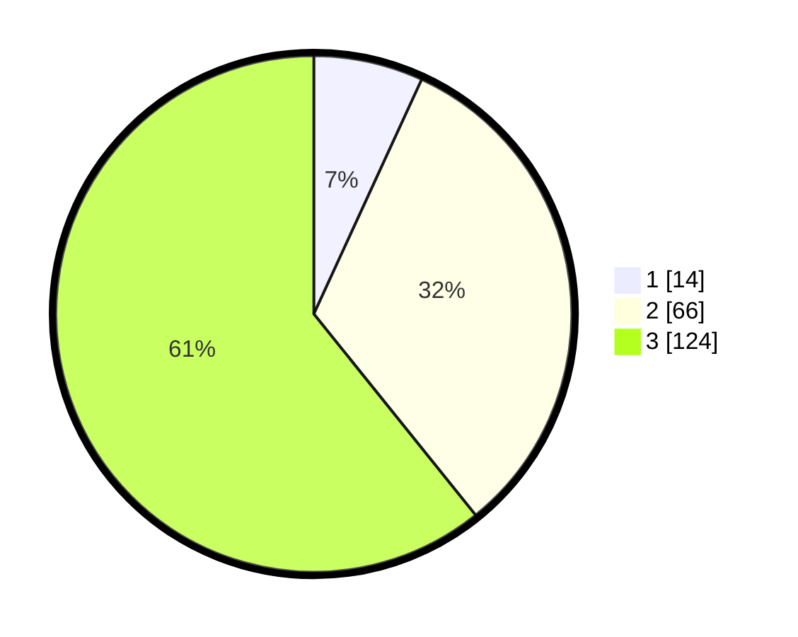

# Hasil

## Grafik

## Tabel

| No. | Nama Paslon    | Suara | Suara (raw) | Persentase |
|:--- |:-------------- | -----:| -----------:| ----------:|
| 1   | ANIES MUHAIMIN | 14    | [14][p-1]   | 6,86       |
| 2   | PRABOWO GIBRAN | 66    | [66][p-2]   | 32,35      |
| 3   | GANJAR MAHFUD  | 124   | [124][p-3]  | 60,78      |

[p-1]: https://github.com/gigit-pemilu/pemilu-2024/blob/main/pilpres/hitung-suara/sub/33-jawa-tengah/sub/07-wonosobo/sub/09-wonosobo/sub/1020-wonosobo-barat/sub/016-tps/sub/paslon-1.txt
[p-2]: https://github.com/gigit-pemilu/pemilu-2024/blob/main/pilpres/hitung-suara/sub/33-jawa-tengah/sub/07-wonosobo/sub/09-wonosobo/sub/1020-wonosobo-barat/sub/016-tps/sub/paslon-2.txt
[p-3]: https://github.com/gigit-pemilu/pemilu-2024/blob/main/pilpres/hitung-suara/sub/33-jawa-tengah/sub/07-wonosobo/sub/09-wonosobo/sub/1020-wonosobo-barat/sub/016-tps/sub/paslon-3.txt

## Foto C Plano

https://sirekap-obj-formc.kpu.go.id/dcee/pemilu/ppwp/33/07/09/10/20/3307091020016-20240214-184917--36f11d14-c4bb-452c-994c-3eaa154f23a8.jpg

https://sirekap-obj-formc.kpu.go.id/dcee/pemilu/ppwp/33/07/09/10/20/3307091020016-20240214-141729--ceaada26-59be-4fa3-b37c-927131b2de83.jpg

https://sirekap-obj-formc.kpu.go.id/dcee/pemilu/ppwp/33/07/09/10/20/3307091020016-20240214-223434--becc98d1-32b6-4029-b8ae-d73cbffa3315.jpg

## Metadata

| Key        | Value               |
| ---------- | ------------------- |
| Time Stamp | 2024-02-19 06:16:00 |

