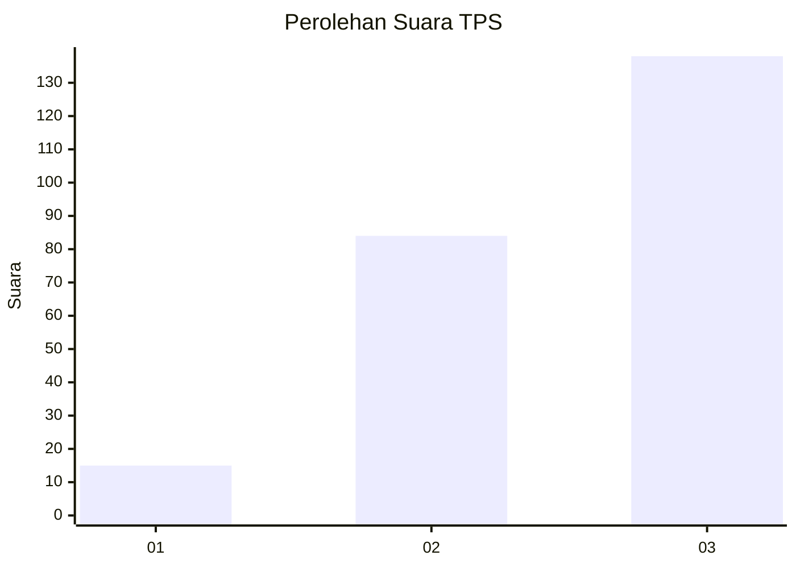
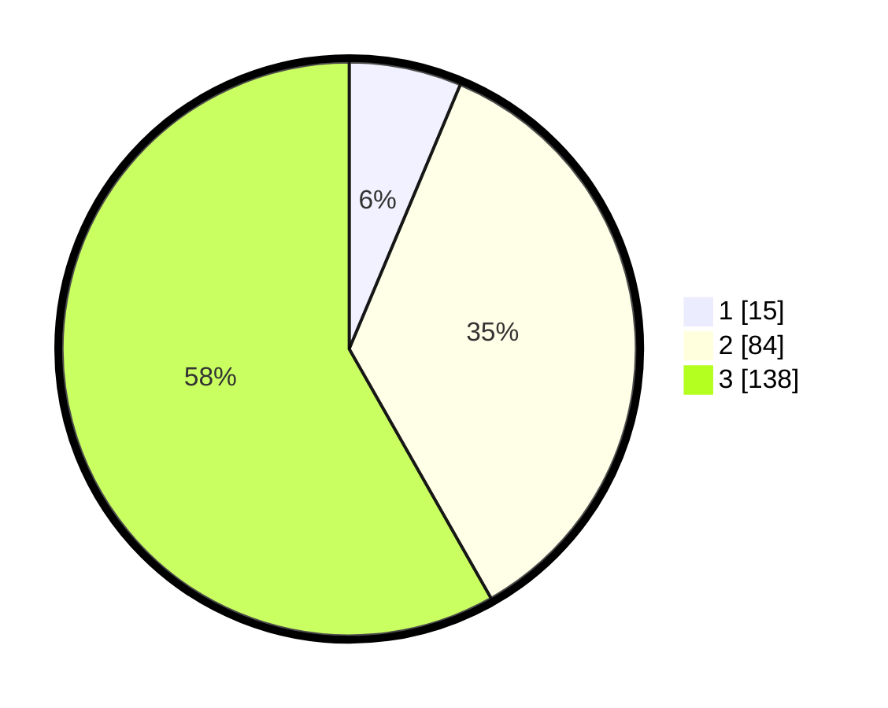

# Hasil

## Grafik

## Tabel

| No. | Nama Paslon    | Suara | Suara (raw) | Persentase |
|:--- |:-------------- | -----:| -----------:| ----------:|
| 1   | ANIES MUHAIMIN | 15    | [15][p-1]   | 6,33       |
| 2   | PRABOWO GIBRAN | 84    | [84][p-2]   | 35,44      |
| 3   | GANJAR MAHFUD  | 138   | [138][p-3]  | 58,23      |

[p-1]: https://github.com/gigit-pemilu/pemilu-2024/blob/main/pilpres/hitung-suara/sub/33-jawa-tengah/sub/07-wonosobo/sub/09-wonosobo/sub/1020-wonosobo-barat/sub/019-tps/sub/paslon-1.txt
[p-2]: https://github.com/gigit-pemilu/pemilu-2024/blob/main/pilpres/hitung-suara/sub/33-jawa-tengah/sub/07-wonosobo/sub/09-wonosobo/sub/1020-wonosobo-barat/sub/019-tps/sub/paslon-2.txt
[p-3]: https://github.com/gigit-pemilu/pemilu-2024/blob/main/pilpres/hitung-suara/sub/33-jawa-tengah/sub/07-wonosobo/sub/09-wonosobo/sub/1020-wonosobo-barat/sub/019-tps/sub/paslon-3.txt

## Foto C Plano

https://sirekap-obj-formc.kpu.go.id/5a27/pemilu/ppwp/33/07/09/10/20/3307091020019-20240222-135621--221cf0df-4c18-4298-9287-87b7dd6b443c.jpg

https://sirekap-obj-formc.kpu.go.id/5a27/pemilu/ppwp/33/07/09/10/20/3307091020019-20240222-135355--6ec3e6da-7677-4fa2-8153-444a226cb993.jpg

https://sirekap-obj-formc.kpu.go.id/5a27/pemilu/ppwp/33/07/09/10/20/3307091020019-20240222-135500--34766512-b4ef-4328-85c7-cc6194ced764.jpg

## Metadata

| Key        | Value               |
| ---------- | ------------------- |
| Time Stamp | 2024-02-25 12:00:00 |

