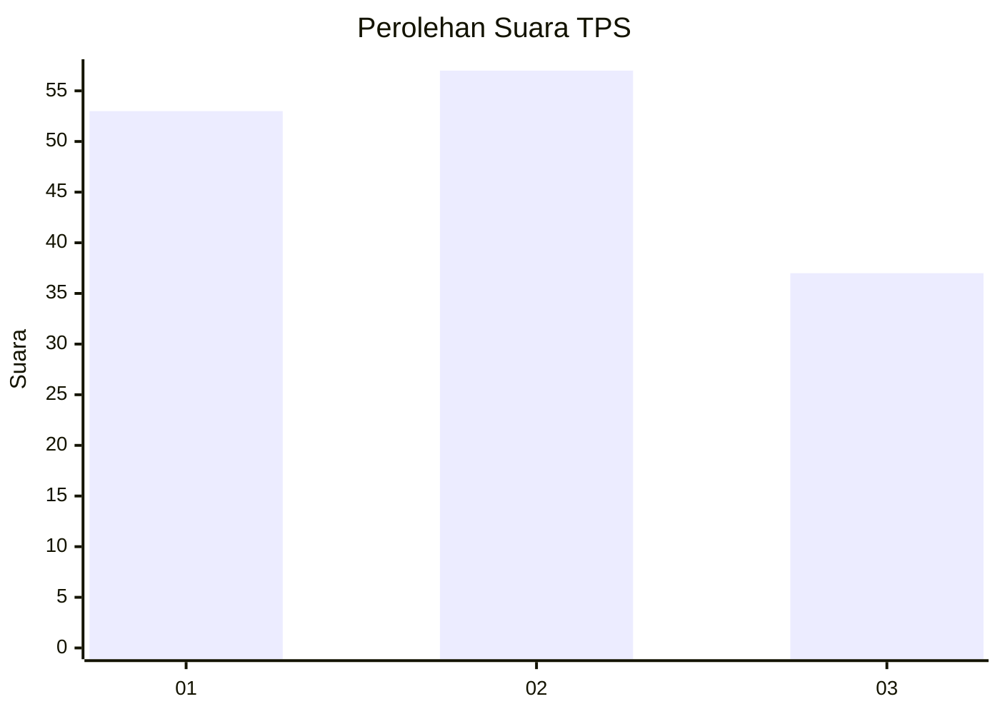
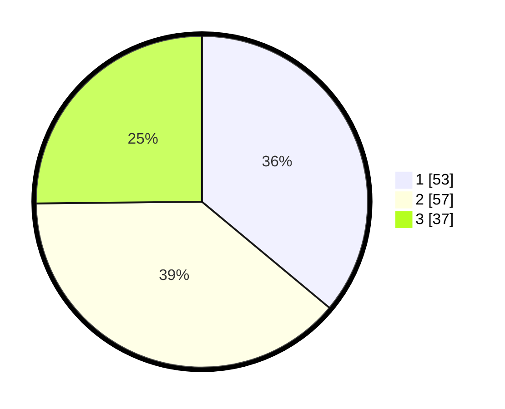

# Hasil

## Grafik

## Tabel

| No. | Nama Paslon    | Suara | Suara (raw) | Persentase |
|:--- |:-------------- | -----:| -----------:| ----------:|
| 1   | ANIES MUHAIMIN | 53    | [53][p-1]   | 36,05      |
| 2   | PRABOWO GIBRAN | 57    | [57][p-2]   | 38,78      |
| 3   | GANJAR MAHFUD  | 37    | [37][p-3]   | 25,17      |

[p-1]: https://github.com/gigit-pemilu/pemilu-2024-33-jawa-tengah/blob/main/pilpres/hitung-suara/sub/33-jawa-tengah/sub/07-wonosobo/sub/09-wonosobo/sub/1021-wonosobo-timur/sub/005-tps/sub/paslon-1.txt
[p-2]: https://github.com/gigit-pemilu/pemilu-2024-33-jawa-tengah/blob/main/pilpres/hitung-suara/sub/33-jawa-tengah/sub/07-wonosobo/sub/09-wonosobo/sub/1021-wonosobo-timur/sub/005-tps/sub/paslon-2.txt
[p-3]: https://github.com/gigit-pemilu/pemilu-2024-33-jawa-tengah/blob/main/pilpres/hitung-suara/sub/33-jawa-tengah/sub/07-wonosobo/sub/09-wonosobo/sub/1021-wonosobo-timur/sub/005-tps/sub/paslon-3.txt

## Foto C Plano

https://sirekap-obj-formc.kpu.go.id/7595/pemilu/ppwp/33/07/09/10/21/3307091021005-20240215-031441--09ffe9ed-c021-4ea6-a120-83082c83dfbd.jpg

https://sirekap-obj-formc.kpu.go.id/7595/pemilu/ppwp/33/07/09/10/21/3307091021005-20240215-032231--10a37269-6e22-4657-80d1-a0a89805d853.jpg

https://sirekap-obj-formc.kpu.go.id/7595/pemilu/ppwp/33/07/09/10/21/3307091021005-20240215-032605--66ffebbf-39a9-4eac-9fc1-7026032f64bf.jpg

## Metadata

| Key        | Value               |
| ---------- | ------------------- |
| Time Stamp | 2024-02-19 06:16:00 |

