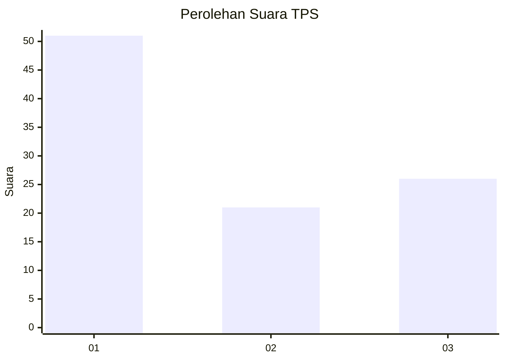
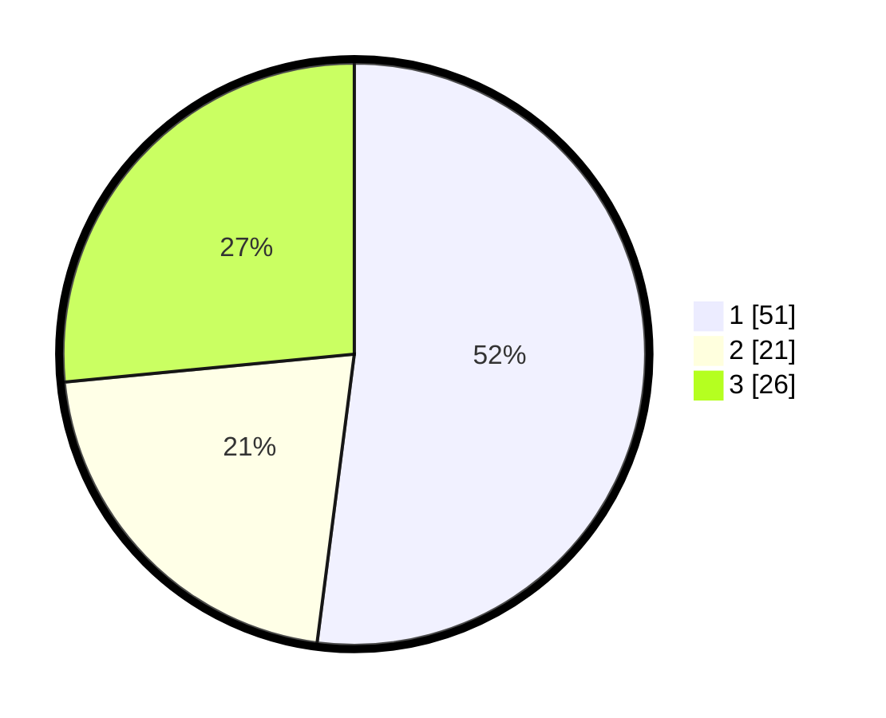

# Hasil

## Grafik

## Tabel

| No. | Nama Paslon    | Suara | Suara (raw) | Persentase |
|:--- |:-------------- | -----:| -----------:| ----------:|
| 1   | ANIES MUHAIMIN | 51    | [51][p-1]   | 52,04      |
| 2   | PRABOWO GIBRAN | 21    | [21][p-2]   | 21,43      |
| 3   | GANJAR MAHFUD  | 26    | [26][p-3]   | 26,53      |

[p-1]: https://github.com/gigit-pemilu/pemilu-2024/blob/main/pilpres/hitung-suara/sub/33-jawa-tengah/sub/07-wonosobo/sub/09-wonosobo/sub/1021-wonosobo-timur/sub/008-tps/sub/paslon-1.txt
[p-2]: https://github.com/gigit-pemilu/pemilu-2024/blob/main/pilpres/hitung-suara/sub/33-jawa-tengah/sub/07-wonosobo/sub/09-wonosobo/sub/1021-wonosobo-timur/sub/008-tps/sub/paslon-2.txt
[p-3]: https://github.com/gigit-pemilu/pemilu-2024/blob/main/pilpres/hitung-suara/sub/33-jawa-tengah/sub/07-wonosobo/sub/09-wonosobo/sub/1021-wonosobo-timur/sub/008-tps/sub/paslon-3.txt

## Foto C Plano

https://sirekap-obj-formc.kpu.go.id/a84c/pemilu/ppwp/33/07/09/10/21/3307091021008-20240215-075904--7eaa0edf-0e99-4429-9ed8-45c092fa3d6b.jpg

https://sirekap-obj-formc.kpu.go.id/a84c/pemilu/ppwp/33/07/09/10/21/3307091021008-20240215-080040--cd8df205-937d-4ba2-9c7c-d36d8c42bbe3.jpg

https://sirekap-obj-formc.kpu.go.id/a84c/pemilu/ppwp/33/07/09/10/21/3307091021008-20240215-080206--b82d83e6-54a2-4155-abe2-04cca895fd07.jpg

## Metadata

| Key        | Value               |
| ---------- | ------------------- |
| Time Stamp | 2024-02-15 22:40:13 |

