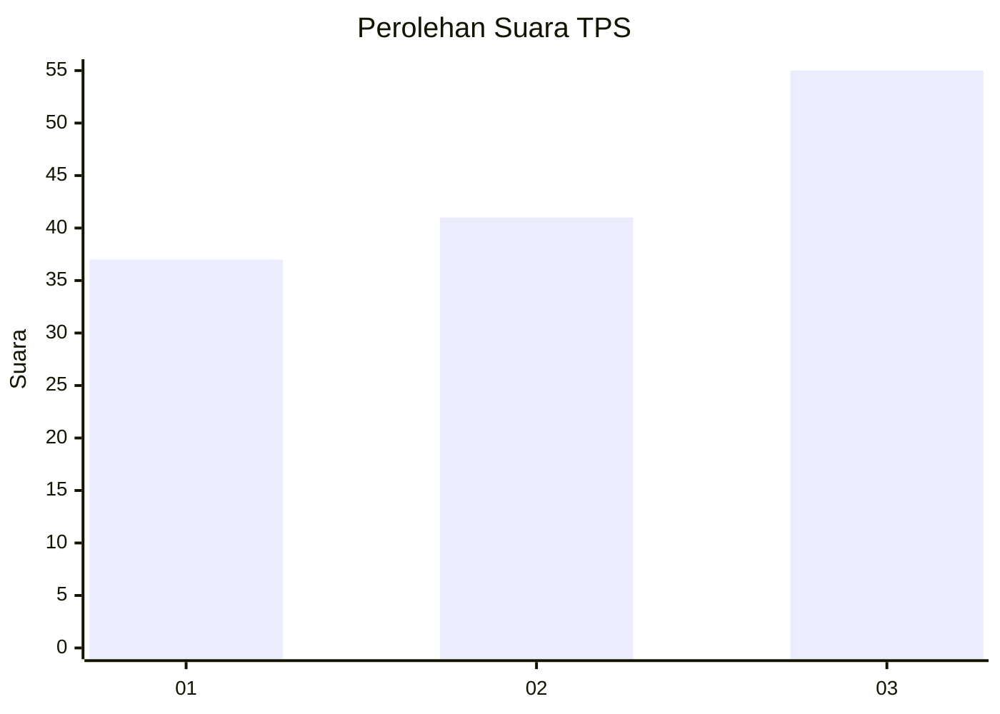
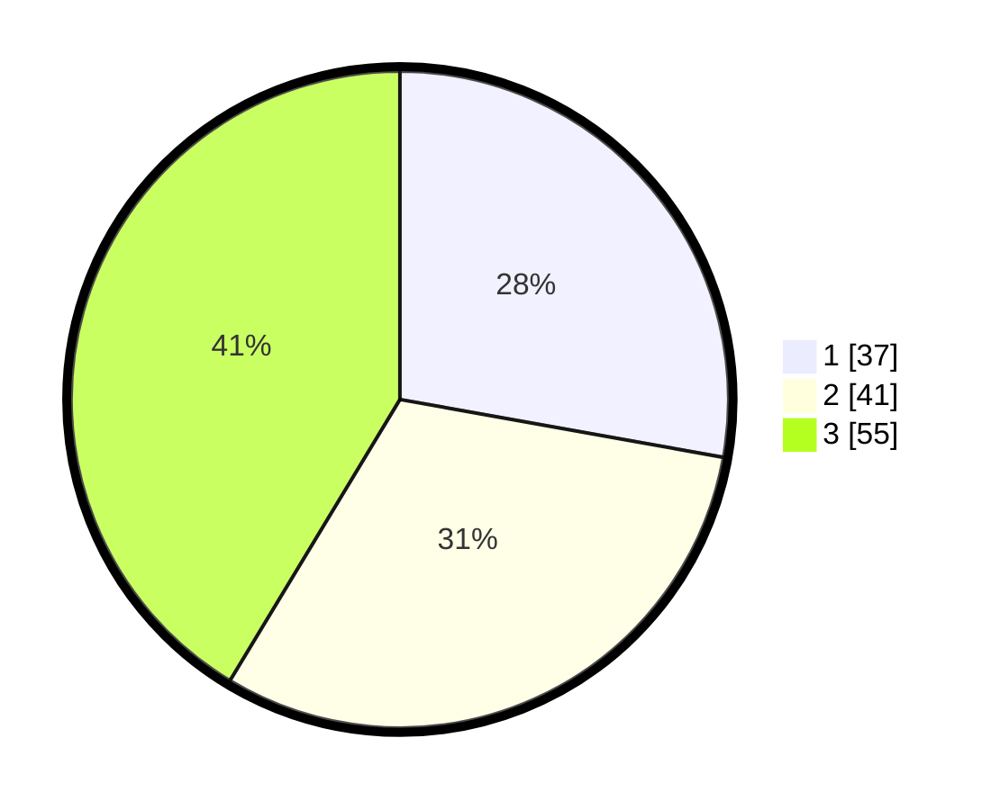

# Hasil

## Grafik

## Tabel

| No. | Nama Paslon    | Suara | Suara (raw) | Persentase |
|:--- |:-------------- | -----:| -----------:| ----------:|
| 1   | ANIES MUHAIMIN | 37    | [37][p-1]   | 27,82      |
| 2   | PRABOWO GIBRAN | 41    | [41][p-2]   | 30,83      |
| 3   | GANJAR MAHFUD  | 55    | [55][p-3]   | 41,35      |

[p-1]: https://github.com/gigit-pemilu/pemilu-2024/blob/main/pilpres/hitung-suara/sub/33-jawa-tengah/sub/07-wonosobo/sub/09-wonosobo/sub/1021-wonosobo-timur/sub/010-tps/sub/paslon-1.txt
[p-2]: https://github.com/gigit-pemilu/pemilu-2024/blob/main/pilpres/hitung-suara/sub/33-jawa-tengah/sub/07-wonosobo/sub/09-wonosobo/sub/1021-wonosobo-timur/sub/010-tps/sub/paslon-2.txt
[p-3]: https://github.com/gigit-pemilu/pemilu-2024/blob/main/pilpres/hitung-suara/sub/33-jawa-tengah/sub/07-wonosobo/sub/09-wonosobo/sub/1021-wonosobo-timur/sub/010-tps/sub/paslon-3.txt

## Foto C Plano

https://sirekap-obj-formc.kpu.go.id/fcdf/pemilu/ppwp/33/07/09/10/21/3307091021010-20240215-025819--d466543d-7e27-4920-af2c-0cf0218c0d58.jpg

https://sirekap-obj-formc.kpu.go.id/fcdf/pemilu/ppwp/33/07/09/10/21/3307091021010-20240215-030109--5be15719-7d8d-44f3-9df5-2460e0ceda6a.jpg

https://sirekap-obj-formc.kpu.go.id/fcdf/pemilu/ppwp/33/07/09/10/21/3307091021010-20240215-030159--650befde-a8f0-4dda-93cd-01bf26f9711f.jpg

## Metadata

| Key        | Value               |
| ---------- | ------------------- |
| Time Stamp | 2024-02-15 22:40:13 |

