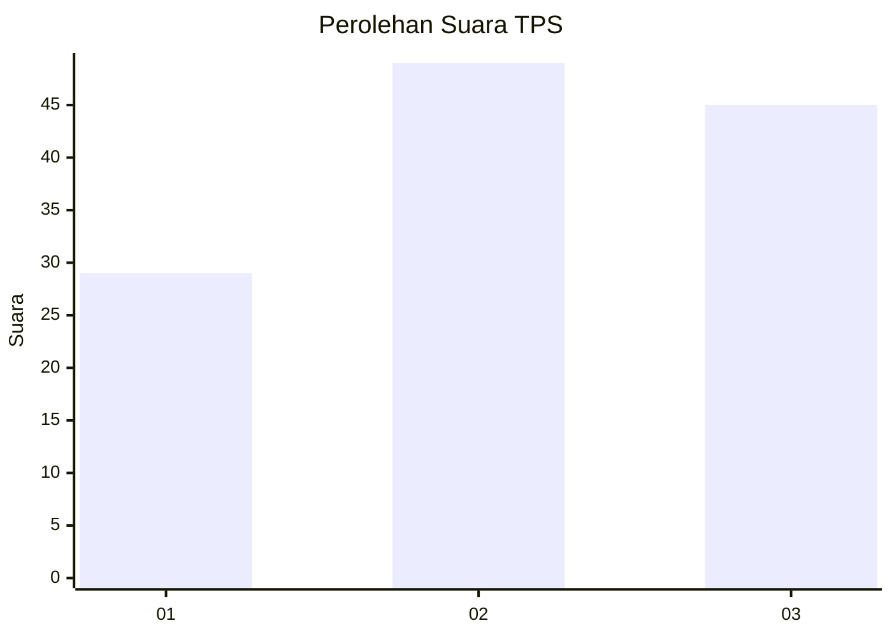
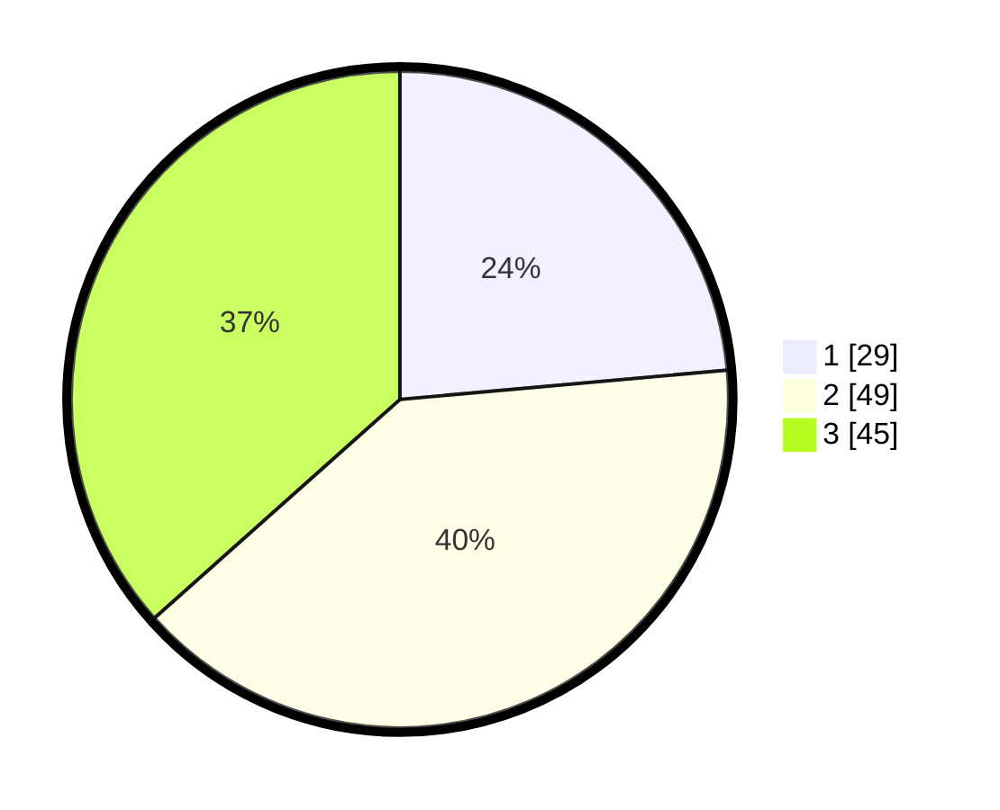

# Hasil

## Grafik

## Tabel

| No. | Nama Paslon    | Suara | Suara (raw) | Persentase |
|:--- |:-------------- | -----:| -----------:| ----------:|
| 1   | ANIES MUHAIMIN | 29    | [29][p-1]   | 23,58      |
| 2   | PRABOWO GIBRAN | 49    | [49][p-2]   | 39,84      |
| 3   | GANJAR MAHFUD  | 45    | [45][p-3]   | 36,59      |

[p-1]: https://github.com/gigit-pemilu/pemilu-2024-33-jawa-tengah/blob/main/pilpres/hitung-suara/sub/33-jawa-tengah/sub/07-wonosobo/sub/09-wonosobo/sub/1021-wonosobo-timur/sub/011-tps/sub/paslon-1.txt
[p-2]: https://github.com/gigit-pemilu/pemilu-2024-33-jawa-tengah/blob/main/pilpres/hitung-suara/sub/33-jawa-tengah/sub/07-wonosobo/sub/09-wonosobo/sub/1021-wonosobo-timur/sub/011-tps/sub/paslon-2.txt
[p-3]: https://github.com/gigit-pemilu/pemilu-2024-33-jawa-tengah/blob/main/pilpres/hitung-suara/sub/33-jawa-tengah/sub/07-wonosobo/sub/09-wonosobo/sub/1021-wonosobo-timur/sub/011-tps/sub/paslon-3.txt

## Foto C Plano

https://sirekap-obj-formc.kpu.go.id/a569/pemilu/ppwp/33/07/09/10/21/3307091021011-20240215-040350--ca314e5e-3255-4361-829c-41fbcde0e3a4.jpg

https://sirekap-obj-formc.kpu.go.id/a569/pemilu/ppwp/33/07/09/10/21/3307091021011-20240215-040445--b88c96cf-cde0-4b0a-80b5-6aeb23f52689.jpg

https://sirekap-obj-formc.kpu.go.id/a569/pemilu/ppwp/33/07/09/10/21/3307091021011-20240215-040609--db0f14e3-cb88-447e-b9a3-1073e87b2023.jpg

## Metadata

| Key        | Value               |
| ---------- | ------------------- |
| Time Stamp | 2024-02-15 12:00:28 |

