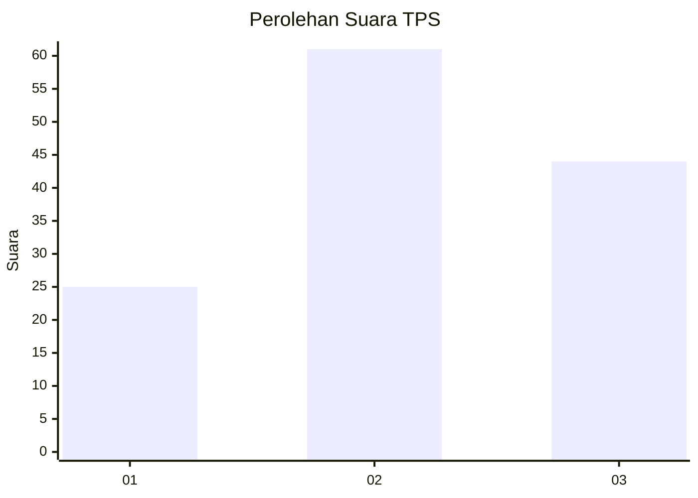
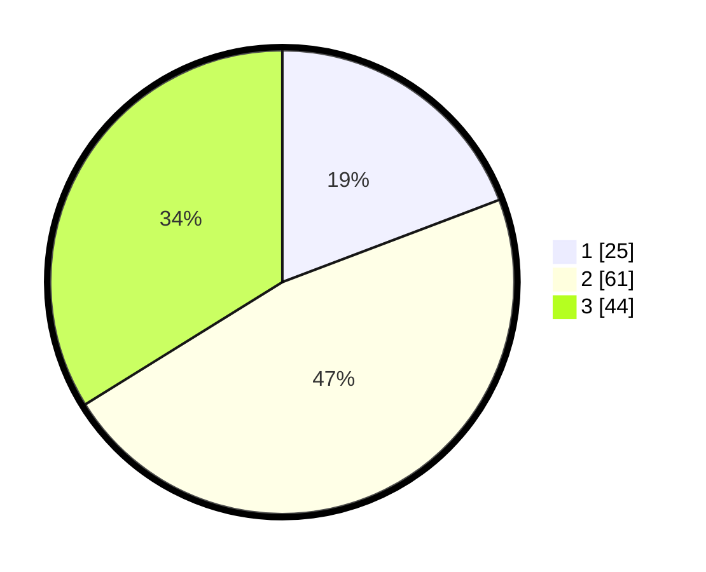

# Hasil

## Grafik

## Tabel

| No. | Nama Paslon    | Suara | Suara (raw) | Persentase |
|:--- |:-------------- | -----:| -----------:| ----------:|
| 1   | ANIES MUHAIMIN | 25    | [25][p-1]   | 19,23      |
| 2   | PRABOWO GIBRAN | 61    | [61][p-2]   | 46,92      |
| 3   | GANJAR MAHFUD  | 44    | [44][p-3]   | 33,85      |

[p-1]: https://github.com/gigit-pemilu/pemilu-2024/blob/main/pilpres/hitung-suara/sub/33-jawa-tengah/sub/07-wonosobo/sub/09-wonosobo/sub/1021-wonosobo-timur/sub/017-tps/sub/paslon-1.txt
[p-2]: https://github.com/gigit-pemilu/pemilu-2024/blob/main/pilpres/hitung-suara/sub/33-jawa-tengah/sub/07-wonosobo/sub/09-wonosobo/sub/1021-wonosobo-timur/sub/017-tps/sub/paslon-2.txt
[p-3]: https://github.com/gigit-pemilu/pemilu-2024/blob/main/pilpres/hitung-suara/sub/33-jawa-tengah/sub/07-wonosobo/sub/09-wonosobo/sub/1021-wonosobo-timur/sub/017-tps/sub/paslon-3.txt

## Foto C Plano

https://sirekap-obj-formc.kpu.go.id/f1bc/pemilu/ppwp/33/07/09/10/21/3307091021017-20240214-232024--4c961e8d-2bf2-4536-af59-edba7c58f930.jpg

https://sirekap-obj-formc.kpu.go.id/f1bc/pemilu/ppwp/33/07/09/10/21/3307091021017-20240214-232401--16ad7c5a-c9b6-48be-bdfe-996c2c16a2b2.jpg

https://sirekap-obj-formc.kpu.go.id/f1bc/pemilu/ppwp/33/07/09/10/21/3307091021017-20240214-232547--8a81aea0-5de0-41db-aaa5-c1c88a558c0e.jpg

## Metadata

| Key        | Value               |
| ---------- | ------------------- |
| Time Stamp | 2024-02-15 07:00:44 |

