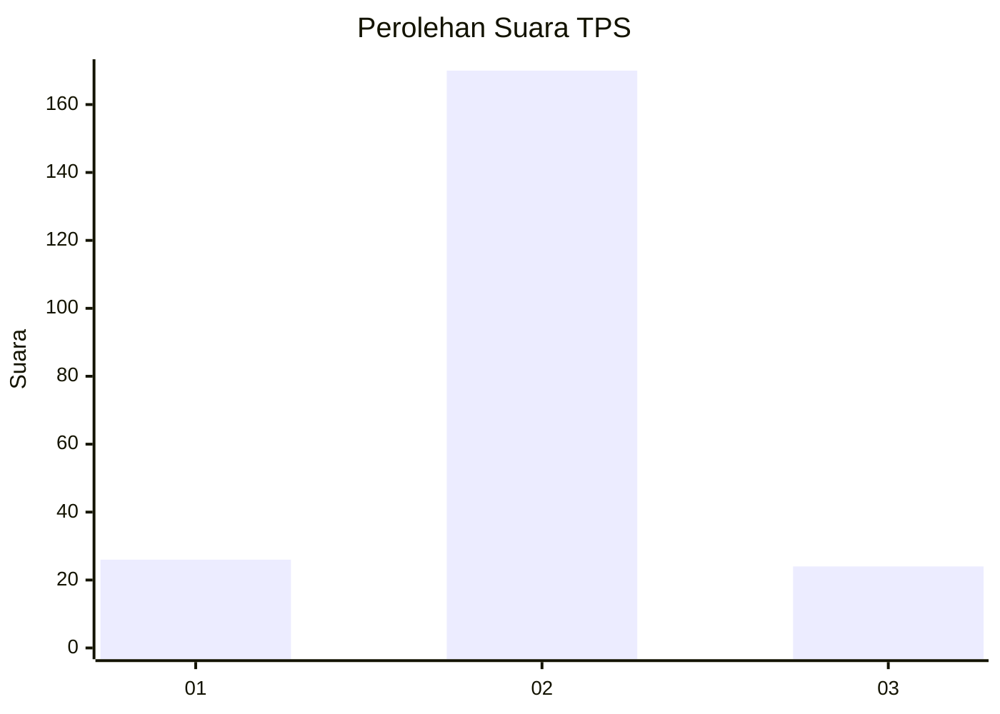
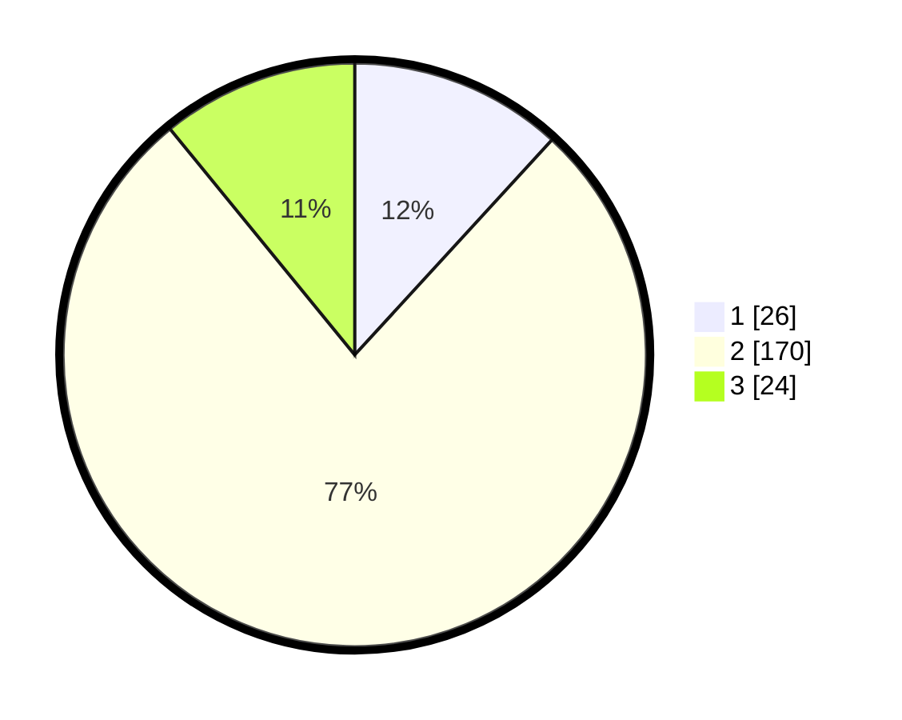

# Hasil

## Grafik

## Tabel

| No. | Nama Paslon    | Suara | Suara (raw) | Persentase |
|:--- |:-------------- | -----:| -----------:| ----------:|
| 1   | ANIES MUHAIMIN | 26    | [26][p-1]   | 11,82      |
| 2   | PRABOWO GIBRAN | 170   | [170][p-2]  | 77,27      |
| 3   | GANJAR MAHFUD  | 24    | [24][p-3]   | 10,91      |

[p-1]: https://github.com/gigit-pemilu/pemilu-2024/blob/main/pilpres/hitung-suara/sub/33-jawa-tengah/sub/07-wonosobo/sub/09-wonosobo/sub/2001-wonolelo/sub/001-tps/sub/paslon-1.txt
[p-2]: https://github.com/gigit-pemilu/pemilu-2024/blob/main/pilpres/hitung-suara/sub/33-jawa-tengah/sub/07-wonosobo/sub/09-wonosobo/sub/2001-wonolelo/sub/001-tps/sub/paslon-2.txt
[p-3]: https://github.com/gigit-pemilu/pemilu-2024/blob/main/pilpres/hitung-suara/sub/33-jawa-tengah/sub/07-wonosobo/sub/09-wonosobo/sub/2001-wonolelo/sub/001-tps/sub/paslon-3.txt

## Foto C Plano

https://sirekap-obj-formc.kpu.go.id/be99/pemilu/ppwp/33/07/09/20/01/3307092001001-20240215-145424--0da70016-3c5f-4df2-8443-8d8e71c5dcf2.jpg

https://sirekap-obj-formc.kpu.go.id/be99/pemilu/ppwp/33/07/09/20/01/3307092001001-20240215-145607--c3d8dd1e-0b38-4a24-987e-5b77bf1b97fb.jpg

https://sirekap-obj-formc.kpu.go.id/be99/pemilu/ppwp/33/07/09/20/01/3307092001001-20240215-145833--0ee0e166-974d-4966-989c-31114f9c8b62.jpg

## Metadata

| Key        | Value               |
| ---------- | ------------------- |
| Time Stamp | 2024-02-15 23:29:50 |

