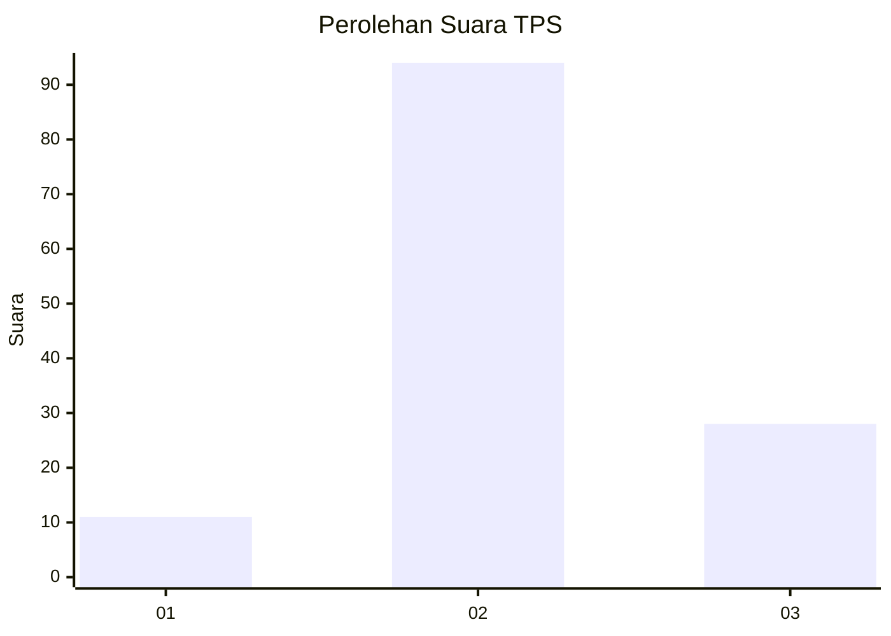
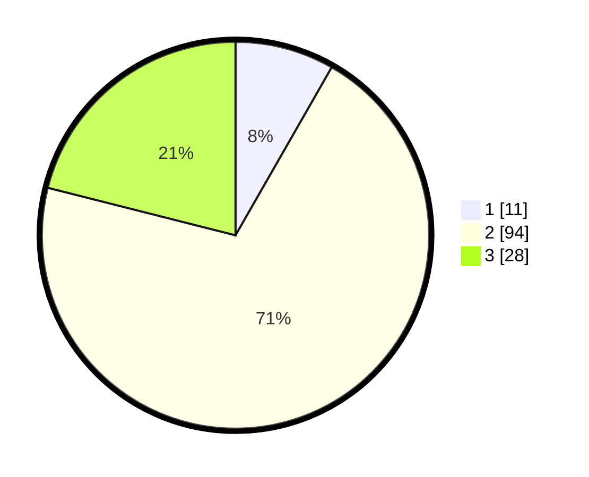

# Hasil

## Grafik

## Tabel

| No. | Nama Paslon    | Suara | Suara (raw) | Persentase |
|:--- |:-------------- | -----:| -----------:| ----------:|
| 1   | ANIES MUHAIMIN | 11    | [11][p-1]   | 8,27       |
| 2   | PRABOWO GIBRAN | 94    | [94][p-2]   | 70,68      |
| 3   | GANJAR MAHFUD  | 28    | [28][p-3]   | 21,05      |

[p-1]: https://github.com/gigit-pemilu/pemilu-2024/blob/main/pilpres/hitung-suara/sub/33-jawa-tengah/sub/07-wonosobo/sub/09-wonosobo/sub/2001-wonolelo/sub/002-tps/sub/paslon-1.txt
[p-2]: https://github.com/gigit-pemilu/pemilu-2024/blob/main/pilpres/hitung-suara/sub/33-jawa-tengah/sub/07-wonosobo/sub/09-wonosobo/sub/2001-wonolelo/sub/002-tps/sub/paslon-2.txt
[p-3]: https://github.com/gigit-pemilu/pemilu-2024/blob/main/pilpres/hitung-suara/sub/33-jawa-tengah/sub/07-wonosobo/sub/09-wonosobo/sub/2001-wonolelo/sub/002-tps/sub/paslon-3.txt

## Foto C Plano

https://sirekap-obj-formc.kpu.go.id/f90b/pemilu/ppwp/33/07/09/20/01/3307092001002-20240214-234052--f044d0b8-12a7-4951-9163-2e2d8d12efd1.jpg

https://sirekap-obj-formc.kpu.go.id/f90b/pemilu/ppwp/33/07/09/20/01/3307092001002-20240214-234331--db57ba9b-d860-4bf2-b45f-17ac6e9db264.jpg

https://sirekap-obj-formc.kpu.go.id/f90b/pemilu/ppwp/33/07/09/20/01/3307092001002-20240214-234605--5ba0ea15-488a-4d94-bc2f-ecb52c76444e.jpg

## Metadata

| Key        | Value               |
| ---------- | ------------------- |
| Time Stamp | 2024-02-15 12:00:28 |

