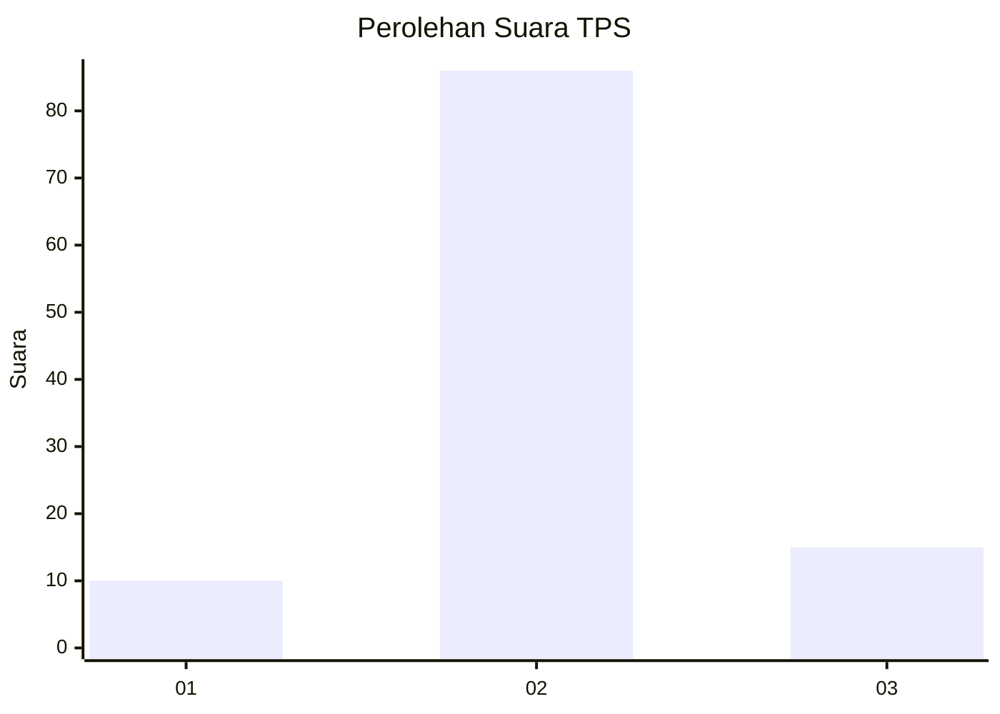
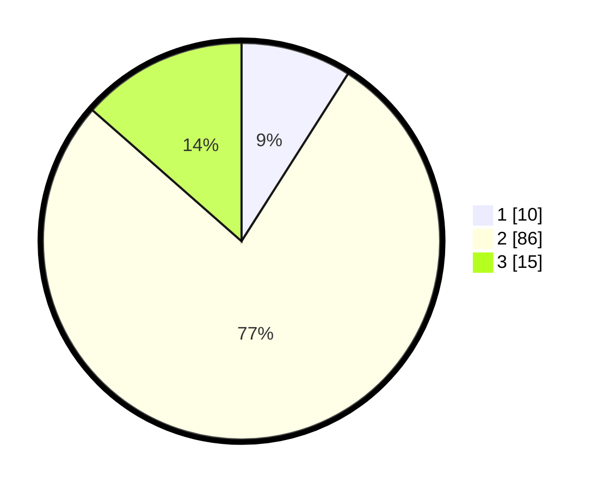

# Hasil

## Grafik

## Tabel

| No. | Nama Paslon    | Suara | Suara (raw) | Persentase |
|:--- |:-------------- | -----:| -----------:| ----------:|
| 1   | ANIES MUHAIMIN | 10    | [10][p-1]   | 9,01       |
| 2   | PRABOWO GIBRAN | 86    | [86][p-2]   | 77,48      |
| 3   | GANJAR MAHFUD  | 15    | [15][p-3]   | 13,51      |

[p-1]: https://github.com/gigit-pemilu/pemilu-2024/blob/main/pilpres/hitung-suara/sub/33-jawa-tengah/sub/07-wonosobo/sub/09-wonosobo/sub/2007-pancurwening/sub/006-tps/sub/paslon-1.txt
[p-2]: https://github.com/gigit-pemilu/pemilu-2024/blob/main/pilpres/hitung-suara/sub/33-jawa-tengah/sub/07-wonosobo/sub/09-wonosobo/sub/2007-pancurwening/sub/006-tps/sub/paslon-2.txt
[p-3]: https://github.com/gigit-pemilu/pemilu-2024/blob/main/pilpres/hitung-suara/sub/33-jawa-tengah/sub/07-wonosobo/sub/09-wonosobo/sub/2007-pancurwening/sub/006-tps/sub/paslon-3.txt

## Foto C Plano

https://sirekap-obj-formc.kpu.go.id/93e3/pemilu/ppwp/33/07/09/20/07/3307092007006-20240215-001719--bfb7907f-d738-455b-a24c-9f32c75914ed.jpg

https://sirekap-obj-formc.kpu.go.id/93e3/pemilu/ppwp/33/07/09/20/07/3307092007006-20240214-141214--53e5c59e-4fca-4aac-b2af-2630a177a052.jpg

https://sirekap-obj-formc.kpu.go.id/93e3/pemilu/ppwp/33/07/09/20/07/3307092007006-20240214-224102--00df2e4b-c9a0-4136-8dd4-d14f087d1b37.jpg

## Metadata

| Key        | Value               |
| ---------- | ------------------- |
| Time Stamp | 2024-02-15 20:30:46 |

