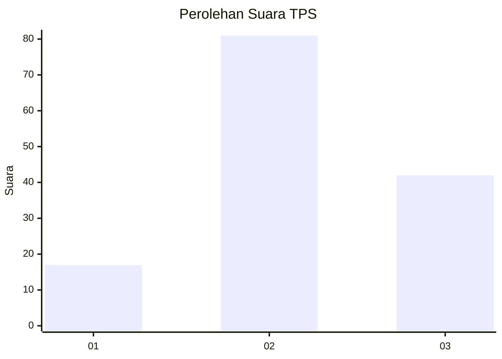
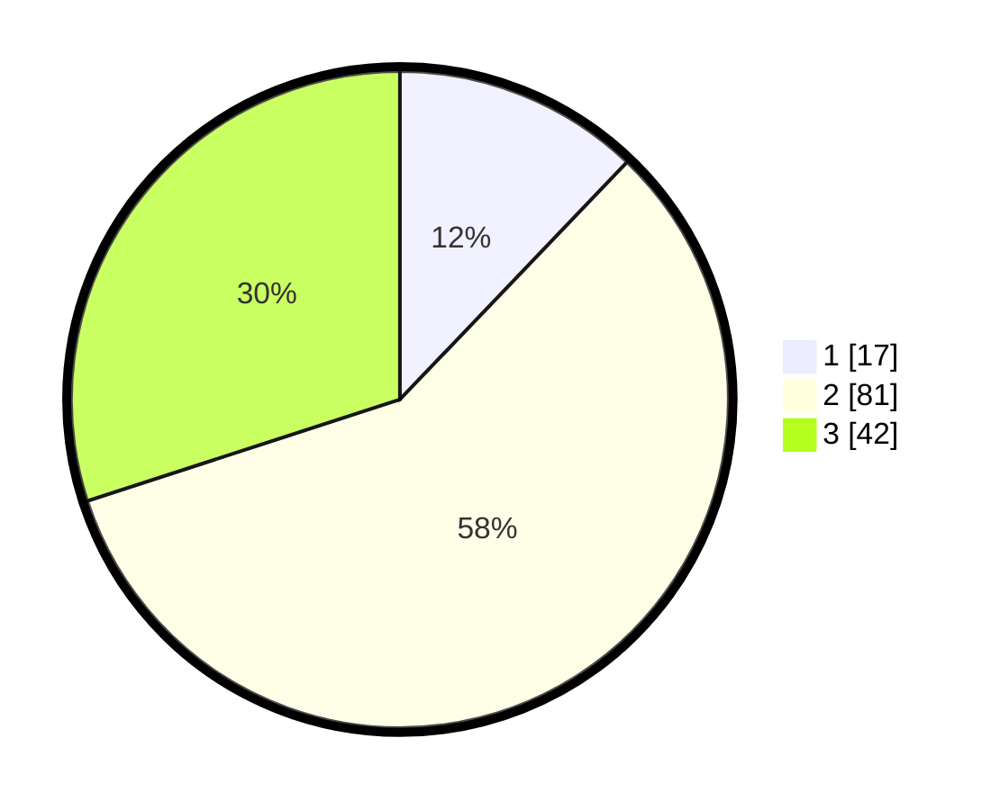

# Hasil

## Grafik

## Tabel

| No. | Nama Paslon    | Suara | Suara (raw) | Persentase |
|:--- |:-------------- | -----:| -----------:| ----------:|
| 1   | ANIES MUHAIMIN | 17    | [17][p-1]   | 12,14      |
| 2   | PRABOWO GIBRAN | 81    | [81][p-2]   | 57,86      |
| 3   | GANJAR MAHFUD  | 42    | [42][p-3]   | 30,00      |

[p-1]: https://github.com/gigit-pemilu/pemilu-2024-33-jawa-tengah/blob/main/pilpres/hitung-suara/sub/33-jawa-tengah/sub/07-wonosobo/sub/10-watumalang/sub/1010-wonoroto/sub/003-tps/sub/paslon-1.txt
[p-2]: https://github.com/gigit-pemilu/pemilu-2024-33-jawa-tengah/blob/main/pilpres/hitung-suara/sub/33-jawa-tengah/sub/07-wonosobo/sub/10-watumalang/sub/1010-wonoroto/sub/003-tps/sub/paslon-2.txt
[p-3]: https://github.com/gigit-pemilu/pemilu-2024-33-jawa-tengah/blob/main/pilpres/hitung-suara/sub/33-jawa-tengah/sub/07-wonosobo/sub/10-watumalang/sub/1010-wonoroto/sub/003-tps/sub/paslon-3.txt

## Foto C Plano

https://sirekap-obj-formc.kpu.go.id/be1d/pemilu/ppwp/33/07/10/10/10/3307101010003-20240314-125438--5d6a9302-4337-463f-8f3c-740c06ca4c00.jpg

https://sirekap-obj-formc.kpu.go.id/be1d/pemilu/ppwp/33/07/10/10/10/3307101010003-20240217-144059--7768ef0c-e3b4-4c27-bad3-ca4137b77b07.jpg

https://sirekap-obj-formc.kpu.go.id/be1d/pemilu/ppwp/33/07/10/10/10/3307101010003-20240217-144128--5340ca97-530e-42d6-88ad-595e3fb9b61c.jpg

## Metadata

| Key        | Value               |
| ---------- | ------------------- |
| Time Stamp | 2024-03-14 13:00:00 |

