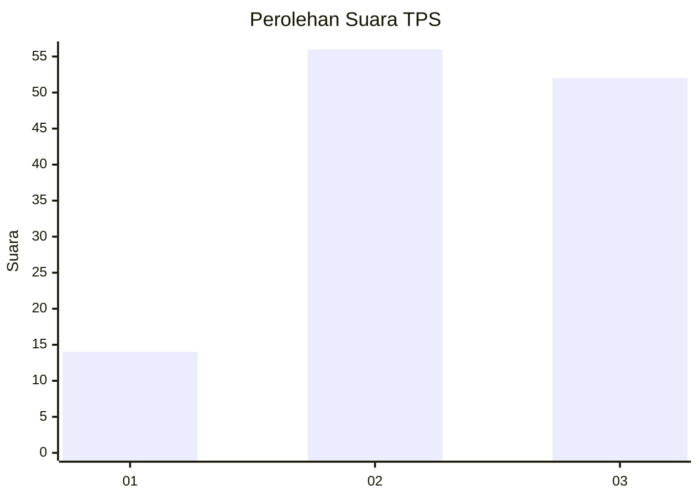
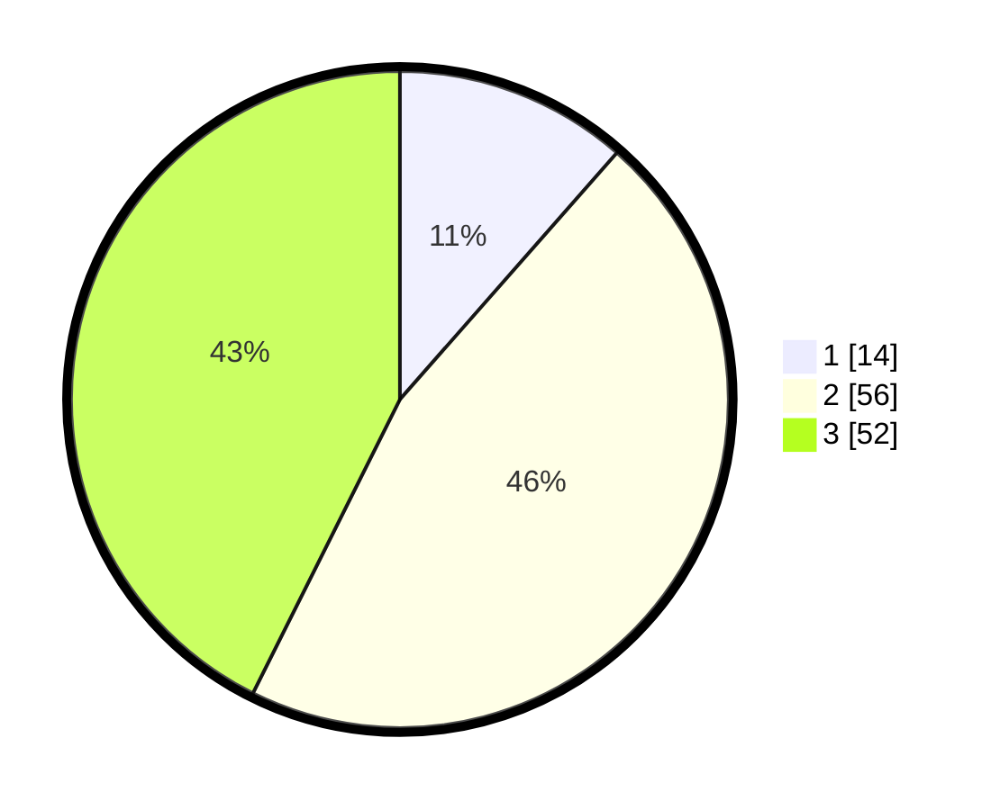

# Hasil

## Grafik

## Tabel

| No. | Nama Paslon    | Suara | Suara (raw) | Persentase |
|:--- |:-------------- | -----:| -----------:| ----------:|
| 1   | ANIES MUHAIMIN | 14    | [14][p-1]   | 11,48      |
| 2   | PRABOWO GIBRAN | 56    | [56][p-2]   | 45,90      |
| 3   | GANJAR MAHFUD  | 52    | [52][p-3]   | 42,62      |

[p-1]: https://github.com/gigit-pemilu/pemilu-2024-33-jawa-tengah/blob/main/pilpres/hitung-suara/sub/33-jawa-tengah/sub/07-wonosobo/sub/10-watumalang/sub/2004-kuripan/sub/012-tps/sub/paslon-1.txt
[p-2]: https://github.com/gigit-pemilu/pemilu-2024-33-jawa-tengah/blob/main/pilpres/hitung-suara/sub/33-jawa-tengah/sub/07-wonosobo/sub/10-watumalang/sub/2004-kuripan/sub/012-tps/sub/paslon-2.txt
[p-3]: https://github.com/gigit-pemilu/pemilu-2024-33-jawa-tengah/blob/main/pilpres/hitung-suara/sub/33-jawa-tengah/sub/07-wonosobo/sub/10-watumalang/sub/2004-kuripan/sub/012-tps/sub/paslon-3.txt

## Foto C Plano

https://sirekap-obj-formc.kpu.go.id/9219/pemilu/ppwp/33/07/10/20/04/3307102004012-20240216-094128--20dcd24e-1a76-4f10-b2f9-fe6ed50d9d7a.jpg

https://sirekap-obj-formc.kpu.go.id/9219/pemilu/ppwp/33/07/10/20/04/3307102004012-20240216-201859--aa6b2cea-a120-42fb-99d1-aa84b90ae6c6.jpg

https://sirekap-obj-formc.kpu.go.id/9219/pemilu/ppwp/33/07/10/20/04/3307102004012-20240216-202047--bcb7b8f4-fde9-4a33-9b2d-0db22918fbf8.jpg

## Metadata

| Key        | Value               |
| ---------- | ------------------- |
| Time Stamp | 2024-02-17 11:30:03 |

