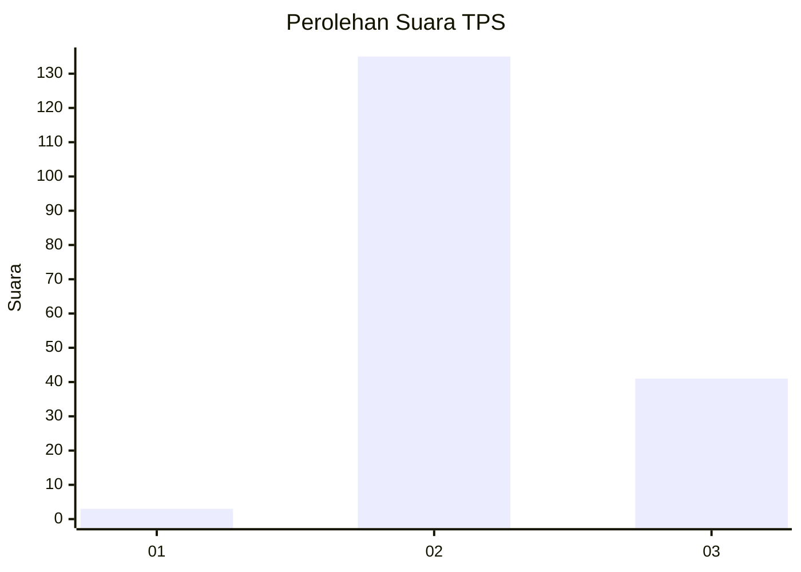
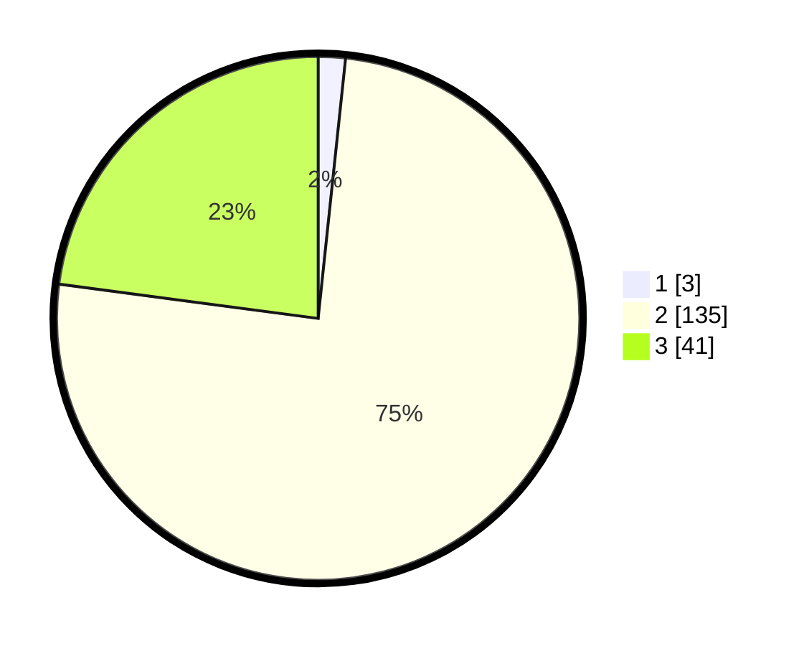

# Hasil

## Grafik

## Tabel

| No. | Nama Paslon    | Suara | Suara (raw) | Persentase |
|:--- |:-------------- | -----:| -----------:| ----------:|
| 1   | ANIES MUHAIMIN | 3     | [3][p-1]    | 1,68       |
| 2   | PRABOWO GIBRAN | 135   | [135][p-2]  | 75,42      |
| 3   | GANJAR MAHFUD  | 41    | [41][p-3]   | 22,91      |

[p-1]: https://github.com/gigit-pemilu/pemilu-2024/blob/main/pilpres/hitung-suara/sub/33-jawa-tengah/sub/07-wonosobo/sub/10-watumalang/sub/2009-pasuruhan/sub/003-tps/sub/paslon-1.txt
[p-2]: https://github.com/gigit-pemilu/pemilu-2024/blob/main/pilpres/hitung-suara/sub/33-jawa-tengah/sub/07-wonosobo/sub/10-watumalang/sub/2009-pasuruhan/sub/003-tps/sub/paslon-2.txt
[p-3]: https://github.com/gigit-pemilu/pemilu-2024/blob/main/pilpres/hitung-suara/sub/33-jawa-tengah/sub/07-wonosobo/sub/10-watumalang/sub/2009-pasuruhan/sub/003-tps/sub/paslon-3.txt

## Foto C Plano

https://sirekap-obj-formc.kpu.go.id/0de7/pemilu/ppwp/33/07/10/20/09/3307102009003-20240314-110406--56f9e559-6cb7-4c3a-ad11-261a8d39d55b.jpg

https://sirekap-obj-formc.kpu.go.id/0de7/pemilu/ppwp/33/07/10/20/09/3307102009003-20240215-060513--1cd1e780-e6ef-431a-8d12-109cd2e711d2.jpg

https://sirekap-obj-formc.kpu.go.id/0de7/pemilu/ppwp/33/07/10/20/09/3307102009003-20240314-110901--06255541-c561-4c75-a676-805d4ec0f746.jpg

## Metadata

| Key        | Value               |
| ---------- | ------------------- |
| Time Stamp | 2024-03-14 11:30:00 |

