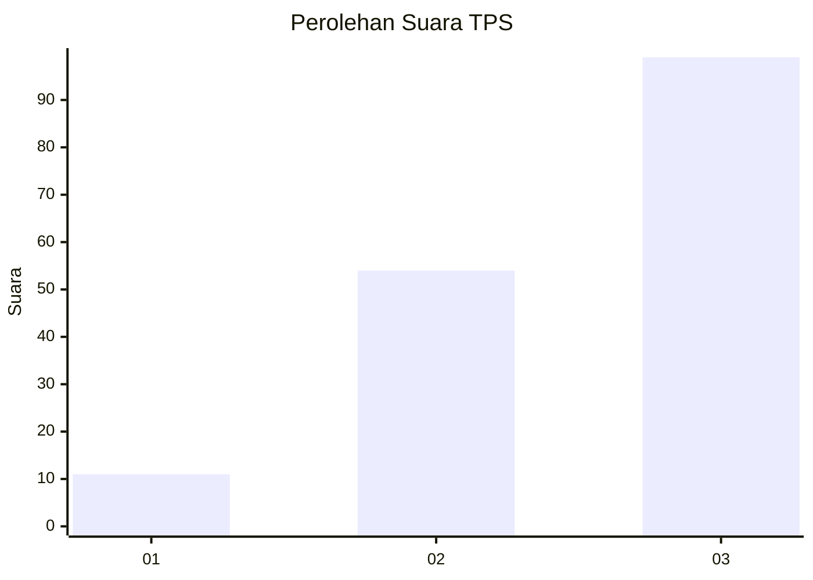
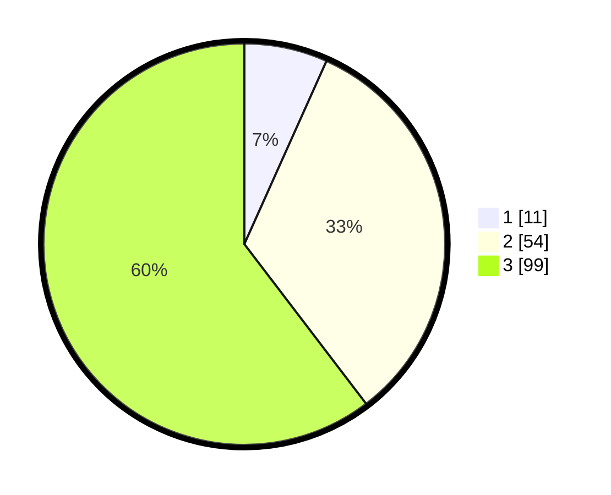

# Hasil

## Grafik

## Tabel

| No. | Nama Paslon    | Suara | Suara (raw) | Persentase |
|:--- |:-------------- | -----:| -----------:| ----------:|
| 1   | ANIES MUHAIMIN | 11    | [11][p-1]   | 6,71       |
| 2   | PRABOWO GIBRAN | 54    | [54][p-2]   | 32,93      |
| 3   | GANJAR MAHFUD  | 99    | [99][p-3]   | 60,37      |

[p-1]: https://github.com/gigit-pemilu/pemilu-2024-33-jawa-tengah/blob/main/pilpres/hitung-suara/sub/33-jawa-tengah/sub/07-wonosobo/sub/10-watumalang/sub/2012-binangun/sub/010-tps/sub/paslon-1.txt
[p-2]: https://github.com/gigit-pemilu/pemilu-2024-33-jawa-tengah/blob/main/pilpres/hitung-suara/sub/33-jawa-tengah/sub/07-wonosobo/sub/10-watumalang/sub/2012-binangun/sub/010-tps/sub/paslon-2.txt
[p-3]: https://github.com/gigit-pemilu/pemilu-2024-33-jawa-tengah/blob/main/pilpres/hitung-suara/sub/33-jawa-tengah/sub/07-wonosobo/sub/10-watumalang/sub/2012-binangun/sub/010-tps/sub/paslon-3.txt

## Foto C Plano

https://sirekap-obj-formc.kpu.go.id/80cc/pemilu/ppwp/33/07/10/20/12/3307102012010-20240314-154338--d8cf2816-c995-4921-a076-7551a58c9e2b.jpg

https://sirekap-obj-formc.kpu.go.id/80cc/pemilu/ppwp/33/07/10/20/12/3307102012010-20240215-000942--d7876b1e-7f4a-40ff-8a5e-4fa315945a15.jpg

https://sirekap-obj-formc.kpu.go.id/80cc/pemilu/ppwp/33/07/10/20/12/3307102012010-20240314-154405--6e363f4c-57f8-42e3-b82f-0b57e737652a.jpg

## Metadata

| Key        | Value               |
| ---------- | ------------------- |
| Time Stamp | 2024-03-14 16:00:00 |

