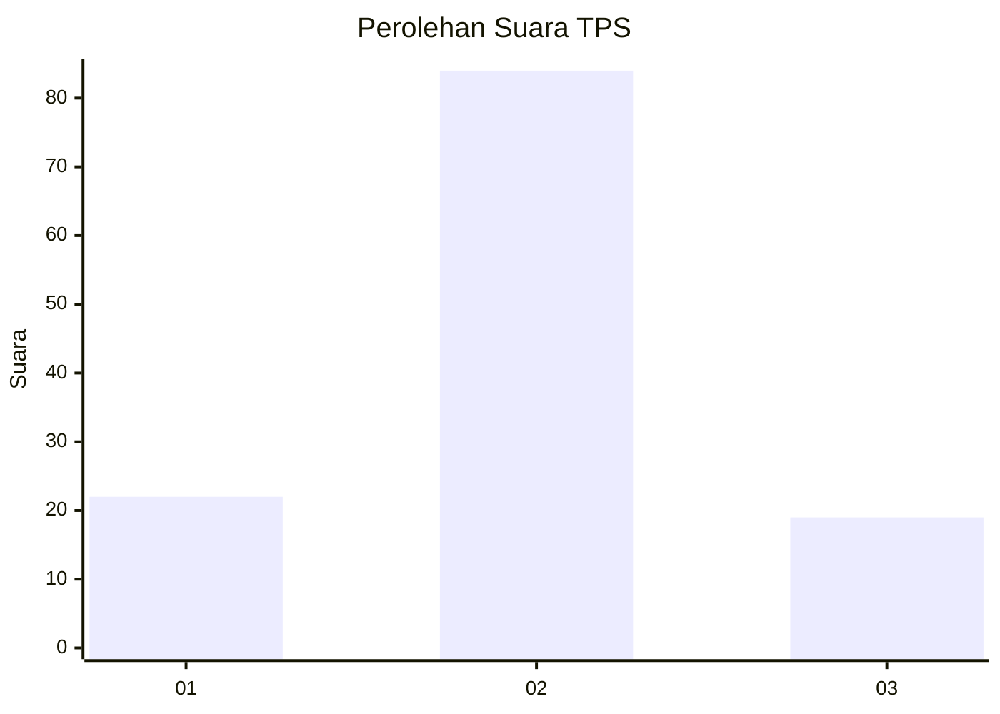
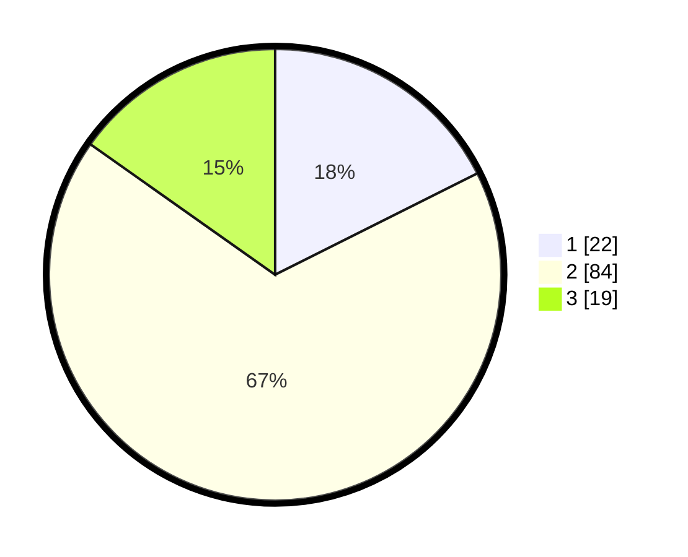

# Hasil

## Grafik

## Tabel

| No. | Nama Paslon    | Suara | Suara (raw) | Persentase |
|:--- |:-------------- | -----:| -----------:| ----------:|
| 1   | ANIES MUHAIMIN | 22    | [22][p-1]   | 17,60      |
| 2   | PRABOWO GIBRAN | 84    | [84][p-2]   | 67,20      |
| 3   | GANJAR MAHFUD  | 19    | [19][p-3]   | 15,20      |

[p-1]: https://github.com/gigit-pemilu/pemilu-2024-33-jawa-tengah/blob/main/pilpres/hitung-suara/sub/33-jawa-tengah/sub/07-wonosobo/sub/10-watumalang/sub/2013-wonokampir/sub/003-tps/sub/paslon-1.txt
[p-2]: https://github.com/gigit-pemilu/pemilu-2024-33-jawa-tengah/blob/main/pilpres/hitung-suara/sub/33-jawa-tengah/sub/07-wonosobo/sub/10-watumalang/sub/2013-wonokampir/sub/003-tps/sub/paslon-2.txt
[p-3]: https://github.com/gigit-pemilu/pemilu-2024-33-jawa-tengah/blob/main/pilpres/hitung-suara/sub/33-jawa-tengah/sub/07-wonosobo/sub/10-watumalang/sub/2013-wonokampir/sub/003-tps/sub/paslon-3.txt

## Foto C Plano

https://sirekap-obj-formc.kpu.go.id/3639/pemilu/ppwp/33/07/10/20/13/3307102013003-20240216-200617--a3dbd72f-ca85-4a6a-b997-40d90fcff02a.jpg

https://sirekap-obj-formc.kpu.go.id/3639/pemilu/ppwp/33/07/10/20/13/3307102013003-20240216-171203--1ff9bb24-ed7c-4229-aa77-e1dbdcb837b1.jpg

https://sirekap-obj-formc.kpu.go.id/3639/pemilu/ppwp/33/07/10/20/13/3307102013003-20240216-204545--2a50128e-3096-431b-8454-8d0f4bf28b44.jpg

## Metadata

| Key        | Value               |
| ---------- | ------------------- |
| Time Stamp | 2024-02-16 22:01:00 |

