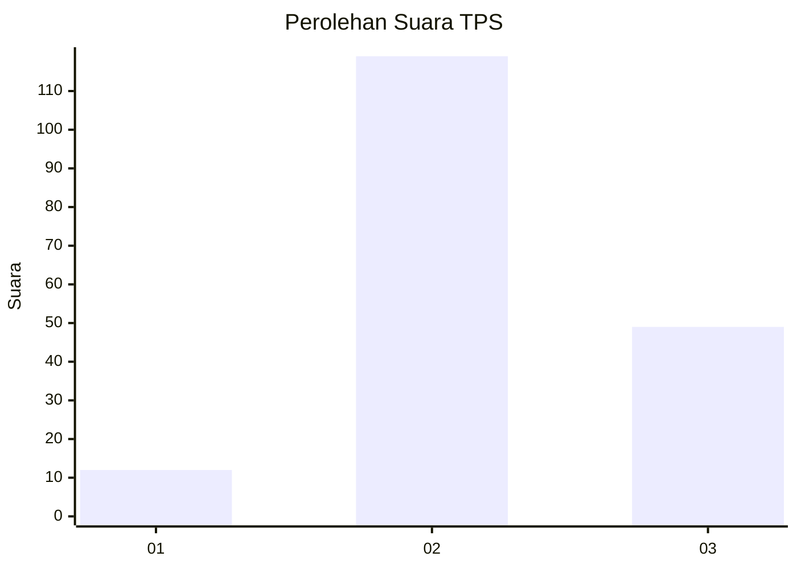

# Hasil

## Grafik

## Tabel

| No. | Nama Paslon    | Suara | Suara (raw) | Persentase |
|:--- |:-------------- | -----:| -----------:| ----------:|
| 1   | ANIES MUHAIMIN | 12    | [12][p-1]   | 6,67       |
| 2   | PRABOWO GIBRAN | 119   | [119][p-2]  | 66,11      |
| 3   | GANJAR MAHFUD  | 49    | [49][p-3]   | 27,22      |

[p-1]: https://github.com/gigit-pemilu/pemilu-2024/blob/main/pilpres/hitung-suara/sub/33-jawa-tengah/sub/07-wonosobo/sub/10-watumalang/sub/2014-krinjing/sub/003-tps/sub/paslon-1.txt
[p-2]: https://github.com/gigit-pemilu/pemilu-2024/blob/main/pilpres/hitung-suara/sub/33-jawa-tengah/sub/07-wonosobo/sub/10-watumalang/sub/2014-krinjing/sub/003-tps/sub/paslon-2.txt
[p-3]: https://github.com/gigit-pemilu/pemilu-2024/blob/main/pilpres/hitung-suara/sub/33-jawa-tengah/sub/07-wonosobo/sub/10-watumalang/sub/2014-krinjing/sub/003-tps/sub/paslon-3.txt

## Foto C Plano

https://sirekap-obj-formc.kpu.go.id/5311/pemilu/ppwp/33/07/10/20/14/3307102014003-20240314-121001--4e2847b2-1634-4b9e-9224-6df4f5d7c405.jpg

https://sirekap-obj-formc.kpu.go.id/5311/pemilu/ppwp/33/07/10/20/14/3307102014003-20240220-105323--9d4efc80-b783-47de-9cb7-8fe8d2f2d8f1.jpg

https://sirekap-obj-formc.kpu.go.id/5311/pemilu/ppwp/33/07/10/20/14/3307102014003-20240220-105428--84acd9a2-0991-488b-b5e4-c87388dcfc03.jpg

## Metadata

| Key        | Value               |
| ---------- | ------------------- |
| Time Stamp | 2024-03-14 12:30:00 |

