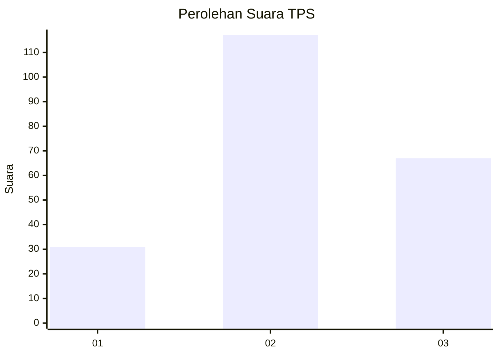
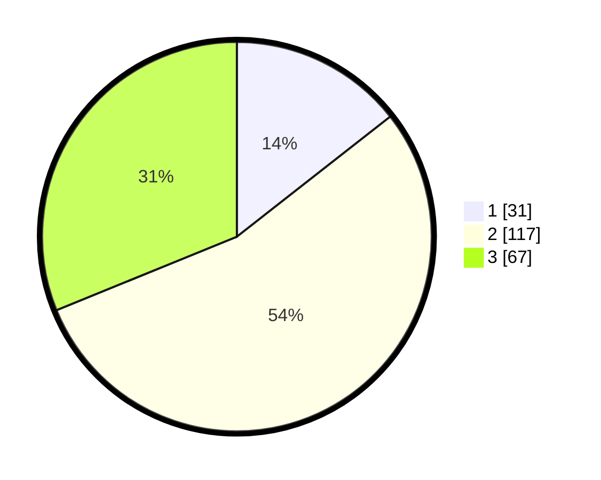

# Hasil

## Grafik

## Tabel

| No. | Nama Paslon    | Suara | Suara (raw) | Persentase |
|:--- |:-------------- | -----:| -----------:| ----------:|
| 1   | ANIES MUHAIMIN | 31    | [31][p-1]   | 14,42      |
| 2   | PRABOWO GIBRAN | 117   | [117][p-2]  | 54,42      |
| 3   | GANJAR MAHFUD  | 67    | [67][p-3]   | 31,16      |

[p-1]: https://github.com/gigit-pemilu/pemilu-2024/blob/main/pilpres/hitung-suara/sub/33-jawa-tengah/sub/07-wonosobo/sub/11-mojotengah/sub/1004-mudal/sub/003-tps/sub/paslon-1.txt
[p-2]: https://github.com/gigit-pemilu/pemilu-2024/blob/main/pilpres/hitung-suara/sub/33-jawa-tengah/sub/07-wonosobo/sub/11-mojotengah/sub/1004-mudal/sub/003-tps/sub/paslon-2.txt
[p-3]: https://github.com/gigit-pemilu/pemilu-2024/blob/main/pilpres/hitung-suara/sub/33-jawa-tengah/sub/07-wonosobo/sub/11-mojotengah/sub/1004-mudal/sub/003-tps/sub/paslon-3.txt

## Foto C Plano

https://sirekap-obj-formc.kpu.go.id/d391/pemilu/ppwp/33/07/11/10/04/3307111004003-20240215-014053--207a6629-ae28-4342-8e42-ee0f8d67d791.jpg

https://sirekap-obj-formc.kpu.go.id/d391/pemilu/ppwp/33/07/11/10/04/3307111004003-20240215-014217--c0b9e81e-4e2f-4f81-ac1a-5aab610131a7.jpg

https://sirekap-obj-formc.kpu.go.id/d391/pemilu/ppwp/33/07/11/10/04/3307111004003-20240215-014536--7a358f1b-6108-418f-b72b-e6b7e2abc2f3.jpg

## Metadata

| Key        | Value               |
| ---------- | ------------------- |
| Time Stamp | 2024-02-15 15:00:29 |

