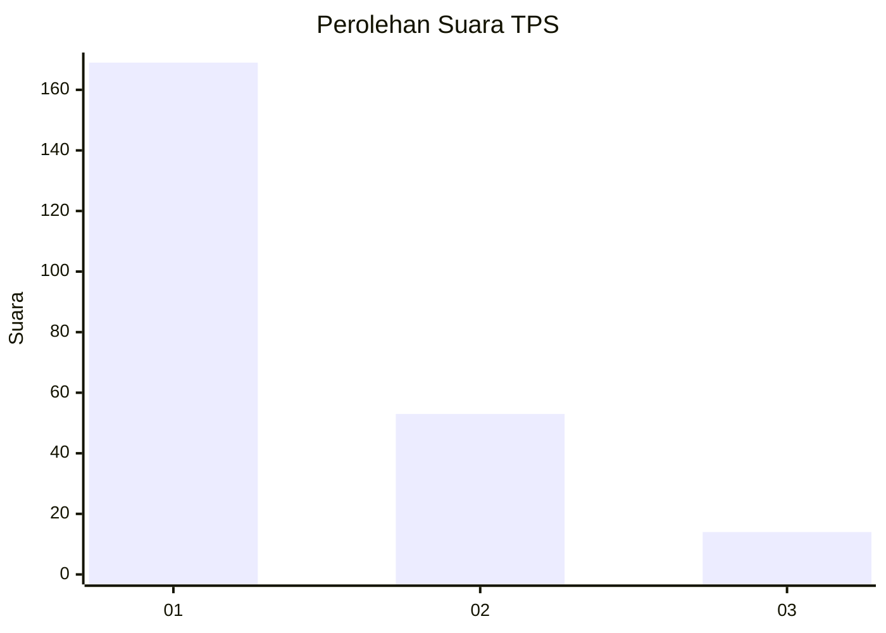
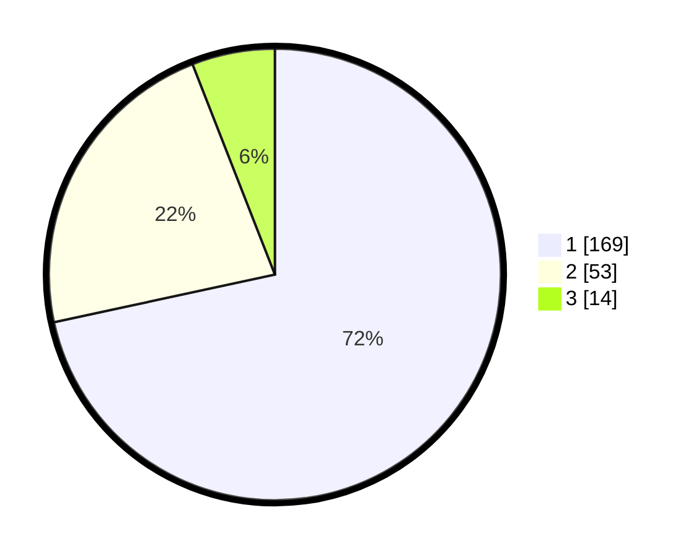

# Hasil

## Grafik

## Tabel

| No. | Nama Paslon    | Suara | Suara (raw) | Persentase |
|:--- |:-------------- | -----:| -----------:| ----------:|
| 1   | ANIES MUHAIMIN | 169   | [169][p-1]  | 71,61      |
| 2   | PRABOWO GIBRAN | 53    | [53][p-2]   | 22,46      |
| 3   | GANJAR MAHFUD  | 14    | [14][p-3]   | 5,93       |

[p-1]: https://github.com/gigit-pemilu/pemilu-2024/blob/main/pilpres/hitung-suara/sub/33-jawa-tengah/sub/07-wonosobo/sub/11-mojotengah/sub/2006-krasak/sub/006-tps/sub/paslon-1.txt
[p-2]: https://github.com/gigit-pemilu/pemilu-2024/blob/main/pilpres/hitung-suara/sub/33-jawa-tengah/sub/07-wonosobo/sub/11-mojotengah/sub/2006-krasak/sub/006-tps/sub/paslon-2.txt
[p-3]: https://github.com/gigit-pemilu/pemilu-2024/blob/main/pilpres/hitung-suara/sub/33-jawa-tengah/sub/07-wonosobo/sub/11-mojotengah/sub/2006-krasak/sub/006-tps/sub/paslon-3.txt

## Foto C Plano

https://sirekap-obj-formc.kpu.go.id/319b/pemilu/ppwp/33/07/11/20/06/3307112006006-20240214-194509--708774d3-4be8-40d2-851a-952306da586d.jpg

https://sirekap-obj-formc.kpu.go.id/319b/pemilu/ppwp/33/07/11/20/06/3307112006006-20240214-194724--c8f6e5ab-e59e-4999-851d-7f92e1594353.jpg

https://sirekap-obj-formc.kpu.go.id/319b/pemilu/ppwp/33/07/11/20/06/3307112006006-20240214-194903--39c06ea1-cb2e-4656-95fc-5201b536d04d.jpg

## Metadata

| Key        | Value               |
| ---------- | ------------------- |
| Time Stamp | 2024-02-15 16:30:25 |

